```r
library(haven)
library(labelled) # for general functions to work with labelled data
library(tidyverse) # general wrangling
library(dplyr)
library(Hmisc)
library(gtsummary) # to demonstrate automatic use of variable labels in summary tables
library(readxl)
library(foreign)
library(sjPlot)
library(sjmisc)
library(sjlabelled) # for example efc data set with variable labels
library(stringr)
```


```r
rm(list = ls())
```


```r
dir_input_data = "C:/Users/AHema/OneDrive - CGIAR/Desktop/WFP Resilience dataset/data/input_data/Chad"
dir_output_data = "C:/Users/AHema/OneDrive - CGIAR/Desktop/WFP Resilience dataset/data/output_data/Chad"
```


```r
Chad_Harmonization_variables <- read_excel(paste0(dir_input_data,"/Chad_Harmonization.xlsx"), 
    sheet = "variables_harmonization")
#View(Chad_Harmonization_variables)

Chad_Harmonization_description <- read_excel(paste0(dir_input_data,"/Chad_Harmonization.xlsx"), 
    sheet = "description")
#View(Chad_Harmonization_description)
```


```r
lst_data = Chad_Harmonization_description$Data
lst_test = Chad_Harmonization_description$Name

for(i in 1:length(lst_data)) {                              # Head of for-loop
  assign(lst_test[i],                                   # Read and store data frames
         read_sav(paste0(dir_input_data,"/",lst_data[i])))
}
```


```r
for (j in 1:length(lst_test)){
         df=  get(lst_test[j], envir = .GlobalEnv)
          for (i in 1:nrow(Chad_Harmonization_variables)){
            df[,Chad_Harmonization_variables$NewVariable_Name[i]]=ifelse(is.na(Chad_Harmonization_variables[i,lst_test[j]]),NA,df[,Chad_Harmonization_variables[i,lst_test[j]][[1]]])
          }
    
    df<-df %>% select(Chad_Harmonization_variables$NewVariable_Name)
    assign(lst_test[j],                                   # Read and store data frames
         df)
#write_sav(df, paste0(dir_output_data,"/",lst_test[j],".sav"))
#write_dta(df, paste0(dir_output_data,"/",lst_test[j],".dta"))
    

}
```


```r
Chad_pdm_2022$ID = 1:nrow(Chad_pdm_2022)
```


# Gender recodification


```r
# We need to recode gender label to:
# 0 = Femme
# 1 = Homme


#View labels
expss::val_lab(Chad_baseline_2018$HHHSex)
Chad_baseline_2018 %>% 
  plot_frq(coord.flip =T,HHHSex)
```

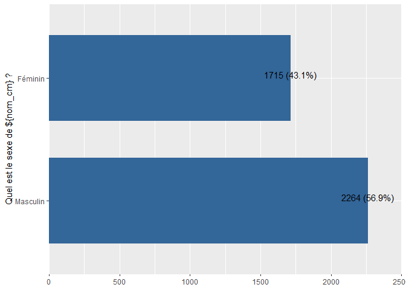<!-- -->

```r
Chad_baseline_2018$HHHSex<-dplyr::recode(Chad_baseline_2018$HHHSex, `2` = 0L, .default = 1L, .combine_value_labels = TRUE)
Chad_baseline_2018$HHHSex <- labelled::labelled(Chad_baseline_2018$HHHSex, c(Femme = 0, Homme = 1))
#Check new labels
expss::val_lab(Chad_baseline_2018$HHHSex)
Chad_baseline_2018 %>% 
  plot_frq(coord.flip =T,HHHSex)
```

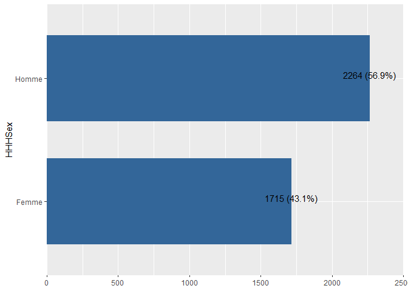<!-- -->

```r
#View labels
expss::val_lab(Chad_ea_2019$HHHSex)
Chad_ea_2019 %>% 
  plot_frq(coord.flip =T,HHHSex)
```

<!-- -->

```r
Chad_ea_2019$HHHSex <- ifelse(Chad_ea_2019$HHHSex=="Feminin","Femme","Homme")

Chad_ea_2019 <- Chad_ea_2019 %>% 
  mutate(HHHSex=ifelse(HHHSex=="Femme",0,1))
Chad_ea_2019$HHHSex<-dplyr::recode(Chad_ea_2019$HHHSex, "1" = 1, "0" = 0)
Chad_ea_2019$HHHSex <- labelled::labelled(Chad_ea_2019$HHHSex, c(Femme = 0, Homme = 1))
#Check labels
expss::val_lab(Chad_ea_2019$HHHSex)
Chad_ea_2019 %>% 
  plot_frq(coord.flip =T,HHHSex)
```

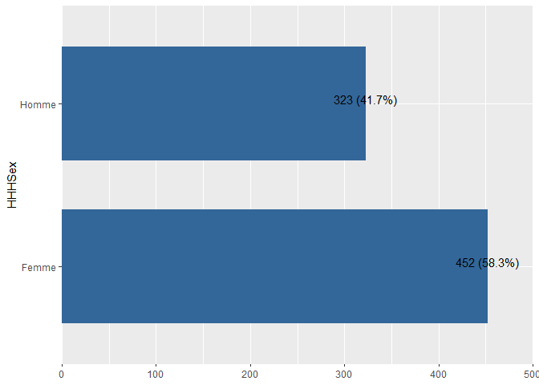<!-- -->

```r
#View labels
expss::val_lab(Chad_ea_2020$HHHSex)
Chad_ea_2020 %>% 
  plot_frq(coord.flip =T,HHHSex)
```

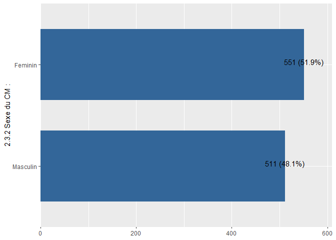<!-- -->

```r
Chad_ea_2020$HHHSex<-dplyr::recode(Chad_ea_2020$HHHSex, `2` = 0L, .default = 1L, .combine_value_labels = TRUE)
Chad_ea_2020$HHHSex <- labelled::labelled(Chad_ea_2020$HHHSex, c(Femme = 0, Homme = 1))
#Check new labels
expss::val_lab(Chad_ea_2020$HHHSex)
Chad_ea_2020 %>% 
  plot_frq(coord.flip =T,HHHSex)
```

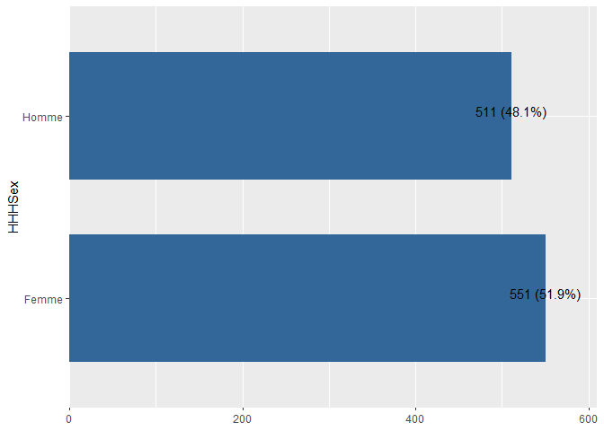<!-- -->

```r
#View labels
expss::val_lab(Chad_ea_2021$HHHSex)
Chad_ea_2021 %>% 
  plot_frq(coord.flip =T,HHHSex)
```

<!-- -->

```r
Chad_ea_2021$HHHSex<-dplyr::recode(Chad_ea_2021$HHHSex, `1` = 0L, .default = 1L, .combine_value_labels = TRUE)

#Check labels
expss::val_lab(Chad_ea_2021$HHHSex)
Chad_ea_2021 %>% 
  plot_frq(coord.flip =T,HHHSex)
```

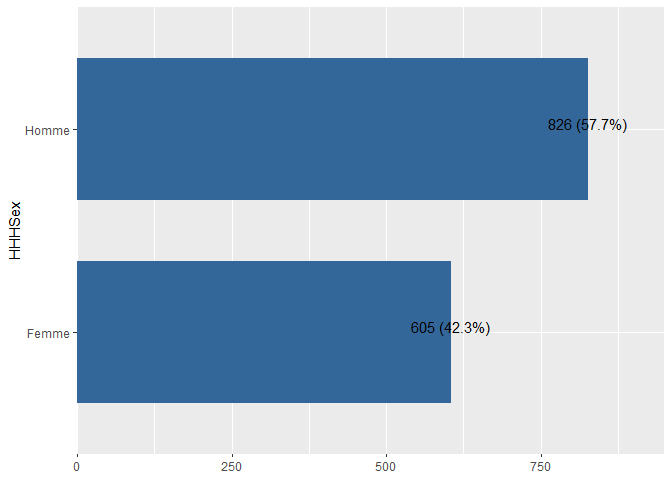<!-- -->

```r
#View labels
expss::val_lab(Chad_ea_2022$HHHSex)
Chad_ea_2022 %>% 
  plot_frq(coord.flip =T,HHHSex)
```

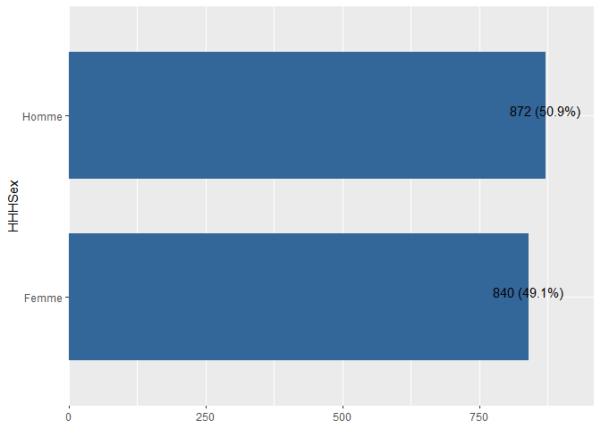<!-- -->

```r
Chad_ea_2022$HHHSex<-dplyr::recode(Chad_ea_2022$HHHSex, `1` = 0L, .default = 1L, .combine_value_labels = TRUE)
#Check labels
expss::val_lab(Chad_ea_2022$HHHSex)
Chad_ea_2022 %>% 
  plot_frq(coord.flip =T,HHHSex)
```

<!-- -->

```r
#View labels
expss::val_lab(Chad_pdm_2020$HHHSex)
Chad_pdm_2020 %>% 
  plot_frq(coord.flip =T,HHHSex)
```

<!-- -->

```r
Chad_pdm_2020$HHHSex<-dplyr::recode(Chad_pdm_2020$HHHSex, `2` = 0L, .default = 1L, .combine_value_labels = TRUE)
Chad_pdm_2020$HHHSex <- labelled::labelled(Chad_pdm_2020$HHHSex, c(Femme = 0, Homme = 1))
#Check labels
expss::val_lab(Chad_pdm_2020$HHHSex)
Chad_pdm_2020 %>% 
  plot_frq(coord.flip =T,HHHSex)
```

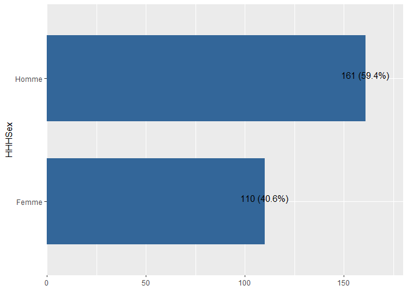<!-- -->

```r
#View labels
expss::val_lab(Chad_pdm_2021$HHHSex)
Chad_pdm_2021 %>% 
  plot_frq(coord.flip =T,HHHSex)
```

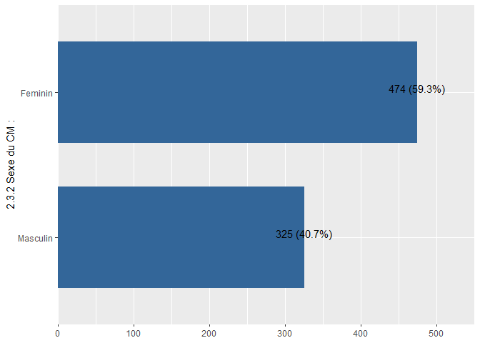<!-- -->

```r
Chad_pdm_2021$HHHSex<-dplyr::recode(Chad_pdm_2021$HHHSex, `2` = 0L, .default = 1L, .combine_value_labels = TRUE)
Chad_pdm_2021$HHHSex <- labelled::labelled(Chad_pdm_2021$HHHSex, c(Femme = 0, Homme = 1))

#Check labels
expss::val_lab(Chad_pdm_2021$HHHSex)
Chad_pdm_2021 %>% 
  plot_frq(coord.flip =T,HHHSex)
```

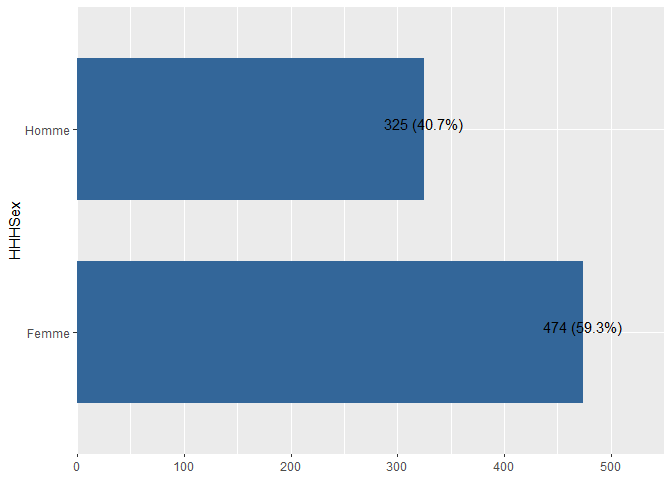<!-- -->

```r
#View labels
expss::val_lab(Chad_pdm_2022$HHHSex)
Chad_pdm_2022 %>% 
  plot_frq(coord.flip =T,HHHSex)
```

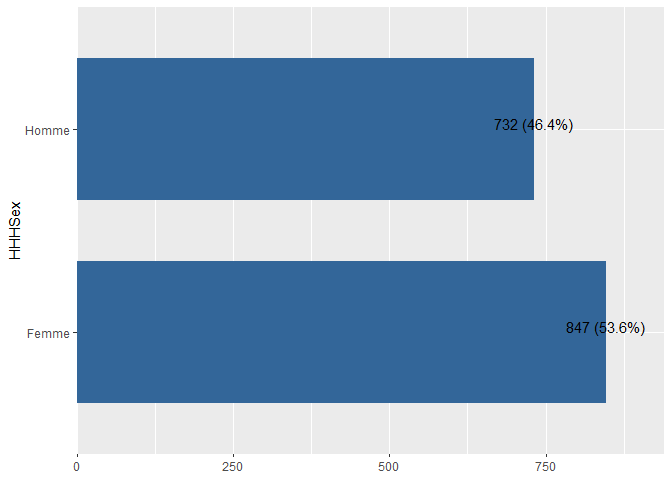<!-- -->

```r
Chad_pdm_2022$HHHSex<-dplyr::recode(Chad_pdm_2022$HHHSex, `2` = 1L, .default = 0L, .combine_value_labels = TRUE)
#Check labels
expss::val_lab(Chad_pdm_2022$HHHSex)
Chad_pdm_2022 %>% 
  plot_frq(coord.flip =T,HHHSex)
```

<!-- -->

# HH Age


# Household head education level


```r
expss::val_lab(Chad_baseline_2018$HHHEdu)

Chad_baseline_2018 <- 
  Chad_baseline_2018 %>% dplyr::mutate(HHHEdu = dplyr::recode(HHHEdu,"1"=1,"2"=3,"3"=4,"4"=4,"5"=5))
Chad_baseline_2018$HHHEdu <- labelled::labelled(Chad_baseline_2018$HHHEdu, c(Aucune = 1, `Alphabétisé ou Coranique` = 2, Primaire= 3,Secondaire=4, Superieur=5))
#check labels
expss::val_lab(Chad_baseline_2018$HHHEdu)
Chad_baseline_2018 %>% 
  plot_frq(coord.flip =T,HHHEdu)
```

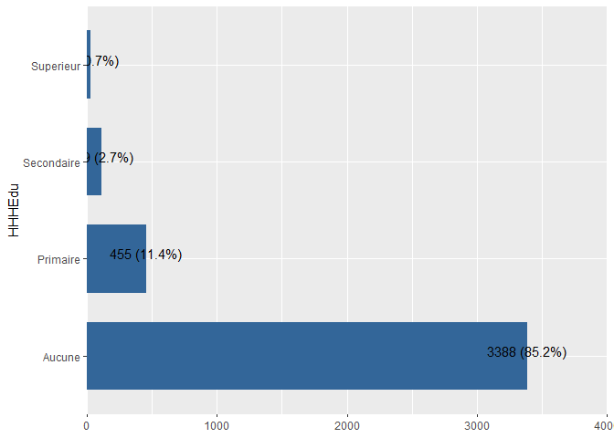<!-- -->

```r
##
expss::val_lab(Chad_ea_2019$HHHEdu)
Chad_ea_2019 <- Chad_ea_2019 %>% 
  dplyr::mutate(HHHEdu = case_when(
    HHHEdu == "Aucune Instruction" ~ "1",
    HHHEdu == "Coranique" ~ "2",
    HHHEdu == "Primaire" ~ "3",
    HHHEdu == "Secondaire" ~ "4",
    HHHEdu ==  "Supérieur" ~ "5",
    .default = NA
  ))
Chad_ea_2019 <- 
  Chad_ea_2019 %>% dplyr::mutate(HHHEdu = dplyr::recode(HHHEdu,"1"=1,"2"=2,"3"=3,"4"=4,"5"=5))
Chad_ea_2019$HHHEdu <- labelled::labelled(Chad_ea_2019$HHHEdu, c(Aucune = 1, `Alphabétisé ou Coranique` = 2, Primaire= 3,Secondaire=4, Superieur=5))
expss::val_lab(Chad_ea_2019$HHHEdu)

expss::val_lab(Chad_ea_2020$HHHEdu)
Chad_ea_2020 <- 
  Chad_ea_2020 %>% dplyr::mutate(HHHEdu = dplyr::recode(HHHEdu,"1"=1,"2"=2,"3"=3,"4"=4,"5"=5))
Chad_ea_2020$HHHEdu <- labelled::labelled(Chad_ea_2020$HHHEdu, c(Aucune = 1, `Alphabétisé ou Coranique` = 2, Primaire= 3,Secondaire=4, Superieur=5))
expss::val_lab(Chad_ea_2020$HHHEdu)
##
expss::val_lab(Chad_ea_2021$HHHEdu)
Chad_ea_2021 <- 
  Chad_ea_2021 %>% dplyr::mutate(HHHEdu = dplyr::recode(HHHEdu,"1"=1,"2"=2,"3"=3,"4"=3,"5"=4,"6"=5))
Chad_ea_2021$HHHEdu <- labelled::labelled(Chad_ea_2021$HHHEdu, c(Aucune = 1, `Alphabétisé ou Coranique` = 2, Primaire= 3,Secondaire=4, Superieur=5))
expss::val_lab(Chad_ea_2021$HHHEdu)
##
expss::val_lab(Chad_ea_2022$HHHEdu)
Chad_ea_2022 <- 
  Chad_ea_2022 %>% dplyr::mutate(HHHEdu = dplyr::recode(HHHEdu,"1"=1,"2"=2,"3"=3,"4"=3,"5"=4,"6"=5))
Chad_ea_2022$HHHEdu <- labelled::labelled(Chad_ea_2022$HHHEdu, c(Aucune = 1, `Alphabétisé ou Coranique` = 2, Primaire= 3,Secondaire=4, Superieur=5))
expss::val_lab(Chad_ea_2022$HHHEdu)
##
expss::val_lab(Chad_pdm_2020$HHHEdu)


expss::val_lab(Chad_pdm_2021$HHHEdu)
Chad_pdm_2021 <- 
  Chad_pdm_2021 %>% dplyr::mutate(HHHEdu = dplyr::recode(HHHEdu,"1"=1,"2"=2,"3"=3,"4"=4,"5"=5))
Chad_pdm_2021$HHHEdu <- labelled::labelled(Chad_pdm_2021$HHHEdu, c(Aucune = 1, `Alphabétisé ou Coranique` = 2, Primaire= 3,Secondaire=4, Superieur=5))
expss::val_lab(Chad_pdm_2021$HHHEdu)
##
expss::val_lab(Chad_pdm_2022$HHHEdu)
Chad_pdm_2022 <- 
  Chad_pdm_2022 %>% dplyr::mutate(HHHEdu = dplyr::recode(HHHEdu,"1"=1,"2"=2,"3"=3,"4"=3,"5"=4,"6"=5))
Chad_pdm_2022$HHHEdu <- labelled::labelled(Chad_pdm_2022$HHHEdu, c(Aucune = 1, `Alphabétisé ou Coranique` = 2, Primaire= 3,Secondaire=4, Superieur=5))
expss::val_lab(Chad_pdm_2022$HHHEdu)
```


# HHHMainActivity


```r
expss::val_lab(Chad_baseline_2018$HHHMainActivity)
Chad_baseline_2018 %>% 
  plot_frq(coord.flip =T,HHHMainActivity)
```

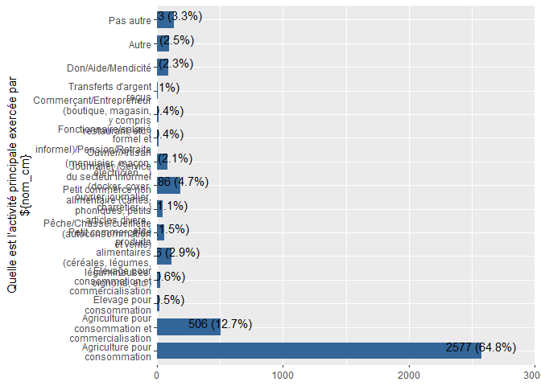<!-- -->

```r
Chad_baseline_2018 %>%
  dplyr::mutate(HHHMainActivity=
                  dplyr::recode(HHHMainActivity,"1"=1,"2"=2,"3"=3,"4"=4,"5"=5,"6"=6,"7"=7,"8"=8,"9"=9,"10"=10,"11"=11,"12"=12, "13"=13,"14"=14,"15"=15))
labels <- c(
  "Agriculture pour consommation",
  "Agriculture pour consommation et commercialisation",
  "Élevage pour consommation",
  "Élevage pour consommation et commercialisation",
  "Petit commerce de produits alimentaires (céréales, légumes, légumineuses, oignons, etc.)",
  "Pêche/Chasse/cueillette (autoconsommation et vente)",
  "Petit commerce non alimentaire (cartes, phoniques, petits articles divers, etc.)",
  "Journalier /Service du secteur informel (docker, coxer, ouvrier journalier, charretier…)",
  "Ouvrier/Artisan (menuisier, maçon, électricien…)",
  "Fonctionnaire/salarié formel et informel)/Pension/Retraite",
  "Commerçant/Entrepreneur (boutique, magasin, y compris restaurant, etc.)",
  "Transferts d'argent reçus",
  "Don/Aide/Mendicité",
  "Autre",
  "Pas autre"
)
Chad_baseline_2018$HHHMainActivity <- factor(Chad_baseline_2018$HHHMainActivity,
                                               levels = 1:15,
                                               labels = labels)

#check
expss::val_lab(Chad_baseline_2018$HHHMainActivity)
Chad_baseline_2018 %>% 
  plot_frq(coord.flip =T,HHHMainActivity)
```

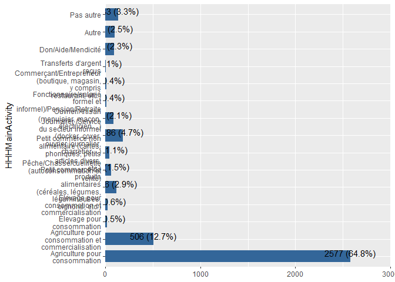<!-- -->

```r
expss::val_lab(Chad_ea_2019$HHHMainActivity)
expss::val_lab(Chad_ea_2020$HHHMainActivity)
Chad_ea_2020 %>% 
  plot_frq(coord.flip =T,HHHMainActivity)
```

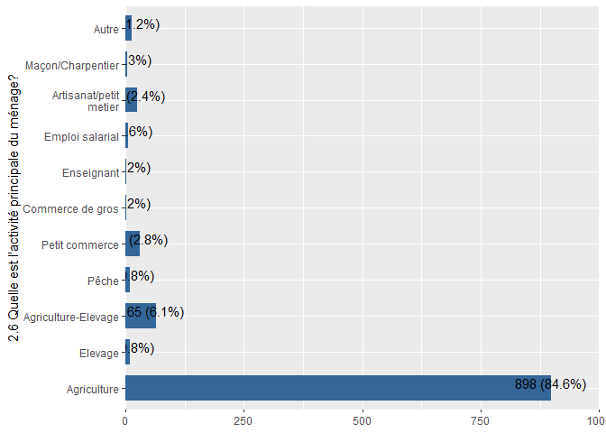<!-- -->

```r
expss::val_lab(Chad_ea_2021$HHHMainActivity)
expss::val_lab(Chad_ea_2022$HHHMainActivity)
expss::val_lab(Chad_pdm_2020$HHHMainActivity)
expss::val_lab(Chad_pdm_2021$HHHMainActivity)
expss::val_lab(Chad_pdm_2022$HHHMainActivity)
```


# HHHMatrimonial


```r
# Monogame    Polygame     Divorcé(e)   Veuf/Veuve    Célibataire 
#   1           2           3              4           5 
expss::val_lab(Chad_baseline_2018$HHHMatrimonial)
Chad_baseline_2018 <- 
  Chad_baseline_2018 %>% dplyr::mutate(HHHMatrimonial = dplyr::recode(HHHMatrimonial,"1"=1,"2"=2,"3"=5,"4"=5,"5"=4,"6"=3, "7"=3))
Chad_baseline_2018$HHHMatrimonial <- labelled::labelled(Chad_baseline_2018$HHHMatrimonial, c(Monogame = 1, Polygame = 2, `Divorcé(e)`= 3,`Veuf/Veuve`=4, `Célibataire`=5))
expss::val_lab(Chad_baseline_2018$HHHMatrimonial)

expss::val_lab(Chad_ea_2019$HHHMatrimonial)
Chad_ea_2019 <- Chad_ea_2019 %>% 
  dplyr::mutate(HHHMatrimonial = case_when(
    HHHMatrimonial == "Monogame" ~ "1",
    HHHMatrimonial == "Polygame" ~ "2",
    HHHMatrimonial == "Divorcé" ~ "3",
    HHHMatrimonial == "Veuf" ~ "4",
    HHHMatrimonial ==  "Célibataire" ~ "5",
    .default = NA
  ))
Chad_ea_2019 <- 
  Chad_ea_2019 %>% dplyr::mutate(HHHMatrimonial = dplyr::recode(HHHMatrimonial,"1"=1,"2"=2,"3"=5,"4"=5,"5"=4,"6"=3, "7"=3))
Chad_ea_2019$HHHMatrimonial <- labelled::labelled(Chad_ea_2019$HHHMatrimonial, c(Monogame = 1, Polygame = 2, `Divorcé(e)`= 3,`Veuf/Veuve`=4, `Célibataire`=5))
expss::val_lab(Chad_ea_2019$HHHMatrimonial)

expss::val_lab(Chad_ea_2020$HHHMatrimonial)
Chad_ea_2020$HHHMatrimonial <- labelled::labelled(Chad_ea_2020$HHHMatrimonial, c(Monogame = 1, Polygame = 2, `Divorcé(e)`= 3,`Veuf/Veuve`=4, `Célibataire`=5))
expss::val_lab(Chad_ea_2020$HHHMatrimonial)


expss::val_lab(Chad_ea_2021$HHHMatrimonial)


expss::val_lab(Chad_ea_2022$HHHMatrimonial)

expss::val_lab(Chad_pdm_2020$HHHMatrimonial)

expss::val_lab(Chad_pdm_2021$HHHMatrimonial)
Chad_pdm_2021$HHHMatrimonial <- labelled::labelled(Chad_pdm_2021$HHHMatrimonial, c(Monogame = 1, Polygame = 2, `Divorcé(e)`= 3,`Veuf/Veuve`=4, `Célibataire`=5))
expss::val_lab(Chad_pdm_2021$HHHMatrimonial)
expss::val_lab(Chad_pdm_2022$HHHMatrimonial)
```


# HHSourceIncome


```r
expss::val_lab(Chad_baseline_2018$HHSourceIncome)
expss::val_lab(Chad_ea_2019$HHSourceIncome)
expss::val_lab(Chad_ea_2020$HHSourceIncome)
expss::val_lab(Chad_ea_2021$HHSourceIncome)
expss::val_lab(Chad_ea_2022$HHSourceIncome)
expss::val_lab(Chad_pdm_2020$HHSourceIncome)
expss::val_lab(Chad_pdm_2021$HHSourceIncome)
expss::val_lab(Chad_pdm_2022$HHSourceIncome)
```


```r
Chad_baseline_2018 %>% 
  plot_frq(coord.flip =T,HHSourceIncome)
```

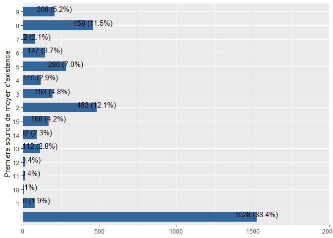<!-- -->

```r
Chad_baseline_2018 <- 
  Chad_baseline_2018 %>%
  dplyr::mutate(
    HHSourceIncome = as.character(HHSourceIncome),
    HHSourceIncome = dplyr::case_when(
      HHSourceIncome == "0" ~ NA_character_,
      TRUE ~ as.factor(HHSourceIncome)
    )
  )
#describe(Chad_baseline_2018$HHSourceIncome)

Chad_baseline_2018 <- Chad_baseline_2018 %>% 
  dplyr::mutate(HHSourceIncome = dplyr::case_when(
    HHSourceIncome == "1" ~ 1,
    HHSourceIncome == "2" ~ 2,
    HHSourceIncome == "3" ~ 3,
    HHSourceIncome == "4" ~ 4,
    HHSourceIncome == "5" ~ 5,
    HHSourceIncome == "6" ~ 6,
    HHSourceIncome == "7" ~ 7, 
    HHSourceIncome == "8"~ 8,
    HHSourceIncome == "9" ~ 9,
    HHSourceIncome == "10" ~ 10, 
    HHSourceIncome == "11" ~ 11,
    HHSourceIncome == "12" ~ 12,
    HHSourceIncome == "13" ~ 13,
    HHSourceIncome == "14" ~ 14,
    HHSourceIncome == "15" ~ 15,
    .default = NA
  )
)


labels <- c(
  "Agriculture vivrière/ou de rente (hors maraîchage)", 
  "Élevage",
  "Vente des produits maraîchers",
  "Vente d'animaux ou de produits d'élevage (lait, fromage, œufs, …)",
  "Vente de produits de la pêche",
  "Vente de produits de chasse/cueillette",
  "Commerce des produits alimentaires ou animaux non produits par le ménage lui-même",
  "Petit commerce de produits non alimentaires",
  "Artisanat/Petits métiers",
  "Travail journalier",
  "Salarié/Pension",
  "Transport",
  "Aides/dons et transfert d'argent",
  "Travail spécialisé (mécanicien, maçon, tailleur, coiffeur, gros commerce/commerce formel)",
  "Autres"
)

Chad_baseline_2018$HHSourceIncome <- factor(Chad_baseline_2018$HHSourceIncome,
                                      levels = 1:15,
                                      labels = labels)

Chad_baseline_2018 %>% 
  plot_frq(coord.flip =T,HHSourceIncome)
```

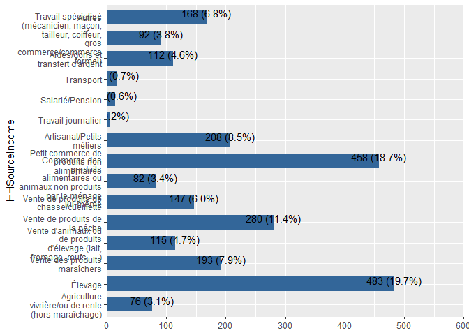<!-- -->

```r
View(Chad_baseline_2018)


'/*Chad_ea_2019'

#expss::val_lab(Chad_ea_2019$HHSourceIncome)
#unique_values <- unique(Chad_ea_2019$HHSourceIncome)
#print(unique_values)

#describe(Chad_ea_2019$HHSourceIncome)
#View(Chad_ea_2019)
Chad_ea_2019 <- Chad_ea_2019 %>% 
  dplyr::mutate(HHSourceIncome = dplyr::case_when(
    HHSourceIncome == "Aides/dons et transfert d'argent" ~ 13,
    HHSourceIncome == "Artisanat/Petits métiers" ~ 9,
    HHSourceIncome == "Autre à  préciser ……………." ~ 15,
    HHSourceIncome == "Commerce des produits alimentaires ou animaux (non produits par le ménage lui-même)" ~ 7,
    HHSourceIncome == "Petit commerce de produits non alimentaires" ~ 8,
    HHSourceIncome == "Vente de produits agricoles produits par le ménage" ~ 1,
    HHSourceIncome == "Vente d'animaux ou produits d'élevage" ~ 4, 
    HHSourceIncome == "Vente de produits de chasse/cueillette"~ 6,
    HHSourceIncome == "Vente de produits de pêche" ~ 5,
    HHSourceIncome == "Vente des produits maraîchers " ~ 3, 
    HHSourceIncome == "Travail journalier" ~ 10,
    HHSourceIncome == "Salaire/Pension" ~ 11,
    .default = NA
  )
)
#describe(Chad_ea_2019$HHSourceIncome)
###recoding
Chad_ea_2019 %>% 
  plot_frq(coord.flip =T,HHSourceIncome)
```

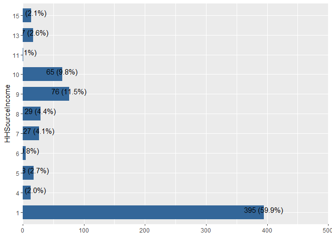<!-- -->

```r
Chad_ea_2019 <- 
  Chad_ea_2019 %>%
  dplyr::mutate(
    HHSourceIncome = as.character(HHSourceIncome),
    HHSourceIncome = dplyr::case_when(
      HHSourceIncome == "0" ~ NA_character_,
      TRUE ~ as.factor(HHSourceIncome)
    )
  )
#describe(Chad_baseline_2018$HHSourceIncome)

Chad_ea_2019 <- Chad_ea_2019 %>% 
  dplyr::mutate(HHSourceIncome = dplyr::case_when(
    HHSourceIncome == "1" ~ 1,
    HHSourceIncome == "2" ~ 2,
    HHSourceIncome == "3" ~ 3,
    HHSourceIncome == "4" ~ 4,
    HHSourceIncome == "5" ~ 5,
    HHSourceIncome == "6" ~ 6,
    HHSourceIncome == "7" ~ 7, 
    HHSourceIncome == "8"~ 8,
    HHSourceIncome == "9" ~ 9,
    HHSourceIncome == "10" ~ 10, 
    HHSourceIncome == "11" ~ 11,
    HHSourceIncome == "12" ~ 12,
    HHSourceIncome == "13" ~ 13,
    HHSourceIncome == "14" ~ 14,
    HHSourceIncome == "15" ~ 15,
    .default = NA
  )
)


labels <- c(
  "Agriculture vivrière/ou de rente (hors maraîchage)", 
  "Élevage",
  "Vente des produits maraîchers",
  "Vente d'animaux ou de produits d'élevage (lait, fromage, œufs, …)",
  "Vente de produits de la pêche",
  "Vente de produits de chasse/cueillette",
  "Commerce des produits alimentaires ou animaux non produits par le ménage lui-même",
  "Petit commerce de produits non alimentaires",
  "Artisanat/Petits métiers",
  "Travail journalier",
  "Salarié/Pension",
  "Transport",
  "Aides/dons et transfert d'argent",
  "Travail spécialisé (mécanicien, maçon, tailleur, coiffeur, gros commerce/commerce formel)",
  "Autres"
)

Chad_ea_2019$HHSourceIncome <- factor(Chad_ea_2019$HHSourceIncome,
                                      levels = 1:15,
                                      labels = labels)

Chad_ea_2019 %>% 
  plot_frq(coord.flip =T,HHSourceIncome)
```

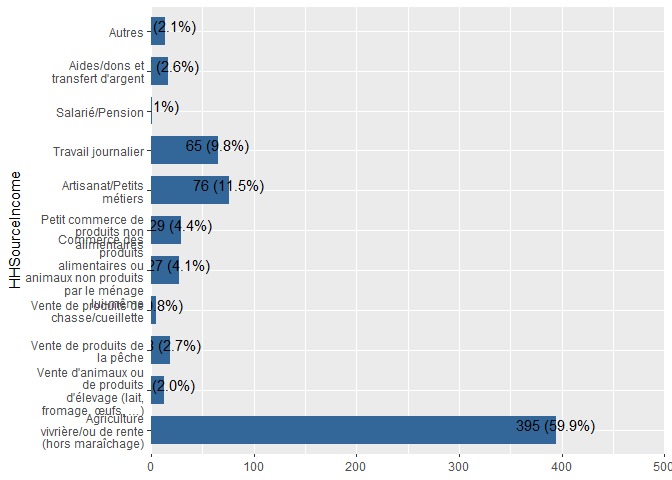<!-- -->

```r
expss::val_lab(Chad_ea_2021$HHSourceIncome)
describe(Chad_ea_2021$HHSourceIncome)
# pas de label

'/* Base Chad_ea_2022*/'

expss::val_lab(Chad_ea_2022$HHSourceIncome)
#View(Chad_ea_2022)

Chad_ea_2022 %>% 
  plot_frq(coord.flip =T,HHSourceIncome)
```

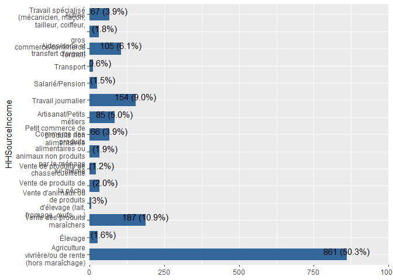<!-- -->

```r
Chad_ea_2022$HHSourceIncome <- as.character(Chad_ea_2022$HHSourceIncome)
 
Chad_ea_2022 <- 
  Chad_ea_2022 %>%
  dplyr::mutate(
    HHSourceIncome = as.character(HHSourceIncome),
    HHSourceIncome = dplyr::case_when(
      HHSourceIncome == "0" ~ NA_character_,
      TRUE ~ as.factor(HHSourceIncome)
    )
  )
describe(Chad_ea_2022$HHSourceIncome)

Chad_ea_2022 <- Chad_ea_2022 %>% 
  dplyr::mutate(HHSourceIncome = dplyr::case_when(
    HHSourceIncome == "1" ~ 1,
    HHSourceIncome == "2" ~ 2,
    HHSourceIncome == "3" ~ 3,
    HHSourceIncome == "4" ~ 4,
    HHSourceIncome == "5" ~ 5,
    HHSourceIncome == "6" ~ 6,
    HHSourceIncome == "7" ~ 7, 
    HHSourceIncome == "8"~ 8,
    HHSourceIncome == "9" ~ 9,
    HHSourceIncome == "10" ~ 10, 
    HHSourceIncome == "11" ~ 11,
    HHSourceIncome == "12" ~ 12,
    HHSourceIncome == "13" ~ 13,
    HHSourceIncome == "14" ~ 14,
    HHSourceIncome == "15" ~ 15,
    .default = NA
  )
)


labels <- c(
  "Agriculture vivrière/ou de rente (hors maraîchage)", 
  "Élevage",
  "Vente des produits maraîchers",
  "Vente d'animaux ou de produits d'élevage (lait, fromage, œufs, …)",
  "Vente de produits de la pêche",
  "Vente de produits de chasse/cueillette",
  "Commerce des produits alimentaires ou animaux non produits par le ménage lui-même",
  "Petit commerce de produits non alimentaires",
  "Artisanat/Petits métiers",
  "Travail journalier",
  "Salarié/Pension",
  "Transport",
  "Aides/dons et transfert d'argent",
  "Travail spécialisé (mécanicien, maçon, tailleur, coiffeur, gros commerce/commerce formel)",
  "Autres"
)

Chad_ea_2022$HHSourceIncome <- factor(Chad_ea_2022$HHSourceIncome,
                                      levels = 1:15,
                                      labels = labels)

Chad_ea_2022 %>% 
  plot_frq(coord.flip =T,HHSourceIncome)
```

<!-- -->

```r
#View(Chad_ea_2022)


'/*base  Chad_ea_2020*/'

expss::val_lab(Chad_ea_2020$HHSourceIncome)

Chad_ea_2020 %>% 
  plot_frq(coord.flip =T,HHSourceIncome)
```

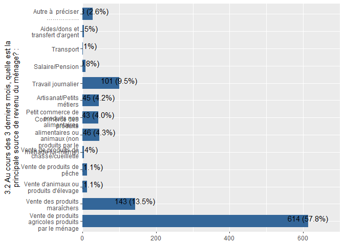<!-- -->

```r
Chad_ea_2020$HHSourceIncome <- as.character(Chad_ea_2020$HHSourceIncome)
 
Chad_ea_2020 <- 
  Chad_ea_2020 %>%
  dplyr::mutate(
    HHSourceIncome = as.character(HHSourceIncome),
    HHSourceIncome = dplyr::case_when(
      HHSourceIncome == "0" ~ NA_character_,
      TRUE ~ as.factor(HHSourceIncome)
   )
)

Chad_ea_2020 <- Chad_ea_2020 %>% 
  dplyr::mutate(HHSourceIncome = dplyr::case_when(
    HHSourceIncome == "1" ~ 1,
    HHSourceIncome == "2" ~ 3,
    HHSourceIncome == "3" ~ 4,
    HHSourceIncome == "4" ~ 5,
    HHSourceIncome == "5" ~ 6,
    HHSourceIncome == "6" ~ 7,
    HHSourceIncome == "7" ~ 8, 
    HHSourceIncome == "8"~ 9,
    HHSourceIncome == "9" ~ 10,
    HHSourceIncome == "10" ~ 11, 
    HHSourceIncome == "11" ~ 12, 
    HHSourceIncome == "12" ~ 13, 
    HHSourceIncome == "13" ~ 15, 
    .default = NA
  )
)

describe(Chad_ea_2020$HHSourceIncome)

library(labelled)

# Define labels
labels <- c(
  "Agriculture vivrière/ou de rente (hors maraîchage)", 
  "Élevage",
  "Vente des produits maraîchers",
  "Vente d'animaux ou de produits d'élevage (lait, fromage, œufs, …)",
  "Vente de produits de la pêche",
  "Vente de produits de chasse/cueillette",
  "Commerce des produits alimentaires ou animaux non produits par le ménage lui-même",
  "Petit commerce de produits non alimentaires",
  "Artisanat/Petits métiers",
  "Travail journalier",
  "Salarié/Pension",
  "Transport",
  "Aides/dons et transfert d'argent",
  "Travail spécialisé (mécanicien, maçon, tailleur, coiffeur, gros commerce/commerce formel)",
  "Autres"
)

# Apply labels using factor function
Chad_ea_2020$HHSourceIncome <- factor(Chad_ea_2020$HHSourceIncome,
                                               levels = 1:15,
                                               labels = labels)


Chad_ea_2020 %>% 
  plot_frq(coord.flip =T,HHSourceIncome)
```

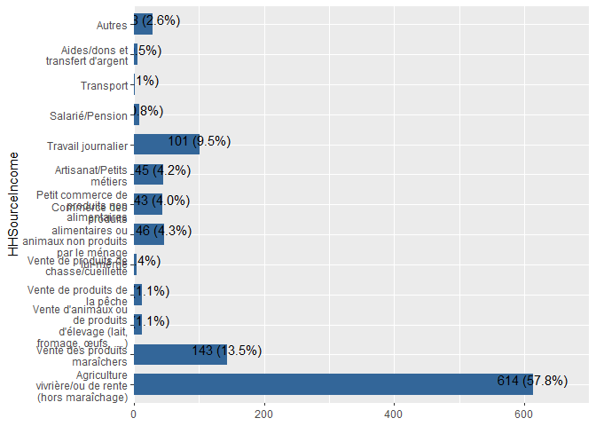<!-- -->

```r
#View(Chad_ea_2020)


'/*base  Chad_pdm_2021*/'

expss::val_lab(Chad_pdm_2021$HHSourceIncome)

Chad_pdm_2021 %>% 
  plot_frq(coord.flip =T,HHSourceIncome)
```

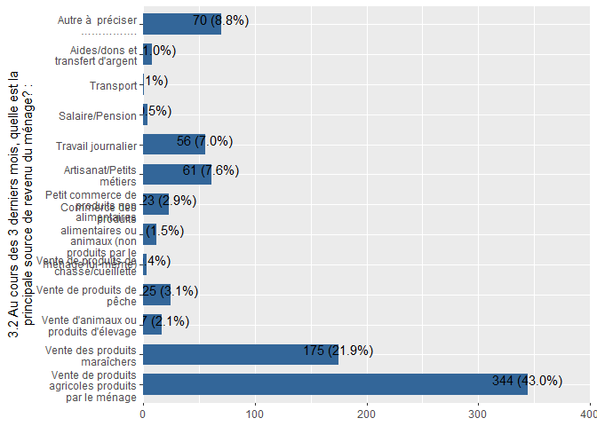<!-- -->

```r
Chad_pdm_2021$HHSourceIncome <- as.character(Chad_pdm_2021$HHSourceIncome)
 
Chad_pdm_2021 <- 
  Chad_pdm_2021 %>%
  dplyr::mutate(
    HHSourceIncome = as.character(HHSourceIncome),
    HHSourceIncome = dplyr::case_when(
      HHSourceIncome == "0" ~ NA_character_,
      TRUE ~ as.factor(HHSourceIncome)
   )
)

Chad_pdm_2021 <- Chad_pdm_2021 %>% 
  dplyr::mutate(HHSourceIncome = dplyr::case_when(
    HHSourceIncome == "1" ~ 1,
    HHSourceIncome == "2" ~ 3,
    HHSourceIncome == "3" ~ 4,
    HHSourceIncome == "4" ~ 5,
    HHSourceIncome == "5" ~ 6,
    HHSourceIncome == "6" ~ 7,
    HHSourceIncome == "7" ~ 8, 
    HHSourceIncome == "8"~ 9,
    HHSourceIncome == "9" ~ 10,
    HHSourceIncome == "10" ~ 11, 
    HHSourceIncome == "11" ~ 12, 
    HHSourceIncome == "12" ~ 13, 
    HHSourceIncome == "13" ~ 15, 
    .default = NA
  )
)

describe(Chad_pdm_2021$HHSourceIncome)

library(labelled)

# Define labels
labels <- c(
  "Agriculture vivrière/ou de rente (hors maraîchage)", 
  "Élevage",
  "Vente des produits maraîchers",
  "Vente d'animaux ou de produits d'élevage (lait, fromage, œufs, …)",
  "Vente de produits de la pêche",
  "Vente de produits de chasse/cueillette",
  "Commerce des produits alimentaires ou animaux non produits par le ménage lui-même",
  "Petit commerce de produits non alimentaires",
  "Artisanat/Petits métiers",
  "Travail journalier",
  "Salarié/Pension",
  "Transport",
  "Aides/dons et transfert d'argent",
  "Travail spécialisé (mécanicien, maçon, tailleur, coiffeur, gros commerce/commerce formel)",
  "Autres"
)

# Apply labels using factor function
Chad_pdm_2021$HHSourceIncome <- factor(Chad_pdm_2021$HHSourceIncome, levels = 1:15,
                                               labels = labels)


Chad_pdm_2021 %>% 
  plot_frq(coord.flip =T,HHSourceIncome)
```

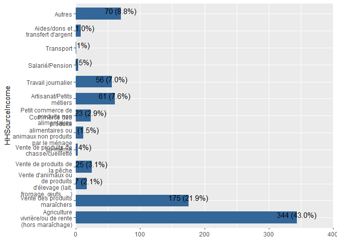<!-- -->

```r
View(Chad_pdm_2021)

#View(Chad_pdm_2021)


'/*base  Chad_pdm_2020*/'

expss::val_lab(Chad_pdm_2020$HHSourceIncome) 
summary(Chad_pdm_2020$HHSourceIncome)# valeurs manquantes pas observation

'/*base  Chad_pdm_2022*/'

expss::val_lab(Chad_pdm_2022$HHSourceIncome)
summary(Chad_pdm_2022$HHSourceIncome) # valeur manquantes 
```


# Merging all data


```r
Chad_baseline_2018 <- labelled::to_factor(Chad_baseline_2018)
Chad_ea_2019 <- labelled::to_factor(Chad_ea_2019)
Chad_ea_2020 <- labelled::to_factor(Chad_ea_2020)
Chad_ea_2021 <- labelled::to_factor(Chad_ea_2021)
Chad_ea_2022 <- labelled::to_factor(Chad_ea_2022)
Chad_ea_2023 <- labelled::to_factor(Chad_ea_2023)
Chad_pdm_2020 <- labelled::to_factor(Chad_pdm_2020)
Chad_pdm_2021 <- labelled::to_factor(Chad_pdm_2021)
Chad_pdm_2022 <- labelled::to_factor(Chad_pdm_2022)
Chad_pdm_2023 <- labelled::to_factor(Chad_pdm_2023)
WFP_Chad<-plyr::rbind.fill(Chad_baseline_2018,
                           Chad_ea_2019,
                           Chad_ea_2020,
                           Chad_ea_2021,
                           Chad_ea_2022,
                           Chad_ea_2023,
                           Chad_pdm_2020,
                           Chad_pdm_2021,
                           Chad_pdm_2022,
                           Chad_pdm_2023)
```


```r
labels_act <- c(
  "Agriculture pour consommation",
  "Agriculture pour consommation et commercialisation",
  "Élevage pour consommation",
  "Élevage pour consommation et commercialisation",
  "Petit commerce de produits alimentaires (céréales, légumes, légumineuses, oignons, etc.)",
  "Pêche/Chasse/cueillette (autoconsommation et vente)",
  "Petit commerce non alimentaire (cartes, phoniques, petits articles divers, etc.)",
  "Journalier /Service du secteur informel (docker, coxer, ouvrier journalier, charretier…)",
  "Ouvrier/Artisan (menuisier, maçon, électricien…)",
  "Fonctionnaire/salarié formel et informel)/Pension/Retraite",
  "Commerçant/Entrepreneur (boutique, magasin, y compris restaurant, etc.)",
  "Transferts d'argent reçus",
  "Don/Aide/Mendicité",
  "Autre"
)

WFP_Chad <- WFP_Chad %>% 
  dplyr::mutate(HHHMainActivity = dplyr::case_when(
    HHHMainActivity == "Agriculture pour consommation" ~ 1,
    HHHMainActivity == "Agriculture pour consommation et commercialisation" ~ 2,
    HHHMainActivity == "Élevage pour consommation" ~ 3,
    HHHMainActivity == "Élevage pour consommation et commercialisation" ~ 4,
    HHHMainActivity == "Petit commerce de produits alimentaires (céréales, légumes, légumineuses, oignons, etc.)" ~ 5,
    HHHMainActivity == "Pêche/Chasse/cueillette (autoconsommation et vente)" ~ 6,
    HHHMainActivity == "Petit commerce non alimentaire (cartes, phoniques, petits articles divers, etc.)" ~ 7, 
    HHHMainActivity == "Journalier /Service du secteur informel (docker, coxer, ouvrier journalier, charretier…)"~ 8,
    HHHMainActivity == "Ouvrier/Artisan (menuisier, maçon, électricien…)" ~ 9,
    HHHMainActivity == "Fonctionnaire/salarié formel et informel)/Pension/Retraite" ~ 10, 
    HHHMainActivity == "Commerçant/Entrepreneur (boutique, magasin, y compris restaurant, etc.)" ~ 11,
    HHHMainActivity == "Transferts d'argent reçus" ~ 12,
    HHHMainActivity == "Don/Aide/Mendicité" ~ 13,
    HHHMainActivity == "Autre" ~ 14,
    #HHHMainActivity == "Pas autre" ~ 15,
    .default = NA
  )
  )

WFP_Chad$HHHMainActivity <- factor(WFP_Chad$HHHMainActivity,
                                   levels = 1:14,
                                   labels = labels_act)


WFP_Chad <- WFP_Chad %>% 
  dplyr::mutate(HHHEdu = case_when(
    HHHEdu == "Aucune" ~ "1",
    HHHEdu == "Alphabétisé ou Coranique" ~ "2",
    HHHEdu == "Primaire" ~ "3",
    HHHEdu == "Secondaire" ~ "4",
    HHHEdu ==  "Supérieur" ~ "5",
    .default = NA
  ))
WFP_Chad <- 
  WFP_Chad %>% dplyr::mutate(HHHEdu = dplyr::recode(HHHEdu,"1"=1,"2"=2,"3"=3,"4"=4,"5"=5))
WFP_Chad$HHHEdu <- labelled::labelled(WFP_Chad$HHHEdu, c(Aucune = 1, `Alphabétisé ou Coranique` = 2, Primaire= 3,Secondaire=4, Superieur=5))


# Monogame    Polygame     Divorcé(e)   Veuf/Veuve    Célibataire 
#   1           2           3              4           5 
WFP_Chad <- WFP_Chad %>% 
  dplyr::mutate(HHHMatrimonial = case_when(
    HHHMatrimonial == "Monogame" ~ "1",
    HHHMatrimonial == "Polygame" ~ "2",
    HHHMatrimonial == "Divorcé(e)" ~ "3",
    HHHMatrimonial == "Veuf/Veuve" ~ "4",
    HHHMatrimonial ==  "Célibataire" ~ "5",
    .default = NA
  ))
WFP_Chad <- 
  WFP_Chad %>% dplyr::mutate(HHHMatrimonial = dplyr::recode(HHHMatrimonial,"1"=1,"2"=2,"3"=3,"4"=4,"5"=5))
WFP_Chad$HHHMatrimonial <- labelled::labelled(WFP_Chad$HHHMatrimonial, c(Monogame = 1, Polygame = 2, `Divorcé(e)`= 3,`Veuf/Veuve`=4, `Célibataire`=5))


#WFP_Chad$HHSourceIncome
WFP_Chad <- WFP_Chad %>% 
  dplyr::mutate(HHSourceIncome = dplyr::case_when(
    HHSourceIncome == "Agriculture vivrière/ou de rente (hors maraîchage)" ~ "1",
    HHSourceIncome == "Élevage" ~ "2",
    HHSourceIncome == "Vente des produits maraîchers" ~ "3",
    HHSourceIncome == "Vente d'animaux ou de produits d'élevage (lait, fromage, œufs, …)" ~ "4",
    HHSourceIncome == "Vente de produits de la pêche" ~ "5",
    HHSourceIncome == "Vente de produits de chasse/cueillette" ~ "6",
    HHSourceIncome == "Commerce des produits alimentaires ou animaux non produits par le ménage lui-même" ~ "7", 
    HHSourceIncome == "Petit commerce de produits non alimentaires"~ "8",
    HHSourceIncome == "Artisanat/Petits métiers" ~ "9",
    HHSourceIncome == "Travail journalier" ~ "10", 
    HHSourceIncome == "Salarié/Pension" ~ "11",
    HHSourceIncome == "Transport" ~ "12",
    HHSourceIncome == "Aides/dons et transfert d'argent" ~ "13",
    HHSourceIncome == "Travail spécialisé (mécanicien, maçon, tailleur, coiffeur, gros commerce/commerce formel)" ~ "14",
    HHSourceIncome == "Autres" ~ "15",
    .default = NA
  )
  )
WFP_Chad <- 
  WFP_Chad %>% dplyr::mutate(HHSourceIncome = dplyr::recode(HHSourceIncome,"1"=1,"2"=2,"3"=3,"4"=4,"5"=5,"6"=6,"7"=7,"8"=8,"9"=9,"10"=10,"11"=11,"12"=12,"13"=13,"14"=14,"15"=15))
WFP_Chad$HHSourceIncome <- labelled::labelled(WFP_Chad$HHSourceIncome, c(`Agriculture vivrière/ou de rente (hors maraîchage)` = 1, `Élevage` = 2, `Vente des produits maraîchers`= 3,`Vente d'animaux ou de produits d'élevage (lait, fromage, œufs, …)`=4,`Vente de produits de la pêche`=5,`Vente de produits de chasse/cueillette`=6,`Commerce des produits alimentaires ou animaux non produits par le ménage lui-même`=7,`Petit commerce de produits non alimentaires`=8,`Artisanat/Petits métiers`=9,`Travail journalier`=10,`Salarié/Pension`=11,`Transport`=12,`Aides/dons et transfert d'argent`=13,`Travail spécialisé (mécanicien, maçon, tailleur, coiffeur, gros commerce/commerce formel)`=14,`Autres`=15))
# WFP_Chad$HHHSex <- labelled::labelled(WFP_Chad$HHHSex, c(Femme = 0, Homme = 1))
```


# Compute household size variable


```r
hhsize_var = WFP_Chad  %>% dplyr::select(starts_with("HHSize")) %>% names()

hhsize_var = hhsize_var[hhsize_var != "HHSize"]

WFP_Chad = WFP_Chad %>% dplyr::mutate(HHSize = ifelse(is.na(HHSize),
                            rowSums(across(hhsize_var), na.rm=TRUE),
                            HHSize))
WFP_Chad$HHSize<-as.numeric(WFP_Chad$HHSize)
WFP_Chad$RESPAge<-as.numeric(WFP_Chad$RESPAge)

# WFP_Chad <- WFP_Chad %>%
#   mutate(across(HHHSex, ~ifelse(is.na(.),NA,ifelse(.==2, 1, 0))))
# 
# 
# # Labels mapping
# label_map <- c(
#   Femme = 0,
#   Homme = 1
# )
# 
# # Apply labels using mutate() and across()
# WFP_Chad <- WFP_Chad %>%
#   mutate(across(HHHSex,
#                 ~ labelled::labelled(., label_map)))
```


```r
key_vars = c("ID")
```


```r
var_needed = c(
             "HHHSex",
             "HHHAge",
             "HHHEdu",
             "HHHMainActivity",
             "HHHMatrimonial",
             "HHSourceIncome",
             "HHSize",
             hhsize_var)
```


```r
WFP_Chad_HH = WFP_Chad %>% dplyr::select(key_vars,var_needed)
```


```r
haven::write_dta(WFP_Chad_HH,paste0(dir_output_data,"/","WFP_Chad_HH.dta"))
```


# Export all data


