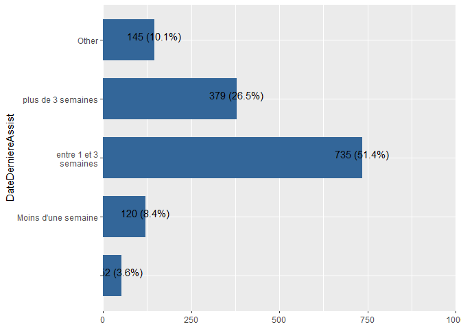
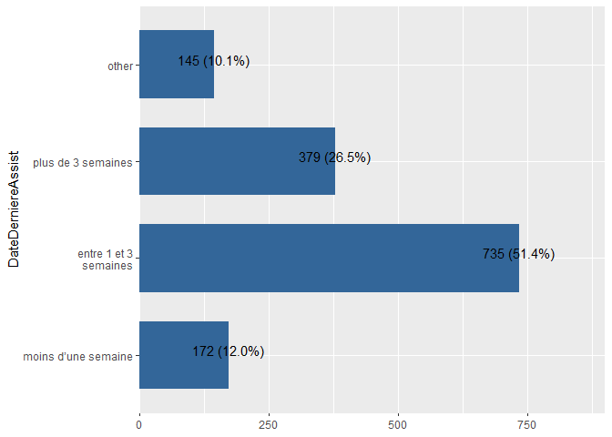
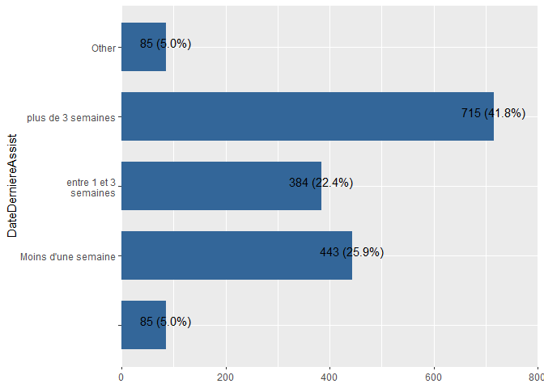
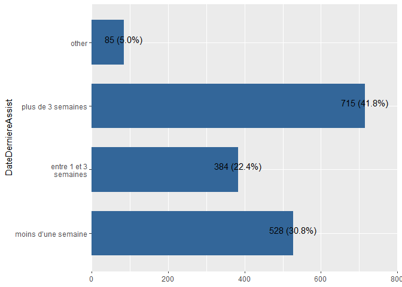
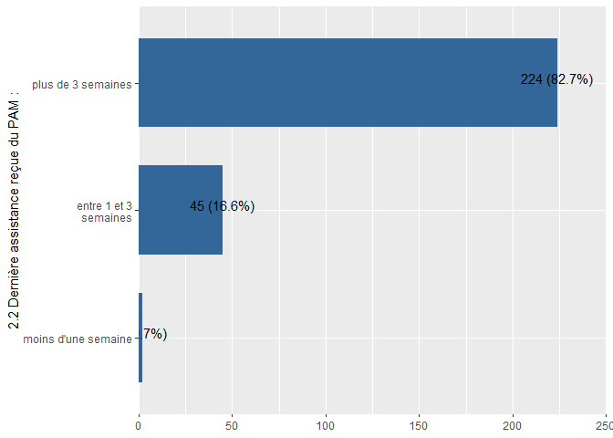
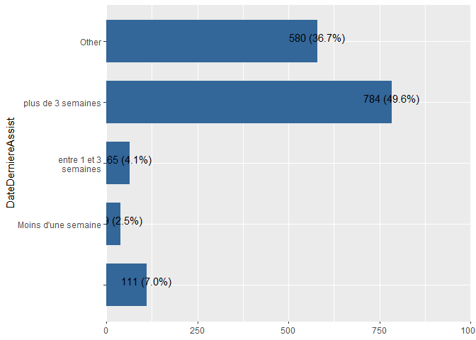
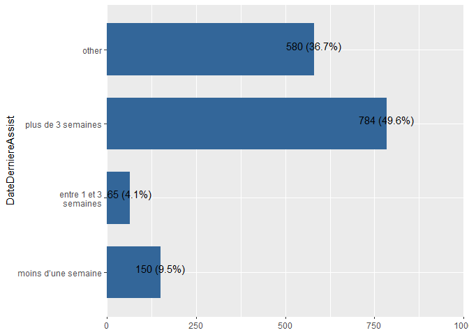
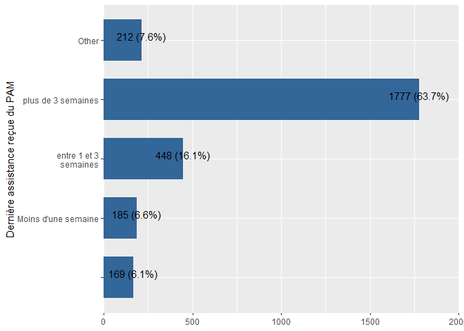
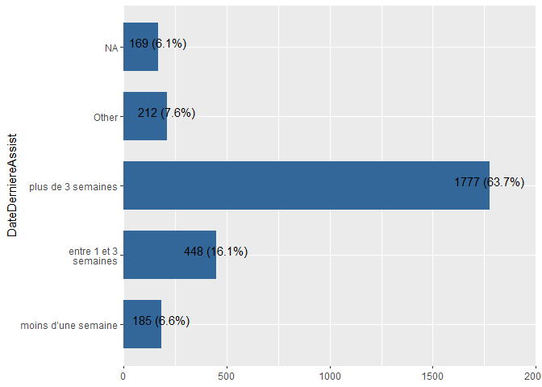
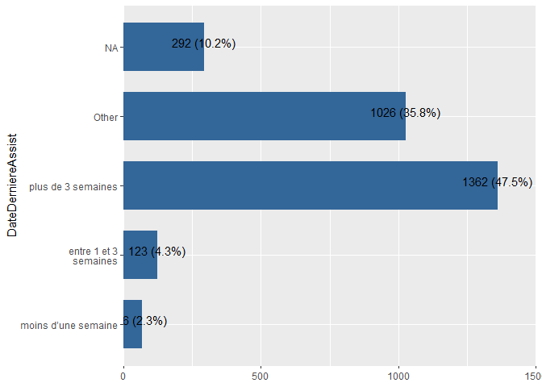

```r
library(haven)
library(labelled) # for general functions to work with labelled data
library(tidyverse) # general wrangling
library(dplyr)
library(Hmisc)
library(gtsummary) # to demonstrate automatic use of variable labels in summary tables
library(readxl)
library(foreign)
library(sjPlot)
library(sjmisc)
library(sjlabelled) # for example efc data set with variable labels
library(stringr)
```


```r
rm(list = ls())
```


```r
dir_input_data = "C:/Users/AHema/OneDrive - CGIAR/Desktop/WFP Resilience dataset/data/input_data/Chad"
dir_output_data = "C:/Users/AHema/OneDrive - CGIAR/Desktop/WFP Resilience dataset/data/output_data/Chad"
```


```r
Chad_Harmonization_variables <- read_excel(paste0(dir_input_data,"/Chad_Harmonization.xlsx"), 
    sheet = "variables_harmonization")
#View(Chad_Harmonization_variables)

Chad_Harmonization_description <- read_excel(paste0(dir_input_data,"/Chad_Harmonization.xlsx"), 
    sheet = "description")
#View(Chad_Harmonization_description)
```


```r
lst_data = Chad_Harmonization_description$Data
lst_test = Chad_Harmonization_description$Name

for(i in 1:length(lst_data)) {                              # Head of for-loop
  assign(lst_test[i],                                   # Read and store data frames
         read_sav(paste0(dir_input_data,"/",lst_data[i])))
}
```


```r
for (j in 1:length(lst_test)){
         df=  get(lst_test[j], envir = .GlobalEnv)
          for (i in 1:nrow(Chad_Harmonization_variables)){
            df[,Chad_Harmonization_variables$NewVariable_Name[i]]=ifelse(is.na(Chad_Harmonization_variables[i,lst_test[j]]),NA,df[,Chad_Harmonization_variables[i,lst_test[j]][[1]]])
          }
    
    df<-df %>% select(Chad_Harmonization_variables$NewVariable_Name)
    assign(lst_test[j],                                   # Read and store data frames
         df)
#write_sav(df, paste0(dir_output_data,"/",lst_test[j],".sav"))
#write_dta(df, paste0(dir_output_data,"/",lst_test[j],".dta"))
    

}
```


```r
Chad_pdm_2022$ID = 1:nrow(Chad_pdm_2022)
```


# Assistance

## Date assistance check


```r
# Chad_baseline_2018$DebutAssistance<-as.Date(Chad_baseline_2018$DebutAssistance) # No assistance

# Chad_ea_2019$DebutAssistance<-as.Date(Chad_ea_2019$DebutAssistance, origin = "1899-12-30")

# Chad_ea_2020 = Chad_ea_2020 %>% 
#   dplyr::mutate(DateDerniereAssist_other = ifelse(DebutAssistance==1,"Bénéficiaire de l'assistance saisonnière de l'année passée (2020)","Non bénéficiaire de l'assistance saisonnière de l'année passée (2020)"))

Chad_ea_2021$DebutAssistance<-as.Date(Chad_ea_2021$DebutAssistance, origin = "1970-01-01")
Chad_ea_2022$DebutAssistance<-as.Date(Chad_ea_2022$DebutAssistance, origin = "1970-01-01")
Chad_pdm_2020$DebutAssistance<-as.Date(Chad_pdm_2020$DebutAssistance)
Chad_pdm_2022$DebutAssistance<-as.Date(Chad_pdm_2022$DebutAssistance, origin = "1970-01-01")

#Chad_ea_2020$DebutAssistance<-as.Date(Chad_ea_2020$DebutAssistance)
#Chad_pdm_2021$DebutAssistance<-as.Date(Chad_pdm_2021$DebutAssistance)
# Chad_ea_2023$DebutAssistance
# Chad_pdm_2023$DebutAssistance
```

## Date last assistance check


```r
#DateDerniereAssist_other


expss::val_lab(Chad_baseline_2018$DateDerniereAssist)
expss::val_lab(Chad_ea_2019$DateDerniereAssist)
expss::val_lab(Chad_ea_2020$DateDerniereAssist)
expss::val_lab(Chad_ea_2021$DateDerniereAssist)
Chad_ea_2021 %>% 
  plot_frq(coord.flip =T,DateDerniereAssist,show.na =T)
```

<!-- -->

```r
Chad_ea_2021 <- 
  Chad_ea_2021 %>% dplyr::mutate_at(c("DateDerniereAssist"),recode,"1"=1,"2"=1,"3"=2,"4"=3)
Chad_ea_2021$DateDerniereAssist <- labelled::labelled(Chad_ea_2021$DateDerniereAssist, c(`moins d’une semaine` = 1, `entre 1 et 3 semaines` = 2,`plus de 3 semaines`=3, `other`=4))
expss::val_lab(Chad_ea_2021$DateDerniereAssist)
Chad_ea_2021 %>% 
  plot_frq(coord.flip =T,DateDerniereAssist,show.na =T)
```

<!-- -->

```r
expss::val_lab(Chad_ea_2022$DateDerniereAssist)
Chad_ea_2022 %>% 
  plot_frq(coord.flip =T,DateDerniereAssist,show.na =T)
```

<!-- -->

```r
Chad_ea_2022 <- 
  Chad_ea_2022 %>% dplyr::mutate_at(c("DateDerniereAssist"),recode,"1"=1,"2"=1,"3"=2,"4"=3)
Chad_ea_2022$DateDerniereAssist <- labelled::labelled(Chad_ea_2022$DateDerniereAssist, c(`moins d’une semaine` = 1, `entre 1 et 3 semaines` = 2,`plus de 3 semaines`=3, `other`=4))
expss::val_lab(Chad_ea_2022$DateDerniereAssist)
Chad_ea_2022 %>% 
  plot_frq(coord.flip =T,DateDerniereAssist,show.na =T)
```

<!-- -->

```r
expss::val_lab(Chad_pdm_2020$DateDerniereAssist)
Chad_pdm_2020 %>% 
  plot_frq(coord.flip =T,DateDerniereAssist,show.na =T)
```

<!-- -->

```r
expss::val_lab(Chad_pdm_2021$DateDerniereAssist)


expss::val_lab(Chad_pdm_2022$DateDerniereAssist)
Chad_pdm_2022 %>% 
  plot_frq(coord.flip =T,DateDerniereAssist,show.na =T)
```

<!-- -->

```r
Chad_pdm_2022 <- 
  Chad_pdm_2022 %>% dplyr::mutate_at(c("DateDerniereAssist"),recode,"1"=1,"2"=1,"3"=2,"4"=3)
Chad_pdm_2022$DateDerniereAssist <- labelled::labelled(Chad_pdm_2022$DateDerniereAssist, c(`moins d’une semaine` = 1, `entre 1 et 3 semaines` = 2,`plus de 3 semaines`=3, `other`=4))
expss::val_lab(Chad_pdm_2022$DateDerniereAssist)
Chad_pdm_2022 %>% 
  plot_frq(coord.flip =T,DateDerniereAssist,show.na =T)
```

<!-- -->

```r
expss::val_lab(Chad_ea_2023$DateDerniereAssist)
Chad_ea_2023 %>% 
  plot_frq(coord.flip =T,DateDerniereAssist,show.na =T)
```

<!-- -->

```r
Chad_ea_2023 <- 
  Chad_ea_2023 %>% dplyr::mutate_at(c("DateDerniereAssist"),recode,"1"=1,"2"=2,"3"=3,"other"=4)

Chad_ea_2023$DateDerniereAssist <- labelled::labelled(Chad_ea_2023$DateDerniereAssist, c(`moins d’une semaine` = 1, `entre 1 et 3 semaines` = 2,`plus de 3 semaines`=3,`Other`=4 ))
expss::val_lab(Chad_ea_2023$DateDerniereAssist)
Chad_ea_2023 %>% 
  plot_frq(coord.flip =T,DateDerniereAssist,show.na =T)
```

<!-- -->

```r
expss::val_lab(Chad_pdm_2023$DateDerniereAssist)

Chad_pdm_2023 <- 
  Chad_pdm_2023 %>% dplyr::mutate_at(c("DateDerniereAssist"),recode,"1"=1,"2"=2,"3"=3,"other"=4)

Chad_pdm_2023$DateDerniereAssist <- labelled::labelled(Chad_pdm_2023$DateDerniereAssist, c(`moins d’une semaine` = 1, `entre 1 et 3 semaines` = 2,`plus de 3 semaines`=3,`Other`=4 ))
expss::val_lab(Chad_pdm_2023$DateDerniereAssist)
Chad_pdm_2023 %>% 
  plot_frq(coord.flip =T,DateDerniereAssist,show.na =T)
```

<!-- -->

## Montant


```r
#Montant
```


## Type d'assistance


```r
var_type_assistance = c("TransfBenef",
"BanqueCerealiere",
"VivreContreTravail",
"ArgentContreTravail",
"DistribVivresSoudure",
"DistribArgentSoudure",
"DistribVivresArgentSoudure",
"BlanketFeedingChildrenWomen",
"BoursesAdo",
"BlanketFeedingChildren",
"BlanketFeedingWomen",
"MAMMASChildrenMAMPLWomen",
"MAMChildren",
"MASChildren",
"MAMPLWomen",
"FARNcommunaut",
"FormationRenfCapacite",
"CashTransfert",
"CantineScolaire",
"CantineScolaireBoursesAdo",
"AutreTransferts"
)
```


### Baseline 2018


### EA 2019


```r
#Chad_ea_2019$ArgentContreTravail
# Chad_ea_2019=Chad_ea_2019 %>% labelled::to_factor() %>% 
#   mutate_at(var_type_assistance, as.character)
Chad_ea_2019 <- Chad_ea_2019 %>% 
  dplyr::mutate(ArgentContreTravail = case_when(
    ArgentContreTravail == "Oui" ~ "1",
    ArgentContreTravail == "Non" ~ "3",
    .default = NA
  ))
Chad_ea_2019 <- 
  Chad_ea_2019 %>% dplyr::mutate(ArgentContreTravail = dplyr::recode(ArgentContreTravail,"1"=1,"2"=2,"3"=3,"4"=4))
Chad_ea_2019$ArgentContreTravail <- labelled::labelled(Chad_ea_2019$ArgentContreTravail, c(`Oui PAM` = 1, `Oui Autre` = 2, Non=3, `Ne Sait Pas`= 4))

#Chad_ea_2019$DistribVivresArgentSoudure
# Chad_ea_2019=Chad_ea_2019 %>% labelled::to_factor() %>% 
#   mutate_at(var_type_assistance, as.character)
Chad_ea_2019 <- Chad_ea_2019 %>% 
  dplyr::mutate(DistribVivresArgentSoudure = case_when(
    DistribVivresArgentSoudure == "Oui" ~ "1",
    DistribVivresArgentSoudure == "Non" ~ "3",
    .default = NA
  ))
Chad_ea_2019 <- 
  Chad_ea_2019 %>% dplyr::mutate(DistribVivresArgentSoudure = dplyr::recode(DistribVivresArgentSoudure,"1"=1,"2"=2,"3"=3,"4"=4))
Chad_ea_2019$DistribVivresArgentSoudure <- labelled::labelled(Chad_ea_2019$DistribVivresArgentSoudure, c(`Oui PAM` = 1, `Oui Autre` = 2, Non=3, `Ne Sait Pas`= 4))

#Chad_ea_2019$BlanketFeedingChildrenWomen
# Chad_ea_2019=Chad_ea_2019 %>% labelled::to_factor() %>% 
#   mutate_at(var_type_assistance, as.character)
Chad_ea_2019 <- Chad_ea_2019 %>% 
  dplyr::mutate(BlanketFeedingChildrenWomen = case_when(
    BlanketFeedingChildrenWomen == "Oui" ~ "1",
    BlanketFeedingChildrenWomen == "Non" ~ "3",
    .default = NA
  ))
Chad_ea_2019 <- 
  Chad_ea_2019 %>% dplyr::mutate(BlanketFeedingChildrenWomen = dplyr::recode(BlanketFeedingChildrenWomen,"1"=1,"2"=2,"3"=3,"4"=4))
Chad_ea_2019$BlanketFeedingChildrenWomen <- labelled::labelled(Chad_ea_2019$BlanketFeedingChildrenWomen, c(`Oui PAM` = 1, `Oui Autre` = 2, Non=3, `Ne Sait Pas`= 4))
#Chad_ea_2019$MAMMASChildrenMAMPLWomen
# Chad_ea_2019=Chad_ea_2019 %>% labelled::to_factor() %>% 
#   mutate_at(var_type_assistance, as.character)
Chad_ea_2019 <- Chad_ea_2019 %>% 
  dplyr::mutate(MAMMASChildrenMAMPLWomen = case_when(
    MAMMASChildrenMAMPLWomen == "Oui" ~ "1",
    MAMMASChildrenMAMPLWomen == "Non" ~ "3",
    .default = NA
  ))
Chad_ea_2019 <- 
  Chad_ea_2019 %>% dplyr::mutate(MAMMASChildrenMAMPLWomen = dplyr::recode(MAMMASChildrenMAMPLWomen,"1"=1,"2"=2,"3"=3,"4"=4))
Chad_ea_2019$MAMMASChildrenMAMPLWomen <- labelled::labelled(Chad_ea_2019$MAMMASChildrenMAMPLWomen, c(`Oui PAM` = 1, `Oui Autre` = 2, Non=3, `Ne Sait Pas`= 4))
#Chad_ea_2019$FormationRenfCapacite
# Chad_ea_2019=Chad_ea_2019 %>% labelled::to_factor() %>% 
#   mutate_at(var_type_assistance, as.character)
Chad_ea_2019 <- Chad_ea_2019 %>% 
  dplyr::mutate(FormationRenfCapacite = case_when(
    FormationRenfCapacite == "Oui" ~ "1",
    FormationRenfCapacite == "Non" ~ "3",
    .default = NA
  ))
Chad_ea_2019 <- 
  Chad_ea_2019 %>% dplyr::mutate(FormationRenfCapacite = dplyr::recode(FormationRenfCapacite,"1"=1,"2"=2,"3"=3,"4"=4))
Chad_ea_2019$FormationRenfCapacite <- labelled::labelled(Chad_ea_2019$FormationRenfCapacite, c(`Oui PAM` = 1, `Oui Autre` = 2, Non=3, `Ne Sait Pas`= 4))
#Chad_ea_2019$CantineScolaire
# Chad_ea_2019=Chad_ea_2019 %>% labelled::to_factor() %>% 
#   mutate_at(var_type_assistance, as.character)
Chad_ea_2019 <- Chad_ea_2019 %>% 
  dplyr::mutate(CantineScolaire = case_when(
    CantineScolaire == "Oui" ~ "1",
    CantineScolaire == "Non" ~ "3",
    .default = NA
  ))
Chad_ea_2019 <- 
  Chad_ea_2019 %>% dplyr::mutate(CantineScolaire = dplyr::recode(CantineScolaire,"1"=1,"2"=2,"3"=3,"4"=4))
Chad_ea_2019$CantineScolaire <- labelled::labelled(Chad_ea_2019$CantineScolaire, c(`Oui PAM` = 1, `Oui Autre` = 2, Non=3, `Ne Sait Pas`= 4))
```


### EA 2020


```r
Chad_ea_2020=Chad_ea_2020 %>% labelled::to_factor() %>% 
  mutate_at(var_type_assistance, as.character)
Chad_ea_2020 <- Chad_ea_2020 %>% 
  dplyr::mutate(ArgentContreTravail = case_when(
    ArgentContreTravail == "Oui" ~ "1",
    ArgentContreTravail == "Non" ~ "3",
    ArgentContreTravail == "Ne Sait Pas" ~ "4",
    ArgentContreTravail == "4" ~ "3",
    ArgentContreTravail == "5" ~ "3",
    .default = NA
  ))
Chad_ea_2020 <- 
  Chad_ea_2020 %>% dplyr::mutate(ArgentContreTravail = dplyr::recode(ArgentContreTravail,"1"=1,"2"=2,"3"=4,"4"=3))
Chad_ea_2020$ArgentContreTravail <- labelled::labelled(Chad_ea_2020$ArgentContreTravail, c(`Oui PAM` = 1, `Oui Autre` = 2, `Ne Sait Pas`= 4, Non=3))
Chad_ea_2020 <- Chad_ea_2020 %>% 
  dplyr::mutate(DistribVivresArgentSoudure = case_when(
    DistribVivresArgentSoudure == "Oui" ~ "1",
    DistribVivresArgentSoudure == "Non" ~ "3",
    DistribVivresArgentSoudure == "Ne Sait Pas" ~ "4",
    DistribVivresArgentSoudure == "4" ~ "3",
    DistribVivresArgentSoudure == "5" ~ "3",
    .default = NA
  ))
Chad_ea_2020 <- 
  Chad_ea_2020 %>% dplyr::mutate(DistribVivresArgentSoudure = dplyr::recode(DistribVivresArgentSoudure,"1"=1,"2"=2,"3"=4,"4"=3))
Chad_ea_2020$DistribVivresArgentSoudure <- labelled::labelled(Chad_ea_2020$DistribVivresArgentSoudure, c(`Oui PAM` = 1, `Oui Autre` = 2, `Ne Sait Pas`= 4, Non=3))


Chad_ea_2020 <- Chad_ea_2020 %>% 
  dplyr::mutate(BlanketFeedingChildrenWomen = case_when(
    BlanketFeedingChildrenWomen == "Oui" ~ "1",
    BlanketFeedingChildrenWomen == "Non" ~ "3",
    BlanketFeedingChildrenWomen == "Ne Sait Pas" ~ "4",
    BlanketFeedingChildrenWomen == "4" ~ "3",
    BlanketFeedingChildrenWomen == "5" ~ "3",
    .default = NA
  ))
Chad_ea_2020 <- 
  Chad_ea_2020 %>% dplyr::mutate(BlanketFeedingChildrenWomen = dplyr::recode(BlanketFeedingChildrenWomen,"1"=1,"2"=2,"3"=4,"4"=3))
Chad_ea_2020$BlanketFeedingChildrenWomenWomen <- labelled::labelled(Chad_ea_2020$BlanketFeedingChildrenWomen, c(`Oui PAM` = 1, `Oui Autre` = 2, `Ne Sait Pas`= 4, Non=3))


Chad_ea_2020 <- Chad_ea_2020 %>% 
  dplyr::mutate(MAMMASChildrenMAMPLWomen = case_when(
    MAMMASChildrenMAMPLWomen == "Oui" ~ "1",
    MAMMASChildrenMAMPLWomen == "Non" ~ "3",
    MAMMASChildrenMAMPLWomen == "Ne Sait Pas" ~ "4",
    MAMMASChildrenMAMPLWomen == "4" ~ "3",
    MAMMASChildrenMAMPLWomen == "5" ~ "3",
    .default = NA
  ))
Chad_ea_2020 <- 
  Chad_ea_2020 %>% dplyr::mutate(MAMMASChildrenMAMPLWomen = dplyr::recode(MAMMASChildrenMAMPLWomen,"1"=1,"2"=2,"3"=4,"4"=3))
Chad_ea_2020$MAMMASChildrenMAMPLWomen <- labelled::labelled(Chad_ea_2020$MAMMASChildrenMAMPLWomen, c(`Oui PAM` = 1, `Oui Autre` = 2, `Ne Sait Pas`= 4, Non=3))


Chad_ea_2020 <- Chad_ea_2020 %>% 
  dplyr::mutate(FormationRenfCapacite = case_when(
    FormationRenfCapacite == "Oui" ~ "1",
    FormationRenfCapacite == "Non" ~ "3",
    FormationRenfCapacite == "Ne Sait Pas" ~ "4",
    FormationRenfCapacite == "4" ~ "3",
    FormationRenfCapacite == "5" ~ "3",
    .default = NA
  ))
Chad_ea_2020 <- 
  Chad_ea_2020 %>% dplyr::mutate(FormationRenfCapacite = dplyr::recode(FormationRenfCapacite,"1"=1,"2"=2,"3"=4,"4"=3))
Chad_ea_2020$FormationRenfCapacite <- labelled::labelled(Chad_ea_2020$FormationRenfCapacite, c(`Oui PAM` = 1, `Oui Autre` = 2, `Ne Sait Pas`= 4, Non=3))


Chad_ea_2020 <- Chad_ea_2020 %>% 
  dplyr::mutate(CantineScolaire = case_when(
    CantineScolaire == "Oui" ~ "1",
    CantineScolaire == "Non" ~ "3",
    CantineScolaire == "Ne Sait Pas" ~ "4",
    CantineScolaire == "4" ~ "3",
    CantineScolaire == "5" ~ "3",
    .default = NA
  ))
Chad_ea_2020 <- 
  Chad_ea_2020 %>% dplyr::mutate(CantineScolaire = dplyr::recode(CantineScolaire,"1"=1,"2"=2,"3"=4,"4"=3))
Chad_ea_2020$CantineScolaire <- labelled::labelled(Chad_ea_2020$CantineScolaire, c(`Oui PAM` = 1, `Oui Autre` = 2, `Ne Sait Pas`= 4, Non=3))
```


### EA 2021


```r
# df <-Chad_ea_2021 %>%
#   dplyr::select(var_type_assistance) # ok
# Labels:
#  value       label
#      1         Oui
#      2         Non
#      3 Ne Sait Pas

 # df <-Chad_ea_2021 %>%
 #   dplyr::select(var_type_assistance)
Chad_ea_2021=Chad_ea_2021 %>% labelled::to_factor() %>% 
  mutate_at(var_type_assistance, as.character)
Chad_ea_2021 <- Chad_ea_2021 %>% 
  dplyr::mutate(TransfBenef = case_when(
    TransfBenef == "Oui" ~ "1",
    TransfBenef == "Non" ~ "3",
    TransfBenef == "Ne Sait Pas" ~ "4",
    TransfBenef == "4" ~ "3",
    TransfBenef == "5" ~ "3",
    .default = NA
  ))
Chad_ea_2021 <- 
  Chad_ea_2021 %>% dplyr::mutate(TransfBenef = dplyr::recode(TransfBenef,"1"=1,"2"=2,"3"=4,"4"=3))
Chad_ea_2021$TransfBenef <- labelled::labelled(Chad_ea_2021$TransfBenef, c(`Oui PAM` = 1, `Oui Autre` = 2, `Ne Sait Pas`= 4, Non=3))

Chad_ea_2021 <- Chad_ea_2021 %>% 
  dplyr::mutate(BanqueCerealiere = case_when(
    BanqueCerealiere == "Oui" ~ "1",
    BanqueCerealiere == "Non" ~ "3",
    BanqueCerealiere == "Ne Sait Pas" ~ "4",
    BanqueCerealiere == "4" ~ "3",
    BanqueCerealiere == "5" ~ "3",
    .default = NA
  ))
Chad_ea_2021 <- 
  Chad_ea_2021 %>% dplyr::mutate(BanqueCerealiere = dplyr::recode(BanqueCerealiere,"1"=1,"2"=2,"3"=4,"4"=3))
Chad_ea_2021$BanqueCerealiere <- labelled::labelled(Chad_ea_2021$BanqueCerealiere, c(`Oui PAM` = 1, `Oui Autre` = 2, `Ne Sait Pas`= 4, Non=3))
Chad_ea_2021 <- Chad_ea_2021 %>% 
  dplyr::mutate(VivreContreTravail = case_when(
    VivreContreTravail == "Oui" ~ "1",
    VivreContreTravail == "Non" ~ "3",
    VivreContreTravail == "Ne Sait Pas" ~ "4",
    VivreContreTravail == "4" ~ "3",
    VivreContreTravail == "5" ~ "3",
    .default = NA
  ))
Chad_ea_2021 <- 
  Chad_ea_2021 %>% dplyr::mutate(VivreContreTravail = dplyr::recode(VivreContreTravail,"1"=1,"2"=2,"3"=4,"4"=3))
Chad_ea_2021$VivreContreTravail <- labelled::labelled(Chad_ea_2021$VivreContreTravail, c(`Oui PAM` = 1, `Oui Autre` = 2, `Ne Sait Pas`= 4, Non=3))
Chad_ea_2021 <- Chad_ea_2021 %>% 
  dplyr::mutate(ArgentContreTravail = case_when(
    ArgentContreTravail == "Oui" ~ "1",
    ArgentContreTravail == "Non" ~ "3",
    ArgentContreTravail == "Ne Sait Pas" ~ "4",
    ArgentContreTravail == "4" ~ "3",
    ArgentContreTravail == "5" ~ "3",
    .default = NA
  ))
Chad_ea_2021 <- 
  Chad_ea_2021 %>% dplyr::mutate(ArgentContreTravail = dplyr::recode(ArgentContreTravail,"1"=1,"2"=2,"3"=4,"4"=3))
Chad_ea_2021$ArgentContreTravail <- labelled::labelled(Chad_ea_2021$ArgentContreTravail, c(`Oui PAM` = 1, `Oui Autre` = 2, `Ne Sait Pas`= 4, Non=3))
Chad_ea_2021 <- Chad_ea_2021 %>% 
  dplyr::mutate(DistribVivresSoudure = case_when(
    DistribVivresSoudure == "Oui" ~ "1",
    DistribVivresSoudure == "Non" ~ "3",
    DistribVivresSoudure == "Ne Sait Pas" ~ "4",
    DistribVivresSoudure == "4" ~ "3",
    DistribVivresSoudure == "5" ~ "3",
    .default = NA
  ))
Chad_ea_2021 <- 
  Chad_ea_2021 %>% dplyr::mutate(DistribVivresSoudure = dplyr::recode(DistribVivresSoudure,"1"=1,"2"=2,"3"=4,"4"=3,"4"=4))
Chad_ea_2021$DistribVivresSoudure <- labelled::labelled(Chad_ea_2021$DistribVivresSoudure, c(`Oui PAM` = 1, `Oui Autre` = 2, `Ne Sait Pas`= 4, Non=3))

Chad_ea_2021 <- Chad_ea_2021 %>% 
  dplyr::mutate(DistribArgentSoudure = case_when(
    DistribArgentSoudure == "Oui" ~ "1",
    DistribArgentSoudure == "Non" ~ "3",
    DistribArgentSoudure == "Ne Sait Pas" ~ "4",
    DistribArgentSoudure == "4" ~ "3",
    DistribArgentSoudure == "5" ~ "3",
    .default = NA
  ))
Chad_ea_2021 <- 
  Chad_ea_2021 %>% dplyr::mutate(DistribArgentSoudure = dplyr::recode(DistribArgentSoudure,"1"=1,"2"=2,"3"=4,"4"=3))
Chad_ea_2021$DistribArgentSoudure <- labelled::labelled(Chad_ea_2021$DistribArgentSoudure, c(`Oui PAM` = 1, `Oui Autre` = 2, `Ne Sait Pas`= 4, Non=3))

Chad_ea_2021 <- Chad_ea_2021 %>% 
  dplyr::mutate(BoursesAdo = case_when(
    BoursesAdo == "Oui" ~ "1",
    BoursesAdo == "Non" ~ "3",
    BoursesAdo == "Ne Sait Pas" ~ "4",
    BoursesAdo == "4" ~ "3",
    BoursesAdo == "5" ~ "3",
    .default = NA
  ))
Chad_ea_2021 <- 
  Chad_ea_2021 %>% dplyr::mutate(BoursesAdo = dplyr::recode(BoursesAdo,"1"=1,"2"=2,"3"=4,"4"=3))
Chad_ea_2021$BoursesAdo <- labelled::labelled(Chad_ea_2021$BoursesAdo, c(`Oui PAM` = 1, `Oui Autre` = 2, `Ne Sait Pas`= 4, Non=3))

Chad_ea_2021 <- Chad_ea_2021 %>% 
  dplyr::mutate(BlanketFeedingChildren = case_when(
    BlanketFeedingChildren == "Oui" ~ "1",
    BlanketFeedingChildren == "Non" ~ "3",
    BlanketFeedingChildren == "Ne Sait Pas" ~ "4",
    BlanketFeedingChildren == "4" ~ "3",
    BlanketFeedingChildren == "5" ~ "3",
    .default = NA
  ))
Chad_ea_2021 <- 
  Chad_ea_2021 %>% dplyr::mutate(BlanketFeedingChildren = dplyr::recode(BlanketFeedingChildren,"1"=1,"2"=2,"3"=4,"4"=3))
Chad_ea_2021$BlanketFeedingChildren <- labelled::labelled(Chad_ea_2021$BlanketFeedingChildren, c(`Oui PAM` = 1, `Oui Autre` = 2, `Ne Sait Pas`= 4, Non=3))

Chad_ea_2021 <- Chad_ea_2021 %>% 
  dplyr::mutate(BlanketFeedingWomen = case_when(
    BlanketFeedingWomen == "Oui" ~ "1",
    BlanketFeedingWomen == "Non" ~ "3",
    BlanketFeedingWomen == "Ne Sait Pas" ~ "4",
    BlanketFeedingWomen == "4" ~ "3",
    BlanketFeedingWomen == "5" ~ "3",
    .default = NA
  ))
Chad_ea_2021 <- 
  Chad_ea_2021 %>% dplyr::mutate(BlanketFeedingWomen = dplyr::recode(BlanketFeedingWomen,"1"=1,"2"=2,"3"=4,"4"=3))
Chad_ea_2021$BlanketFeedingWomen <- labelled::labelled(Chad_ea_2021$BlanketFeedingWomen, c(`Oui PAM` = 1, `Oui Autre` = 2, `Ne Sait Pas`= 4, Non=3))

Chad_ea_2021 <- Chad_ea_2021 %>% 
  dplyr::mutate(MAMChildren = case_when(
    MAMChildren == "Oui" ~ "1",
    MAMChildren == "Non" ~ "3",
    MAMChildren == "Ne Sait Pas" ~ "4",
    MAMChildren == "4" ~ "3",
    MAMChildren == "5" ~ "3",
    .default = NA
  ))
Chad_ea_2021 <- 
  Chad_ea_2021 %>% dplyr::mutate(MAMChildren = dplyr::recode(MAMChildren,"1"=1,"2"=2,"3"=4,"4"=3))
Chad_ea_2021$MAMChildren <- labelled::labelled(Chad_ea_2021$MAMChildren, c(`Oui PAM` = 1, `Oui Autre` = 2, `Ne Sait Pas`= 4, Non=3))

Chad_ea_2021 <- Chad_ea_2021 %>% 
  dplyr::mutate(MAMPLWomen = case_when(
    MAMPLWomen == "Oui" ~ "1",
    MAMPLWomen == "Non" ~ "3",
    MAMPLWomen == "Ne Sait Pas" ~ "4",
    MAMPLWomen == "4" ~ "3",
    MAMPLWomen == "5" ~ "3",
    .default = NA
  ))
Chad_ea_2021 <- 
  Chad_ea_2021 %>% dplyr::mutate(MAMPLWomen = dplyr::recode(MAMPLWomen,"1"=1,"2"=2,"3"=4,"4"=3))
Chad_ea_2021$MAMPLWomen <- labelled::labelled(Chad_ea_2021$MAMPLWomen, c(`Oui PAM` = 1, `Oui Autre` = 2, `Ne Sait Pas`= 4, Non=3))

Chad_ea_2021 <- Chad_ea_2021 %>% 
  dplyr::mutate(FARNcommunaut = case_when(
    FARNcommunaut == "Oui" ~ "1",
    FARNcommunaut == "Non" ~ "3",
    FARNcommunaut == "Ne Sait Pas" ~ "4",
    FARNcommunaut == "4" ~ "3",
    FARNcommunaut == "5" ~ "3",
    .default = NA
  ))
Chad_ea_2021 <- 
  Chad_ea_2021 %>% dplyr::mutate(FARNcommunaut = dplyr::recode(FARNcommunaut,"1"=1,"2"=2,"3"=4,"4"=3))
Chad_ea_2021$FARNcommunaut <- labelled::labelled(Chad_ea_2021$FARNcommunaut, c(`Oui PAM` = 1, `Oui Autre` = 2, `Ne Sait Pas`= 4, Non=3))

Chad_ea_2021 <- Chad_ea_2021 %>% 
  dplyr::mutate(FormationRenfCapacite = case_when(
    FormationRenfCapacite == "Oui" ~ "1",
    FormationRenfCapacite == "Non" ~ "3",
    FormationRenfCapacite == "Ne Sait Pas" ~ "4",
    FormationRenfCapacite == "4" ~ "3",
    FormationRenfCapacite == "5" ~ "3",
    .default = NA
  ))
Chad_ea_2021 <- 
  Chad_ea_2021 %>% dplyr::mutate(FormationRenfCapacite = dplyr::recode(FormationRenfCapacite,"1"=1,"2"=2,"3"=4,"4"=3))
Chad_ea_2021$FormationRenfCapacite <- labelled::labelled(Chad_ea_2021$FormationRenfCapacite, c(`Oui PAM` = 1, `Oui Autre` = 2, `Ne Sait Pas`= 4, Non=3))

Chad_ea_2021 <- Chad_ea_2021 %>% 
  dplyr::mutate(CashTransfert = case_when(
    CashTransfert == "Oui" ~ "1",
    CashTransfert == "Non" ~ "3",
    CashTransfert == "Ne Sait Pas" ~ "4",
    CashTransfert == "4" ~ "3",
    CashTransfert == "5" ~ "3",
    .default = NA
  ))
Chad_ea_2021 <- 
  Chad_ea_2021 %>% dplyr::mutate(CashTransfert = dplyr::recode(CashTransfert,"1"=1,"2"=2,"3"=4,"4"=3))
Chad_ea_2021$CashTransfert <- labelled::labelled(Chad_ea_2021$CashTransfert, c(`Oui PAM` = 1, `Oui Autre` = 2, `Ne Sait Pas`= 4, Non=3))

Chad_ea_2021 <- Chad_ea_2021 %>% 
  dplyr::mutate(CantineScolaire = case_when(
    CantineScolaire == "Oui" ~ "1",
    CantineScolaire == "Non" ~ "3",
    CantineScolaire == "Ne Sait Pas" ~ "4",
    CantineScolaire == "4" ~ "3",
    CantineScolaire == "5" ~ "3",
    .default = NA
  ))
Chad_ea_2021 <- 
  Chad_ea_2021 %>% dplyr::mutate(CantineScolaire = dplyr::recode(CantineScolaire,"1"=1,"2"=2,"3"=4,"4"=3))
Chad_ea_2021$CantineScolaire <- labelled::labelled(Chad_ea_2021$CantineScolaire, c(`Oui PAM` = 1, `Oui Autre` = 2, `Ne Sait Pas`= 4, Non=3))


Chad_ea_2021 <- Chad_ea_2021 %>% 
  dplyr::mutate(MASChildren = case_when(
    MASChildren == "Oui" ~ "1",
    MASChildren == "Non" ~ "3",
    MASChildren == "Ne Sait Pas" ~ "4",
    MASChildren == "4" ~ "3",
    MASChildren == "5" ~ "3",
    .default = NA
  ))
Chad_ea_2021 <- 
  Chad_ea_2021 %>% dplyr::mutate(MASChildren = dplyr::recode(MASChildren,"1"=1,"2"=2,"3"=4,"4"=3))
Chad_ea_2021$MASChildren <- labelled::labelled(Chad_ea_2021$MASChildren, c(`Oui PAM` = 1, `Oui Autre` = 2, `Ne Sait Pas`= 4, Non=3))

Chad_ea_2021 <- Chad_ea_2021 %>% 
  dplyr::mutate(AutreTransferts = case_when(
    AutreTransferts == "Oui" ~ "1",
    AutreTransferts == "Non" ~ "3",
    AutreTransferts == "Ne Sait Pas" ~ "4",
    AutreTransferts == "4" ~ "3",
    AutreTransferts == "5" ~ "3",
    .default = NA
  ))
Chad_ea_2021 <- 
  Chad_ea_2021 %>% dplyr::mutate(AutreTransferts = dplyr::recode(AutreTransferts,"1"=1,"2"=2,"3"=4,"4"=3))
Chad_ea_2021$AutreTransferts <- labelled::labelled(Chad_ea_2021$AutreTransferts, c(`Oui PAM` = 1, `Oui Autre` = 2, `Ne Sait Pas`= 4, Non=3))
```


### EA 2022


```r
# df <-Chad_ea_2022 %>%
#   dplyr::select(var_type_assistance) #ok

# Labels:
#  value       label
#      1         Oui
#      2         Non
#      3 Ne Sait Pas
 # df <-Chad_ea_2022 %>%
 #   dplyr::select(var_type_assistance)
Chad_ea_2022=Chad_ea_2022 %>% mutate_at(var_type_assistance, as.character)
Chad_ea_2022 <- Chad_ea_2022 %>% 
  dplyr::mutate(TransfBenef = case_when(
    TransfBenef == "1" ~ "1",
    TransfBenef == "2" ~ "4",
    TransfBenef == "3" ~ "3",
    .default = NA
  ))
Chad_ea_2022 <- 
  Chad_ea_2022 %>% dplyr::mutate(TransfBenef = dplyr::recode(TransfBenef,"1"=1,"2"=2,"3"=4,"4"=3))
Chad_ea_2022$TransfBenef <- labelled::labelled(Chad_ea_2022$TransfBenef, c(`Oui PAM` = 1, `Oui Autre` = 2, `Ne Sait Pas`= 4, Non=3))

Chad_ea_2022 <- Chad_ea_2022 %>% 
  dplyr::mutate(BanqueCerealiere = case_when(
    BanqueCerealiere == "1" ~ "1",
    BanqueCerealiere == "2" ~ "4",
    BanqueCerealiere == "3" ~ "3",
    .default = NA
  ))
Chad_ea_2022 <- 
  Chad_ea_2022 %>% dplyr::mutate(BanqueCerealiere = dplyr::recode(BanqueCerealiere,"1"=1,"2"=2,"3"=3,"4"=4))
Chad_ea_2022$BanqueCerealiere <- labelled::labelled(Chad_ea_2022$BanqueCerealiere, c(`Oui PAM` = 1, `Oui Autre` = 2, `Ne Sait Pas`= 4, Non=3))
Chad_ea_2022 <- Chad_ea_2022 %>% 
  dplyr::mutate(VivreContreTravail = case_when(
    VivreContreTravail == "1" ~ "1",
    VivreContreTravail == "2" ~ "4",
    VivreContreTravail == "3" ~ "3",
    .default = NA
  ))
Chad_ea_2022 <- 
  Chad_ea_2022 %>% dplyr::mutate(VivreContreTravail = dplyr::recode(VivreContreTravail,"1"=1,"2"=2,"3"=3,"4"=4))
Chad_ea_2022$VivreContreTravail <- labelled::labelled(Chad_ea_2022$VivreContreTravail, c(`Oui PAM` = 1, `Oui Autre` = 2, `Ne Sait Pas`= 4, Non=3))
Chad_ea_2022 <- Chad_ea_2022 %>% 
  dplyr::mutate(ArgentContreTravail = case_when(
    ArgentContreTravail == "1" ~ "1",
    ArgentContreTravail == "2" ~ "4",
    ArgentContreTravail == "3" ~ "3",
    .default = NA
  ))
Chad_ea_2022 <- 
  Chad_ea_2022 %>% dplyr::mutate(ArgentContreTravail = dplyr::recode(ArgentContreTravail,"1"=1,"2"=2,"3"=3,"4"=4))
Chad_ea_2022$ArgentContreTravail <- labelled::labelled(Chad_ea_2022$ArgentContreTravail, c(`Oui PAM` = 1, `Oui Autre` = 2, `Ne Sait Pas`= 4, Non=3))
Chad_ea_2022 <- Chad_ea_2022 %>% 
  dplyr::mutate(DistribVivresSoudure = case_when(
    DistribVivresSoudure == "1" ~ "1",
    DistribVivresSoudure == "2" ~ "4",
    DistribVivresSoudure == "3" ~ "3",
    .default = NA
  ))
Chad_ea_2022 <- 
  Chad_ea_2022 %>% dplyr::mutate(DistribVivresSoudure = dplyr::recode(DistribVivresSoudure,"1"=1,"2"=2,"3"=3,"4"=4))
Chad_ea_2022$DistribVivresSoudure <- labelled::labelled(Chad_ea_2022$DistribVivresSoudure, c(`Oui PAM` = 1, `Oui Autre` = 2, `Ne Sait Pas`= 4, Non=3))

Chad_ea_2022 <- Chad_ea_2022 %>% 
  dplyr::mutate(DistribArgentSoudure = case_when(
    DistribArgentSoudure == "1" ~ "1",
    DistribArgentSoudure == "2" ~ "4",
    DistribArgentSoudure == "3" ~ "3",
    .default = NA
  ))
Chad_ea_2022 <- 
  Chad_ea_2022 %>% dplyr::mutate(DistribArgentSoudure = dplyr::recode(DistribArgentSoudure,"1"=1,"2"=2,"3"=3,"4"=4))
Chad_ea_2022$DistribArgentSoudure <- labelled::labelled(Chad_ea_2022$DistribArgentSoudure, c(`Oui PAM` = 1, `Oui Autre` = 2, `Ne Sait Pas`= 4, Non=3))

Chad_ea_2022 <- Chad_ea_2022 %>% 
  dplyr::mutate(BoursesAdo = case_when(
    BoursesAdo == "1" ~ "1",
    BoursesAdo == "2" ~ "4",
    BoursesAdo == "3" ~ "3",
    .default = NA
  ))
Chad_ea_2022 <- 
  Chad_ea_2022 %>% dplyr::mutate(BoursesAdo = dplyr::recode(BoursesAdo,"1"=1,"2"=2,"3"=3,"4"=4))
Chad_ea_2022$BoursesAdo <- labelled::labelled(Chad_ea_2022$BoursesAdo, c(`Oui PAM` = 1, `Oui Autre` = 2, `Ne Sait Pas`= 4, Non=3))

Chad_ea_2022 <- Chad_ea_2022 %>% 
  dplyr::mutate(BlanketFeedingChildren = case_when(
    BlanketFeedingChildren == "1" ~ "1",
    BlanketFeedingChildren == "2" ~ "4",
    BlanketFeedingChildren == "3" ~ "3",
    .default = NA
  ))
Chad_ea_2022 <- 
  Chad_ea_2022 %>% dplyr::mutate(BlanketFeedingChildren = dplyr::recode(BlanketFeedingChildren,"1"=1,"2"=2,"3"=3,"4"=4))
Chad_ea_2022$BlanketFeedingChildren <- labelled::labelled(Chad_ea_2022$BlanketFeedingChildren, c(`Oui PAM` = 1, `Oui Autre` = 2, `Ne Sait Pas`= 4, Non=3))

Chad_ea_2022 <- Chad_ea_2022 %>% 
  dplyr::mutate(BlanketFeedingWomen = case_when(
    BlanketFeedingWomen == "1" ~ "1",
    BlanketFeedingWomen == "2" ~ "4",
    BlanketFeedingWomen == "3" ~ "3",
    .default = NA
  ))
Chad_ea_2022 <- 
  Chad_ea_2022 %>% dplyr::mutate(BlanketFeedingWomen = dplyr::recode(BlanketFeedingWomen,"1"=1,"2"=2,"3"=3,"4"=4))
Chad_ea_2022$BlanketFeedingWomen <- labelled::labelled(Chad_ea_2022$BlanketFeedingWomen, c(`Oui PAM` = 1, `Oui Autre` = 2, `Ne Sait Pas`= 4, Non=3))

Chad_ea_2022 <- Chad_ea_2022 %>% 
  dplyr::mutate(MAMChildren = case_when(
    MAMChildren == "1" ~ "1",
    MAMChildren == "2" ~ "4",
    MAMChildren == "3" ~ "3",
    .default = NA
  ))
Chad_ea_2022 <- 
  Chad_ea_2022 %>% dplyr::mutate(MAMChildren = dplyr::recode(MAMChildren,"1"=1,"2"=2,"3"=3,"4"=4))
Chad_ea_2022$MAMChildren <- labelled::labelled(Chad_ea_2022$MAMChildren, c(`Oui PAM` = 1, `Oui Autre` = 2, `Ne Sait Pas`= 4, Non=3))

Chad_ea_2022 <- Chad_ea_2022 %>% 
  dplyr::mutate(MAMPLWomen = case_when(
    MAMPLWomen == "1" ~ "1",
    MAMPLWomen == "2" ~ "4",
    MAMPLWomen == "3" ~ "3",
    .default = NA
  ))
Chad_ea_2022 <- 
  Chad_ea_2022 %>% dplyr::mutate(MAMPLWomen = dplyr::recode(MAMPLWomen,"1"=1,"2"=2,"3"=3,"4"=4))
Chad_ea_2022$MAMPLWomen <- labelled::labelled(Chad_ea_2022$MAMPLWomen, c(`Oui PAM` = 1, `Oui Autre` = 2, `Ne Sait Pas`= 4, Non=3))

Chad_ea_2022 <- Chad_ea_2022 %>% 
  dplyr::mutate(FARNcommunaut = case_when(
    FARNcommunaut == "1" ~ "1",
    FARNcommunaut == "2" ~ "4",
    FARNcommunaut == "3" ~ "3",
    .default = NA
  ))
Chad_ea_2022 <- 
  Chad_ea_2022 %>% dplyr::mutate(FARNcommunaut = dplyr::recode(FARNcommunaut,"1"=1,"2"=2,"3"=3,"4"=4))
Chad_ea_2022$FARNcommunaut <- labelled::labelled(Chad_ea_2022$FARNcommunaut, c(`Oui PAM` = 1, `Oui Autre` = 2, `Ne Sait Pas`= 4, Non=3))

Chad_ea_2022 <- Chad_ea_2022 %>% 
  dplyr::mutate(FormationRenfCapacite = case_when(
    FormationRenfCapacite == "1" ~ "1",
    FormationRenfCapacite == "2" ~ "4",
    FormationRenfCapacite == "3" ~ "3",
    .default = NA
  ))
Chad_ea_2022 <- 
  Chad_ea_2022 %>% dplyr::mutate(FormationRenfCapacite = dplyr::recode(FormationRenfCapacite,"1"=1,"2"=2,"3"=3,"4"=4))
Chad_ea_2022$FormationRenfCapacite <- labelled::labelled(Chad_ea_2022$FormationRenfCapacite, c(`Oui PAM` = 1, `Oui Autre` = 2, `Ne Sait Pas`= 4, Non=3))

Chad_ea_2022 <- Chad_ea_2022 %>% 
  dplyr::mutate(CashTransfert = case_when(
    CashTransfert == "1" ~ "1",
    CashTransfert == "2" ~ "4",
    CashTransfert == "3" ~ "3",
    .default = NA
  ))
Chad_ea_2022 <- 
  Chad_ea_2022 %>% dplyr::mutate(CashTransfert = dplyr::recode(CashTransfert,"1"=1,"2"=2,"3"=3,"4"=4))
Chad_ea_2022$CashTransfert <- labelled::labelled(Chad_ea_2022$CashTransfert, c(`Oui PAM` = 1, `Oui Autre` = 2, `Ne Sait Pas`= 4, Non=3))

Chad_ea_2022 <- Chad_ea_2022 %>% 
  dplyr::mutate(CantineScolaire = case_when(
    CantineScolaire == "1" ~ "1",
    CantineScolaire == "2" ~ "4",
    CantineScolaire == "3" ~ "3",
    .default = NA
  ))
Chad_ea_2022 <- 
  Chad_ea_2022 %>% dplyr::mutate(CantineScolaire = dplyr::recode(CantineScolaire,"1"=1,"2"=2,"3"=3,"4"=4))
Chad_ea_2022$CantineScolaire <- labelled::labelled(Chad_ea_2022$CantineScolaire, c(`Oui PAM` = 1, `Oui Autre` = 2, `Ne Sait Pas`= 4, Non=3))

Chad_ea_2022 <- Chad_ea_2022 %>% 
  dplyr::mutate(MASChildren = case_when(
    MASChildren == "1" ~ "1",
    MASChildren == "2" ~ "4",
    MASChildren == "3" ~ "3",
    .default = NA
  ))
Chad_ea_2022 <- 
  Chad_ea_2022 %>% dplyr::mutate(MASChildren = dplyr::recode(MASChildren,"1"=1,"2"=2,"3"=3,"4"=4))
Chad_ea_2022$MASChildren <- labelled::labelled(Chad_ea_2022$MASChildren, c(`Oui PAM` = 1, `Oui Autre` = 2, `Ne Sait Pas`= 4, Non=3))

Chad_ea_2022 <- Chad_ea_2022 %>% 
  dplyr::mutate(AutreTransferts = case_when(
    AutreTransferts == "1" ~ "1",
    AutreTransferts == "2" ~ "4",
    AutreTransferts == "3" ~ "3",
    .default = NA
  ))
Chad_ea_2022 <- 
  Chad_ea_2022 %>% dplyr::mutate(AutreTransferts = dplyr::recode(AutreTransferts,"1"=1,"2"=2,"3"=3,"4"=4))
Chad_ea_2022$AutreTransferts <- labelled::labelled(Chad_ea_2022$AutreTransferts, c(`Oui PAM` = 1, `Oui Autre` = 2, `Ne Sait Pas`= 4, Non=3))
```


### EA 2023


```r
Chad_ea_2023=Chad_ea_2023 %>% mutate_at(var_type_assistance, as.character)
Chad_ea_2023 <- Chad_ea_2023 %>% 
  dplyr::mutate(TransfBenef = case_when(
    TransfBenef == "1" ~ "1",
    TransfBenef == "2" ~ "3",
    TransfBenef == "3" ~ "4",
    .default = NA
  ))
Chad_ea_2023 <- 
  Chad_ea_2023 %>% dplyr::mutate(TransfBenef = dplyr::recode(TransfBenef,"1"=1,"2"=2,"3"=4,"4"=3))
Chad_ea_2023$TransfBenef <- labelled::labelled(Chad_ea_2023$TransfBenef, c(`Oui PAM` = 1, `Oui Autre` = 2, `Ne Sait Pas`= 4, Non=3))

Chad_ea_2023 <- Chad_ea_2023 %>% 
  dplyr::mutate(BanqueCerealiere = case_when(
    BanqueCerealiere == "1" ~ "1",
    BanqueCerealiere == "2" ~ "3",
    BanqueCerealiere == "3" ~ "4",
    .default = NA
  ))
Chad_ea_2023 <- 
  Chad_ea_2023 %>% dplyr::mutate(BanqueCerealiere = dplyr::recode(BanqueCerealiere,"1"=1,"2"=2,"3"=4,"4"=3))
Chad_ea_2023$BanqueCerealiere <- labelled::labelled(Chad_ea_2023$BanqueCerealiere, c(`Oui PAM` = 1, `Oui Autre` = 2, `Ne Sait Pas`= 4, Non=3))
Chad_ea_2023 <- Chad_ea_2023 %>% 
  dplyr::mutate(VivreContreTravail = case_when(
    VivreContreTravail == "1" ~ "1",
    VivreContreTravail == "2" ~ "3",
    VivreContreTravail == "3" ~ "4",
    .default = NA
  ))
Chad_ea_2023 <- 
  Chad_ea_2023 %>% dplyr::mutate(VivreContreTravail = dplyr::recode(VivreContreTravail,"1"=1,"2"=2,"3"=4,"4"=3))
Chad_ea_2023$VivreContreTravail <- labelled::labelled(Chad_ea_2023$VivreContreTravail, c(`Oui PAM` = 1, `Oui Autre` = 2, `Ne Sait Pas`= 4, Non=3))
Chad_ea_2023 <- Chad_ea_2023 %>% 
  dplyr::mutate(ArgentContreTravail = case_when(
    ArgentContreTravail == "1" ~ "1",
    ArgentContreTravail == "2" ~ "3",
    ArgentContreTravail == "3" ~ "4",
    .default = NA
  ))
Chad_ea_2023 <- 
  Chad_ea_2023 %>% dplyr::mutate(ArgentContreTravail = dplyr::recode(ArgentContreTravail,"1"=1,"2"=2,"3"=4,"4"=3))
Chad_ea_2023$ArgentContreTravail <- labelled::labelled(Chad_ea_2023$ArgentContreTravail, c(`Oui PAM` = 1, `Oui Autre` = 2, `Ne Sait Pas`= 4, Non=3))
Chad_ea_2023 <- Chad_ea_2023 %>% 
  dplyr::mutate(DistribVivresSoudure = case_when(
    DistribVivresSoudure == "1" ~ "1",
    DistribVivresSoudure == "2" ~ "3",
    DistribVivresSoudure == "3" ~ "4",
    .default = NA
  ))
Chad_ea_2023 <- 
  Chad_ea_2023 %>% dplyr::mutate(DistribVivresSoudure = dplyr::recode(DistribVivresSoudure,"1"=1,"2"=2,"3"=4,"4"=3))
Chad_ea_2023$DistribVivresSoudure <- labelled::labelled(Chad_ea_2023$DistribVivresSoudure, c(`Oui PAM` = 1, `Oui Autre` = 2, `Ne Sait Pas`= 4, Non=3))

Chad_ea_2023 <- Chad_ea_2023 %>% 
  dplyr::mutate(DistribArgentSoudure = case_when(
    DistribArgentSoudure == "1" ~ "1",
    DistribArgentSoudure == "2" ~ "3",
    DistribArgentSoudure == "3" ~ "4",
    .default = NA
  ))
Chad_ea_2023 <- 
  Chad_ea_2023 %>% dplyr::mutate(DistribArgentSoudure = dplyr::recode(DistribArgentSoudure,"1"=1,"2"=2,"3"=4,"4"=3))
Chad_ea_2023$DistribArgentSoudure <- labelled::labelled(Chad_ea_2023$DistribArgentSoudure, c(`Oui PAM` = 1, `Oui Autre` = 2, `Ne Sait Pas`= 4, Non=3))

Chad_ea_2023 <- Chad_ea_2023 %>% 
  dplyr::mutate(BoursesAdo = case_when(
    BoursesAdo == "1" ~ "1",
    BoursesAdo == "2" ~ "3",
    BoursesAdo == "3" ~ "4",
    .default = NA
  ))
Chad_ea_2023 <- 
  Chad_ea_2023 %>% dplyr::mutate(BoursesAdo = dplyr::recode(BoursesAdo,"1"=1,"2"=2,"3"=4,"4"=3))
Chad_ea_2023$BoursesAdo <- labelled::labelled(Chad_ea_2023$BoursesAdo, c(`Oui PAM` = 1, `Oui Autre` = 2, `Ne Sait Pas`= 4, Non=3))

Chad_ea_2023 <- Chad_ea_2023 %>% 
  dplyr::mutate(BlanketFeedingChildren = case_when(
    BlanketFeedingChildren == "1" ~ "1",
    BlanketFeedingChildren == "2" ~ "3",
    BlanketFeedingChildren == "3" ~ "4",
    .default = NA
  ))
Chad_ea_2023 <- 
  Chad_ea_2023 %>% dplyr::mutate(BlanketFeedingChildren = dplyr::recode(BlanketFeedingChildren,"1"=1,"2"=2,"3"=4,"4"=3))
Chad_ea_2023$BlanketFeedingChildren <- labelled::labelled(Chad_ea_2023$BlanketFeedingChildren, c(`Oui PAM` = 1, `Oui Autre` = 2, `Ne Sait Pas`= 4, Non=3))

Chad_ea_2023 <- Chad_ea_2023 %>% 
  dplyr::mutate(BlanketFeedingWomen = case_when(
    BlanketFeedingWomen == "1" ~ "1",
    BlanketFeedingWomen == "2" ~ "3",
    BlanketFeedingWomen == "3" ~ "4",
    .default = NA
  ))
Chad_ea_2023 <- 
  Chad_ea_2023 %>% dplyr::mutate(BlanketFeedingWomen = dplyr::recode(BlanketFeedingWomen,"1"=1,"2"=2,"3"=4,"4"=3))
Chad_ea_2023$BlanketFeedingWomen <- labelled::labelled(Chad_ea_2023$BlanketFeedingWomen, c(`Oui PAM` = 1, `Oui Autre` = 2, `Ne Sait Pas`= 4, Non=3))

Chad_ea_2023 <- Chad_ea_2023 %>% 
  dplyr::mutate(MAMChildren = case_when(
    MAMChildren == "1" ~ "1",
    MAMChildren == "2" ~ "3",
    MAMChildren == "3" ~ "4",
    .default = NA
  ))
Chad_ea_2023 <- 
  Chad_ea_2023 %>% dplyr::mutate(MAMChildren = dplyr::recode(MAMChildren,"1"=1,"2"=2,"3"=4,"4"=3))
Chad_ea_2023$MAMChildren <- labelled::labelled(Chad_ea_2023$MAMChildren, c(`Oui PAM` = 1, `Oui Autre` = 2, `Ne Sait Pas`= 4, Non=3))

Chad_ea_2023 <- Chad_ea_2023 %>% 
  dplyr::mutate(MAMPLWomen = case_when(
    MAMPLWomen == "1" ~ "1",
    MAMPLWomen == "2" ~ "3",
    MAMPLWomen == "3" ~ "4",
    .default = NA
  ))
Chad_ea_2023 <- 
  Chad_ea_2023 %>% dplyr::mutate(MAMPLWomen = dplyr::recode(MAMPLWomen,"1"=1,"2"=2,"3"=4,"4"=3))
Chad_ea_2023$MAMPLWomen <- labelled::labelled(Chad_ea_2023$MAMPLWomen, c(`Oui PAM` = 1, `Oui Autre` = 2, `Ne Sait Pas`= 4, Non=3))

Chad_ea_2023 <- Chad_ea_2023 %>% 
  dplyr::mutate(FARNcommunaut = case_when(
    FARNcommunaut == "1" ~ "1",
    FARNcommunaut == "2" ~ "3",
    FARNcommunaut == "3" ~ "4",
    .default = NA
  ))
Chad_ea_2023 <- 
  Chad_ea_2023 %>% dplyr::mutate(FARNcommunaut = dplyr::recode(FARNcommunaut,"1"=1,"2"=2,"3"=4,"4"=3))
Chad_ea_2023$FARNcommunaut <- labelled::labelled(Chad_ea_2023$FARNcommunaut, c(`Oui PAM` = 1, `Oui Autre` = 2, `Ne Sait Pas`= 4, Non=3))

Chad_ea_2023 <- Chad_ea_2023 %>% 
  dplyr::mutate(FormationRenfCapacite = case_when(
    FormationRenfCapacite == "1" ~ "1",
    FormationRenfCapacite == "2" ~ "3",
    FormationRenfCapacite == "3" ~ "4",
    .default = NA
  ))
Chad_ea_2023 <- 
  Chad_ea_2023 %>% dplyr::mutate(FormationRenfCapacite = dplyr::recode(FormationRenfCapacite,"1"=1,"2"=2,"3"=4,"4"=3))
Chad_ea_2023$FormationRenfCapacite <- labelled::labelled(Chad_ea_2023$FormationRenfCapacite, c(`Oui PAM` = 1, `Oui Autre` = 2, `Ne Sait Pas`= 4, Non=3))

Chad_ea_2023 <- Chad_ea_2023 %>% 
  dplyr::mutate(CashTransfert = case_when(
    CashTransfert == "1" ~ "1",
    CashTransfert == "2" ~ "3",
    CashTransfert == "3" ~ "4",
    .default = NA
  ))
Chad_ea_2023 <- 
  Chad_ea_2023 %>% dplyr::mutate(CashTransfert = dplyr::recode(CashTransfert,"1"=1,"2"=2,"3"=4,"4"=3))
Chad_ea_2023$CashTransfert <- labelled::labelled(Chad_ea_2023$CashTransfert, c(`Oui PAM` = 1, `Oui Autre` = 2, `Ne Sait Pas`= 4, Non=3))

Chad_ea_2023 <- Chad_ea_2023 %>% 
  dplyr::mutate(CantineScolaire = case_when(
    CantineScolaire == "1" ~ "1",
    CantineScolaire == "2" ~ "3",
    CantineScolaire == "3" ~ "4",
    .default = NA
  ))
Chad_ea_2023 <- 
  Chad_ea_2023 %>% dplyr::mutate(CantineScolaire = dplyr::recode(CantineScolaire,"1"=1,"2"=2,"3"=4,"4"=3))
Chad_ea_2023$CantineScolaire <- labelled::labelled(Chad_ea_2023$CantineScolaire, c(`Oui PAM` = 1, `Oui Autre` = 2, `Ne Sait Pas`= 4, Non=3))

Chad_ea_2023 <- Chad_ea_2023 %>% 
  dplyr::mutate(MASChildren = case_when(
    MASChildren == "1" ~ "1",
    MASChildren == "2" ~ "3",
    MASChildren == "3" ~ "4",
    .default = NA
  ))
Chad_ea_2023 <- 
  Chad_ea_2023 %>% dplyr::mutate(MASChildren = dplyr::recode(MASChildren,"1"=1,"2"=2,"3"=4,"4"=3))
Chad_ea_2023$MASChildren <- labelled::labelled(Chad_ea_2023$MASChildren, c(`Oui PAM` = 1, `Oui Autre` = 2, `Ne Sait Pas`= 4, Non=3))

Chad_ea_2023 <- Chad_ea_2023 %>% 
  dplyr::mutate(AutreTransferts = case_when(
    AutreTransferts == "1" ~ "1",
    AutreTransferts == "2" ~ "3",
    AutreTransferts == "3" ~ "4",
    .default = NA
  ))
Chad_ea_2023 <- 
  Chad_ea_2023 %>% dplyr::mutate(AutreTransferts = dplyr::recode(AutreTransferts,"1"=1,"2"=2,"3"=4,"4"=3))
Chad_ea_2023$AutreTransferts <- labelled::labelled(Chad_ea_2023$AutreTransferts, c(`Oui PAM` = 1, `Oui Autre` = 2, `Ne Sait Pas`= 4, Non=3))
```


### PDM 2020


```r
df <-Chad_pdm_2020 %>%
  dplyr::select(var_type_assistance)  
# Labels:
#  value label
#      1     1
#      2     2
#      3     3
#      4     4
#      5     5
Chad_pdm_2020=Chad_pdm_2020 %>% mutate_at(var_type_assistance, as.character)

Chad_pdm_2020 <- Chad_pdm_2020 %>% 
  dplyr::mutate(ArgentContreTravail = case_when(
    ArgentContreTravail == "1" ~ "1",
    ArgentContreTravail == "0" ~ "3",
    .default = NA
  ))
Chad_pdm_2020 <- 
  Chad_pdm_2020 %>% dplyr::mutate(ArgentContreTravail = dplyr::recode(ArgentContreTravail,"1"=1,"2"=2,"3"=4,"4"=3))
Chad_pdm_2020$ArgentContreTravail <- labelled::labelled(Chad_pdm_2020$ArgentContreTravail, c(`Oui PAM` = 1, `Oui Autre` = 2, `Ne Sait Pas`= 4, Non=3))

Chad_pdm_2020 <- Chad_pdm_2020 %>% 
  dplyr::mutate(DistribVivresArgentSoudure = case_when(
    DistribVivresArgentSoudure == "1" ~ "1",
    DistribVivresArgentSoudure == "0" ~ "3",
    .default = NA
  ))

Chad_pdm_2020 <- 
  Chad_pdm_2020 %>% dplyr::mutate(DistribVivresArgentSoudure = dplyr::recode(DistribVivresArgentSoudure,"1"=1,"2"=2,"3"=4,"4"=3))
Chad_pdm_2020$DistribVivresArgentSoudure <- labelled::labelled(Chad_pdm_2020$DistribVivresArgentSoudure, c(`Oui PAM` = 1, `Oui Autre` = 2, `Ne Sait Pas`= 4, Non=3))


Chad_pdm_2020 <- Chad_pdm_2020 %>% 
  dplyr::mutate(CantineScolaireBoursesAdo = case_when(
    CantineScolaireBoursesAdo == "1" ~ "1",
    CantineScolaireBoursesAdo == "0" ~ "3",
    .default = NA
  ))
Chad_pdm_2020 <- 
  Chad_pdm_2020 %>% dplyr::mutate(CantineScolaireBoursesAdo = dplyr::recode(CantineScolaireBoursesAdo,"1"=1,"2"=2,"3"=4,"4"=3))
Chad_pdm_2020$CantineScolaireBoursesAdo <- labelled::labelled(Chad_pdm_2020$CantineScolaireBoursesAdo, c(`Oui PAM` = 1, `Oui Autre` = 2, `Ne Sait Pas`= 4, Non=3))

Chad_pdm_2020 <- Chad_pdm_2020 %>% 
  dplyr::mutate(BlanketFeedingChildrenWomen = case_when(
    BlanketFeedingChildrenWomen == "1" ~ "1",
    BlanketFeedingChildrenWomen == "0" ~ "3",
    .default = NA
  ))
Chad_pdm_2020 <- 
  Chad_pdm_2020 %>% dplyr::mutate(BlanketFeedingChildrenWomen = dplyr::recode(BlanketFeedingChildrenWomen,"1"=1,"2"=2,"3"=4,"4"=3))
Chad_pdm_2020$BlanketFeedingChildrenWomen <- labelled::labelled(Chad_pdm_2020$BlanketFeedingChildrenWomen, c(`Oui PAM` = 1, `Oui Autre` = 2, `Ne Sait Pas`= 4, Non=3))


Chad_pdm_2020 <- Chad_pdm_2020 %>% 
  dplyr::mutate(MAMMASChildrenMAMPLWomen = case_when(
    MAMMASChildrenMAMPLWomen == "1" ~ "1",
    MAMMASChildrenMAMPLWomen == "0" ~ "3",
    .default = NA
  ))
Chad_pdm_2020 <- 
  Chad_pdm_2020 %>% dplyr::mutate(MAMMASChildrenMAMPLWomen = dplyr::recode(MAMMASChildrenMAMPLWomen,"1"=1,"2"=2,"3"=4,"4"=3))
Chad_pdm_2020$MAMMASChildrenMAMPLWomen <- labelled::labelled(Chad_pdm_2020$MAMMASChildrenMAMPLWomen, c(`Oui PAM` = 1, `Oui Autre` = 2, `Ne Sait Pas`= 4, Non=3))


Chad_pdm_2020 <- Chad_pdm_2020 %>% 
  dplyr::mutate(FARNcommunaut = case_when(
    FARNcommunaut == "1" ~ "1",
    FARNcommunaut == "0" ~ "3",
    .default = NA
  ))
Chad_pdm_2020 <- 
  Chad_pdm_2020 %>% dplyr::mutate(FARNcommunaut = dplyr::recode(FARNcommunaut,"1"=1,"2"=2,"3"=4,"4"=3))
Chad_pdm_2020$FARNcommunaut <- labelled::labelled(Chad_pdm_2020$FARNcommunaut, c(`Oui PAM` = 1, `Oui Autre` = 2, `Ne Sait Pas`= 4, Non=3))
```


### PDM 2021


```r
Chad_pdm_2021=Chad_pdm_2021 %>% mutate_at(var_type_assistance, as.character)


Chad_pdm_2021 <- Chad_pdm_2021 %>% 
  dplyr::mutate(ArgentContreTravail = case_when(
    ArgentContreTravail == "1" ~ "1",
    ArgentContreTravail == "0" ~ "3",
    .default = NA
  ))
Chad_pdm_2021 <- 
  Chad_pdm_2021 %>% dplyr::mutate(ArgentContreTravail = dplyr::recode(ArgentContreTravail,"1"=1,"2"=2,"3"=4,"4"=3))
Chad_pdm_2021$ArgentContreTravail <- labelled::labelled(Chad_pdm_2021$ArgentContreTravail, c(`Oui PAM` = 1, `Oui Autre` = 2, `Ne Sait Pas`= 4, Non=3))
Chad_pdm_2021 <- Chad_pdm_2021 %>% 
  dplyr::mutate(DistribVivresArgentSoudure = case_when(
    DistribVivresArgentSoudure == "1" ~ "1",
    DistribVivresArgentSoudure == "0" ~ "3",
    .default = NA
  ))
Chad_pdm_2021 <- 
  Chad_pdm_2021 %>% dplyr::mutate(DistribVivresArgentSoudure = dplyr::recode(DistribVivresArgentSoudure,"1"=1,"2"=2,"3"=4,"4"=3))
Chad_pdm_2021$DistribVivresArgentSoudure <- labelled::labelled(Chad_pdm_2021$DistribVivresArgentSoudure, c(`Oui PAM` = 1, `Oui Autre` = 2, `Ne Sait Pas`= 4, Non=3))


Chad_pdm_2021 <- Chad_pdm_2021 %>% 
  dplyr::mutate(BlanketFeedingChildrenWomen = case_when(
    BlanketFeedingChildrenWomen == "1" ~ "1",
    BlanketFeedingChildrenWomen == "0" ~ "3",
    .default = NA
  ))
Chad_pdm_2021 <- 
  Chad_pdm_2021 %>% dplyr::mutate(BlanketFeedingChildrenWomen = dplyr::recode(BlanketFeedingChildrenWomen,"1"=1,"2"=2,"3"=4,"4"=3))
Chad_pdm_2021$BlanketFeedingChildrenWomen <- labelled::labelled(Chad_pdm_2021$BlanketFeedingChildrenWomen, c(`Oui PAM` = 1, `Oui Autre` = 2, `Ne Sait Pas`= 4, Non=3))


Chad_pdm_2021 <- Chad_pdm_2021 %>% 
  dplyr::mutate(MAMMASChildrenMAMPLWomen = case_when(
    MAMMASChildrenMAMPLWomen == "1" ~ "1",
    MAMMASChildrenMAMPLWomen == "0" ~ "3",
    .default = NA
  ))
Chad_pdm_2021 <- 
  Chad_pdm_2021 %>% dplyr::mutate(MAMMASChildrenMAMPLWomen = dplyr::recode(MAMMASChildrenMAMPLWomen,"1"=1,"2"=2,"3"=4,"4"=3))
Chad_pdm_2021$MAMMASChildrenMAMPLWomen <- labelled::labelled(Chad_pdm_2021$MAMMASChildrenMAMPLWomen, c(`Oui PAM` = 1, `Oui Autre` = 2, `Ne Sait Pas`= 4, Non=3))


Chad_pdm_2021 <- Chad_pdm_2021 %>% 
  dplyr::mutate(FormationRenfCapacite = case_when(
    FormationRenfCapacite == "1" ~ "1",
    FormationRenfCapacite == "0" ~ "3",
    .default = NA
  ))
Chad_pdm_2021 <- 
  Chad_pdm_2021 %>% dplyr::mutate(FormationRenfCapacite = dplyr::recode(FormationRenfCapacite,"1"=1,"2"=2,"3"=4,"4"=3))
Chad_pdm_2021$FormationRenfCapacite <- labelled::labelled(Chad_pdm_2021$FormationRenfCapacite, c(`Oui PAM` = 1, `Oui Autre` = 2, `Ne Sait Pas`= 4, Non=3))


Chad_pdm_2021 <- Chad_pdm_2021 %>% 
  dplyr::mutate(CantineScolaire = case_when(
    CantineScolaire == "1" ~ "1",
    CantineScolaire == "0" ~ "3",
    .default = NA
  ))
Chad_pdm_2021 <- 
  Chad_pdm_2021 %>% dplyr::mutate(CantineScolaire = dplyr::recode(CantineScolaire,"1"=1,"2"=2,"3"=4,"4"=3))
Chad_pdm_2021$CantineScolaire <- labelled::labelled(Chad_pdm_2021$CantineScolaire, c(`Oui PAM` = 1, `Oui Autre` = 2, `Ne Sait Pas`= 4, Non=3))
```


### PDM 2022


```r
# df <-Chad_pdm_2022 %>%
#   dplyr::select(var_type_assistance) #ok
# Labels:
#  value       label
#      1         Oui
#      2         Non
#      3 Ne Sait Pas

Chad_pdm_2022=Chad_pdm_2022 %>% mutate_at(var_type_assistance, as.character)
Chad_pdm_2022 <- Chad_pdm_2022 %>% 
  dplyr::mutate(TransfBenef = case_when(
    TransfBenef == "1" ~ "1",
    TransfBenef == "2" ~ "4",
    TransfBenef == "3" ~ "3",
    .default = NA
  ))
Chad_pdm_2022 <- 
  Chad_pdm_2022 %>% dplyr::mutate(TransfBenef = dplyr::recode(TransfBenef,"1"=1,"2"=2,"3"=3,"4"=4))
Chad_pdm_2022$TransfBenef <- labelled::labelled(Chad_pdm_2022$TransfBenef, c(`Oui PAM` = 1, `Oui Autre` = 2, `Ne Sait Pas`= 4, Non=3))

Chad_pdm_2022 <- Chad_pdm_2022 %>% 
  dplyr::mutate(BanqueCerealiere = case_when(
    BanqueCerealiere == "1" ~ "1",
    BanqueCerealiere == "2" ~ "4",
    BanqueCerealiere == "3" ~ "3",
    .default = NA
  ))
Chad_pdm_2022 <- 
  Chad_pdm_2022 %>% dplyr::mutate(BanqueCerealiere = dplyr::recode(BanqueCerealiere,"1"=1,"2"=2,"3"=3,"4"=4))
Chad_pdm_2022$BanqueCerealiere <- labelled::labelled(Chad_pdm_2022$BanqueCerealiere, c(`Oui PAM` = 1, `Oui Autre` = 2, `Ne Sait Pas`= 4, Non=3))
Chad_pdm_2022 <- Chad_pdm_2022 %>% 
  dplyr::mutate(VivreContreTravail = case_when(
    VivreContreTravail == "1" ~ "1",
    VivreContreTravail == "2" ~ "4",
    VivreContreTravail == "3" ~ "3",
    .default = NA
  ))
Chad_pdm_2022 <- 
  Chad_pdm_2022 %>% dplyr::mutate(VivreContreTravail = dplyr::recode(VivreContreTravail,"1"=1,"2"=2,"3"=3,"4"=4))
Chad_pdm_2022$VivreContreTravail <- labelled::labelled(Chad_pdm_2022$VivreContreTravail, c(`Oui PAM` = 1, `Oui Autre` = 2, `Ne Sait Pas`= 4, Non=3))
Chad_pdm_2022 <- Chad_pdm_2022 %>% 
  dplyr::mutate(ArgentContreTravail = case_when(
    ArgentContreTravail == "1" ~ "1",
    ArgentContreTravail == "2" ~ "4",
    ArgentContreTravail == "3" ~ "3",
    .default = NA
  ))
Chad_pdm_2022 <- 
  Chad_pdm_2022 %>% dplyr::mutate(ArgentContreTravail = dplyr::recode(ArgentContreTravail,"1"=1,"2"=2,"3"=3,"4"=4))
Chad_pdm_2022$ArgentContreTravail <- labelled::labelled(Chad_pdm_2022$ArgentContreTravail, c(`Oui PAM` = 1, `Oui Autre` = 2, `Ne Sait Pas`= 4, Non=3))
Chad_pdm_2022 <- Chad_pdm_2022 %>% 
  dplyr::mutate(DistribVivresSoudure = case_when(
    DistribVivresSoudure == "1" ~ "1",
    DistribVivresSoudure == "2" ~ "4",
    DistribVivresSoudure == "3" ~ "3",
    .default = NA
  ))
Chad_pdm_2022 <- 
  Chad_pdm_2022 %>% dplyr::mutate(DistribVivresSoudure = dplyr::recode(DistribVivresSoudure,"1"=1,"2"=2,"3"=3,"4"=4))
Chad_pdm_2022$DistribVivresSoudure <- labelled::labelled(Chad_pdm_2022$DistribVivresSoudure, c(`Oui PAM` = 1, `Oui Autre` = 2, `Ne Sait Pas`= 4, Non=3))

Chad_pdm_2022 <- Chad_pdm_2022 %>% 
  dplyr::mutate(DistribArgentSoudure = case_when(
    DistribArgentSoudure == "1" ~ "1",
    DistribArgentSoudure == "2" ~ "4",
    DistribArgentSoudure == "3" ~ "3",
    .default = NA
  ))
Chad_pdm_2022 <- 
  Chad_pdm_2022 %>% dplyr::mutate(DistribArgentSoudure = dplyr::recode(DistribArgentSoudure,"1"=1,"2"=2,"3"=3,"4"=4))
Chad_pdm_2022$DistribArgentSoudure <- labelled::labelled(Chad_pdm_2022$DistribArgentSoudure, c(`Oui PAM` = 1, `Oui Autre` = 2, `Ne Sait Pas`= 4, Non=3))

Chad_pdm_2022 <- Chad_pdm_2022 %>% 
  dplyr::mutate(BoursesAdo = case_when(
    BoursesAdo == "1" ~ "1",
    BoursesAdo == "2" ~ "4",
    BoursesAdo == "3" ~ "3",
    .default = NA
  ))
Chad_pdm_2022 <- 
  Chad_pdm_2022 %>% dplyr::mutate(BoursesAdo = dplyr::recode(BoursesAdo,"1"=1,"2"=2,"3"=3,"4"=4))
Chad_pdm_2022$BoursesAdo <- labelled::labelled(Chad_pdm_2022$BoursesAdo, c(`Oui PAM` = 1, `Oui Autre` = 2, `Ne Sait Pas`= 4, Non=3))

Chad_pdm_2022 <- Chad_pdm_2022 %>% 
  dplyr::mutate(BlanketFeedingChildren = case_when(
    BlanketFeedingChildren == "1" ~ "1",
    BlanketFeedingChildren == "2" ~ "4",
    BlanketFeedingChildren == "3" ~ "3",
    .default = NA
  ))
Chad_pdm_2022 <- 
  Chad_pdm_2022 %>% dplyr::mutate(BlanketFeedingChildren = dplyr::recode(BlanketFeedingChildren,"1"=1,"2"=2,"3"=3,"4"=4))
Chad_pdm_2022$BlanketFeedingChildren <- labelled::labelled(Chad_pdm_2022$BlanketFeedingChildren, c(`Oui PAM` = 1, `Oui Autre` = 2, `Ne Sait Pas`= 4, Non=3))

Chad_pdm_2022 <- Chad_pdm_2022 %>% 
  dplyr::mutate(BlanketFeedingWomen = case_when(
    BlanketFeedingWomen == "1" ~ "1",
    BlanketFeedingWomen == "2" ~ "4",
    BlanketFeedingWomen == "3" ~ "3",
    .default = NA
  ))
Chad_pdm_2022 <- 
  Chad_pdm_2022 %>% dplyr::mutate(BlanketFeedingWomen = dplyr::recode(BlanketFeedingWomen,"1"=1,"2"=2,"3"=3,"4"=4))
Chad_pdm_2022$BlanketFeedingWomen <- labelled::labelled(Chad_pdm_2022$BlanketFeedingWomen, c(`Oui PAM` = 1, `Oui Autre` = 2, `Ne Sait Pas`= 4, Non=3))

Chad_pdm_2022 <- Chad_pdm_2022 %>% 
  dplyr::mutate(MAMChildren = case_when(
    MAMChildren == "1" ~ "1",
    MAMChildren == "2" ~ "4",
    MAMChildren == "3" ~ "3",
    .default = NA
  ))
Chad_pdm_2022 <- 
  Chad_pdm_2022 %>% dplyr::mutate(MAMChildren = dplyr::recode(MAMChildren,"1"=1,"2"=2,"3"=3,"4"=4))
Chad_pdm_2022$MAMChildren <- labelled::labelled(Chad_pdm_2022$MAMChildren, c(`Oui PAM` = 1, `Oui Autre` = 2, `Ne Sait Pas`= 4, Non=3))

Chad_pdm_2022 <- Chad_pdm_2022 %>% 
  dplyr::mutate(MAMPLWomen = case_when(
    MAMPLWomen == "1" ~ "1",
    MAMPLWomen == "2" ~ "4",
    MAMPLWomen == "3" ~ "3",
    .default = NA
  ))
Chad_pdm_2022 <- 
  Chad_pdm_2022 %>% dplyr::mutate(MAMPLWomen = dplyr::recode(MAMPLWomen,"1"=1,"2"=2,"3"=3,"4"=4))
Chad_pdm_2022$MAMPLWomen <- labelled::labelled(Chad_pdm_2022$MAMPLWomen, c(`Oui PAM` = 1, `Oui Autre` = 2, `Ne Sait Pas`= 4, Non=3))

Chad_pdm_2022 <- Chad_pdm_2022 %>% 
  dplyr::mutate(FARNcommunaut = case_when(
    FARNcommunaut == "1" ~ "1",
    FARNcommunaut == "2" ~ "4",
    FARNcommunaut == "3" ~ "3",
    .default = NA
  ))
Chad_pdm_2022 <- 
  Chad_pdm_2022 %>% dplyr::mutate(FARNcommunaut = dplyr::recode(FARNcommunaut,"1"=1,"2"=2,"3"=3,"4"=4))
Chad_pdm_2022$FARNcommunaut <- labelled::labelled(Chad_pdm_2022$FARNcommunaut, c(`Oui PAM` = 1, `Oui Autre` = 2, `Ne Sait Pas`= 4, Non=3))

Chad_pdm_2022 <- Chad_pdm_2022 %>% 
  dplyr::mutate(FormationRenfCapacite = case_when(
    FormationRenfCapacite == "1" ~ "1",
    FormationRenfCapacite == "2" ~ "4",
    FormationRenfCapacite == "3" ~ "3",
    .default = NA
  ))
Chad_pdm_2022 <- 
  Chad_pdm_2022 %>% dplyr::mutate(FormationRenfCapacite = dplyr::recode(FormationRenfCapacite,"1"=1,"2"=2,"3"=3,"4"=4))
Chad_pdm_2022$FormationRenfCapacite <- labelled::labelled(Chad_pdm_2022$FormationRenfCapacite, c(`Oui PAM` = 1, `Oui Autre` = 2, `Ne Sait Pas`= 4, Non=3))

Chad_pdm_2022 <- Chad_pdm_2022 %>% 
  dplyr::mutate(CashTransfert = case_when(
    CashTransfert == "1" ~ "1",
    CashTransfert == "2" ~ "4",
    CashTransfert == "3" ~ "3",
    .default = NA
  ))
Chad_pdm_2022 <- 
  Chad_pdm_2022 %>% dplyr::mutate(CashTransfert = dplyr::recode(CashTransfert,"1"=1,"2"=2,"3"=3,"4"=4))
Chad_pdm_2022$CashTransfert <- labelled::labelled(Chad_pdm_2022$CashTransfert, c(`Oui PAM` = 1, `Oui Autre` = 2, `Ne Sait Pas`= 4, Non=3))

Chad_pdm_2022 <- Chad_pdm_2022 %>% 
  dplyr::mutate(CantineScolaire = case_when(
    CantineScolaire == "1" ~ "1",
    CantineScolaire == "2" ~ "4",
    CantineScolaire == "3" ~ "3",
    .default = NA
  ))
Chad_pdm_2022 <- 
  Chad_pdm_2022 %>% dplyr::mutate(CantineScolaire = dplyr::recode(CantineScolaire,"1"=1,"2"=2,"3"=3,"4"=4))
Chad_pdm_2022$CantineScolaire <- labelled::labelled(Chad_pdm_2022$CantineScolaire, c(`Oui PAM` = 1, `Oui Autre` = 2, `Ne Sait Pas`= 4, Non=3))

Chad_pdm_2022 <- Chad_pdm_2022 %>% 
  dplyr::mutate(MASChildren = case_when(
    MASChildren == "1" ~ "1",
    MASChildren == "2" ~ "4",
    MASChildren == "3" ~ "3",
    .default = NA
  ))
Chad_pdm_2022 <- 
  Chad_pdm_2022 %>% dplyr::mutate(MASChildren = dplyr::recode(MASChildren,"1"=1,"2"=2,"3"=3,"4"=4))
Chad_pdm_2022$MASChildren <- labelled::labelled(Chad_pdm_2022$MASChildren, c(`Oui PAM` = 1, `Oui Autre` = 2, `Ne Sait Pas`= 4, Non=3))


Chad_pdm_2022 <- Chad_pdm_2022 %>% 
  dplyr::mutate(AutreTransferts = case_when(
    AutreTransferts == "1" ~ "1",
    AutreTransferts == "2" ~ "4",
    AutreTransferts == "3" ~ "3",
    .default = NA
  ))
Chad_pdm_2022 <- 
  Chad_pdm_2022 %>% dplyr::mutate(AutreTransferts = dplyr::recode(AutreTransferts,"1"=1,"2"=2,"3"=3,"4"=4))
Chad_pdm_2022$AutreTransferts <- labelled::labelled(Chad_pdm_2022$AutreTransferts, c(`Oui PAM` = 1, `Oui Autre` = 2, `Ne Sait Pas`= 4, Non=3))
```


### PDM 2023


```r
Chad_pdm_2023=Chad_pdm_2023 %>% mutate_at(var_type_assistance, as.character)
Chad_pdm_2023 <- Chad_pdm_2023 %>% 
  dplyr::mutate(TransfBenef = case_when(
    TransfBenef == "1" ~ "1",
    TransfBenef == "2" ~ "3",
    TransfBenef == "3" ~ "4",
    .default = NA
  ))
Chad_pdm_2023 <- 
  Chad_pdm_2023 %>% dplyr::mutate(TransfBenef = dplyr::recode(TransfBenef,"1"=1,"2"=2,"3"=4,"4"=3))
Chad_pdm_2023$TransfBenef <- labelled::labelled(Chad_pdm_2023$TransfBenef, c(`Oui PAM` = 1, `Oui Autre` = 2, `Ne Sait Pas`= 4, Non=3))

Chad_pdm_2023 <- Chad_pdm_2023 %>% 
  dplyr::mutate(BanqueCerealiere = case_when(
    BanqueCerealiere == "1" ~ "1",
    BanqueCerealiere == "2" ~ "3",
    BanqueCerealiere == "3" ~ "4",
    .default = NA
  ))
Chad_pdm_2023 <- 
  Chad_pdm_2023 %>% dplyr::mutate(BanqueCerealiere = dplyr::recode(BanqueCerealiere,"1"=1,"2"=2,"3"=4,"4"=3))
Chad_pdm_2023$BanqueCerealiere <- labelled::labelled(Chad_pdm_2023$BanqueCerealiere, c(`Oui PAM` = 1, `Oui Autre` = 2, `Ne Sait Pas`= 4, Non=3))
Chad_pdm_2023 <- Chad_pdm_2023 %>% 
  dplyr::mutate(VivreContreTravail = case_when(
    VivreContreTravail == "1" ~ "1",
    VivreContreTravail == "2" ~ "3",
    VivreContreTravail == "3" ~ "4",
    .default = NA
  ))
Chad_pdm_2023 <- 
  Chad_pdm_2023 %>% dplyr::mutate(VivreContreTravail = dplyr::recode(VivreContreTravail,"1"=1,"2"=2,"3"=4,"4"=3))
Chad_pdm_2023$VivreContreTravail <- labelled::labelled(Chad_pdm_2023$VivreContreTravail, c(`Oui PAM` = 1, `Oui Autre` = 2, `Ne Sait Pas`= 4, Non=3))
Chad_pdm_2023 <- Chad_pdm_2023 %>% 
  dplyr::mutate(ArgentContreTravail = case_when(
    ArgentContreTravail == "1" ~ "1",
    ArgentContreTravail == "2" ~ "3",
    ArgentContreTravail == "3" ~ "4",
    .default = NA
  ))
Chad_pdm_2023 <- 
  Chad_pdm_2023 %>% dplyr::mutate(ArgentContreTravail = dplyr::recode(ArgentContreTravail,"1"=1,"2"=2,"3"=4,"4"=3))
Chad_pdm_2023$ArgentContreTravail <- labelled::labelled(Chad_pdm_2023$ArgentContreTravail, c(`Oui PAM` = 1, `Oui Autre` = 2, `Ne Sait Pas`= 4, Non=3))
Chad_pdm_2023 <- Chad_pdm_2023 %>% 
  dplyr::mutate(DistribVivresSoudure = case_when(
    DistribVivresSoudure == "1" ~ "1",
    DistribVivresSoudure == "2" ~ "3",
    DistribVivresSoudure == "3" ~ "4",
    .default = NA
  ))
Chad_pdm_2023 <- 
  Chad_pdm_2023 %>% dplyr::mutate(DistribVivresSoudure = dplyr::recode(DistribVivresSoudure,"1"=1,"2"=2,"3"=4,"4"=3))
Chad_pdm_2023$DistribVivresSoudure <- labelled::labelled(Chad_pdm_2023$DistribVivresSoudure, c(`Oui PAM` = 1, `Oui Autre` = 2, `Ne Sait Pas`= 4, Non=3))

Chad_pdm_2023 <- Chad_pdm_2023 %>% 
  dplyr::mutate(DistribArgentSoudure = case_when(
    DistribArgentSoudure == "1" ~ "1",
    DistribArgentSoudure == "2" ~ "3",
    DistribArgentSoudure == "3" ~ "4",
    .default = NA
  ))
Chad_pdm_2023 <- 
  Chad_pdm_2023 %>% dplyr::mutate(DistribArgentSoudure = dplyr::recode(DistribArgentSoudure,"1"=1,"2"=2,"3"=4,"4"=3))
Chad_pdm_2023$DistribArgentSoudure <- labelled::labelled(Chad_pdm_2023$DistribArgentSoudure, c(`Oui PAM` = 1, `Oui Autre` = 2, `Ne Sait Pas`= 4, Non=3))

Chad_pdm_2023 <- Chad_pdm_2023 %>% 
  dplyr::mutate(BoursesAdo = case_when(
    BoursesAdo == "1" ~ "1",
    BoursesAdo == "2" ~ "3",
    BoursesAdo == "3" ~ "4",
    .default = NA
  ))
Chad_pdm_2023 <- 
  Chad_pdm_2023 %>% dplyr::mutate(BoursesAdo = dplyr::recode(BoursesAdo,"1"=1,"2"=2,"3"=4,"4"=3))
Chad_pdm_2023$BoursesAdo <- labelled::labelled(Chad_pdm_2023$BoursesAdo, c(`Oui PAM` = 1, `Oui Autre` = 2, `Ne Sait Pas`= 4, Non=3))

Chad_pdm_2023 <- Chad_pdm_2023 %>% 
  dplyr::mutate(BlanketFeedingChildren = case_when(
    BlanketFeedingChildren == "1" ~ "1",
    BlanketFeedingChildren == "2" ~ "3",
    BlanketFeedingChildren == "3" ~ "4",
    .default = NA
  ))
Chad_pdm_2023 <- 
  Chad_pdm_2023 %>% dplyr::mutate(BlanketFeedingChildren = dplyr::recode(BlanketFeedingChildren,"1"=1,"2"=2,"3"=4,"4"=3))
Chad_pdm_2023$BlanketFeedingChildren <- labelled::labelled(Chad_pdm_2023$BlanketFeedingChildren, c(`Oui PAM` = 1, `Oui Autre` = 2, `Ne Sait Pas`= 4, Non=3))

Chad_pdm_2023 <- Chad_pdm_2023 %>% 
  dplyr::mutate(BlanketFeedingWomen = case_when(
    BlanketFeedingWomen == "1" ~ "1",
    BlanketFeedingWomen == "2" ~ "3",
    BlanketFeedingWomen == "3" ~ "4",
    .default = NA
  ))
Chad_pdm_2023 <- 
  Chad_pdm_2023 %>% dplyr::mutate(BlanketFeedingWomen = dplyr::recode(BlanketFeedingWomen,"1"=1,"2"=2,"3"=4,"4"=3))
Chad_pdm_2023$BlanketFeedingWomen <- labelled::labelled(Chad_pdm_2023$BlanketFeedingWomen, c(`Oui PAM` = 1, `Oui Autre` = 2, `Ne Sait Pas`= 4, Non=3))

Chad_pdm_2023 <- Chad_pdm_2023 %>% 
  dplyr::mutate(MAMChildren = case_when(
    MAMChildren == "1" ~ "1",
    MAMChildren == "2" ~ "3",
    MAMChildren == "3" ~ "4",
    .default = NA
  ))
Chad_pdm_2023 <- 
  Chad_pdm_2023 %>% dplyr::mutate(MAMChildren = dplyr::recode(MAMChildren,"1"=1,"2"=2,"3"=4,"4"=3))
Chad_pdm_2023$MAMChildren <- labelled::labelled(Chad_pdm_2023$MAMChildren, c(`Oui PAM` = 1, `Oui Autre` = 2, `Ne Sait Pas`= 4, Non=3))

Chad_pdm_2023 <- Chad_pdm_2023 %>% 
  dplyr::mutate(MAMPLWomen = case_when(
    MAMPLWomen == "1" ~ "1",
    MAMPLWomen == "2" ~ "3",
    MAMPLWomen == "3" ~ "4",
    .default = NA
  ))
Chad_pdm_2023 <- 
  Chad_pdm_2023 %>% dplyr::mutate(MAMPLWomen = dplyr::recode(MAMPLWomen,"1"=1,"2"=2,"3"=4,"4"=3))
Chad_pdm_2023$MAMPLWomen <- labelled::labelled(Chad_pdm_2023$MAMPLWomen, c(`Oui PAM` = 1, `Oui Autre` = 2, `Ne Sait Pas`= 4, Non=3))

Chad_pdm_2023 <- Chad_pdm_2023 %>% 
  dplyr::mutate(FARNcommunaut = case_when(
    FARNcommunaut == "1" ~ "1",
    FARNcommunaut == "2" ~ "3",
    FARNcommunaut == "3" ~ "4",
    .default = NA
  ))
Chad_pdm_2023 <- 
  Chad_pdm_2023 %>% dplyr::mutate(FARNcommunaut = dplyr::recode(FARNcommunaut,"1"=1,"2"=2,"3"=4,"4"=3))
Chad_pdm_2023$FARNcommunaut <- labelled::labelled(Chad_pdm_2023$FARNcommunaut, c(`Oui PAM` = 1, `Oui Autre` = 2, `Ne Sait Pas`= 4, Non=3))

Chad_pdm_2023 <- Chad_pdm_2023 %>% 
  dplyr::mutate(FormationRenfCapacite = case_when(
    FormationRenfCapacite == "1" ~ "1",
    FormationRenfCapacite == "2" ~ "3",
    FormationRenfCapacite == "3" ~ "4",
    .default = NA
  ))
Chad_pdm_2023 <- 
  Chad_pdm_2023 %>% dplyr::mutate(FormationRenfCapacite = dplyr::recode(FormationRenfCapacite,"1"=1,"2"=2,"3"=4,"4"=3))
Chad_pdm_2023$FormationRenfCapacite <- labelled::labelled(Chad_pdm_2023$FormationRenfCapacite, c(`Oui PAM` = 1, `Oui Autre` = 2, `Ne Sait Pas`= 4, Non=3))

Chad_pdm_2023 <- Chad_pdm_2023 %>% 
  dplyr::mutate(CashTransfert = case_when(
    CashTransfert == "1" ~ "1",
    CashTransfert == "2" ~ "3",
    CashTransfert == "3" ~ "4",
    .default = NA
  ))
Chad_pdm_2023 <- 
  Chad_pdm_2023 %>% dplyr::mutate(CashTransfert = dplyr::recode(CashTransfert,"1"=1,"2"=2,"3"=4,"4"=3))
Chad_pdm_2023$CashTransfert <- labelled::labelled(Chad_pdm_2023$CashTransfert, c(`Oui PAM` = 1, `Oui Autre` = 2, `Ne Sait Pas`= 4, Non=3))

Chad_pdm_2023 <- Chad_pdm_2023 %>% 
  dplyr::mutate(CantineScolaire = case_when(
    CantineScolaire == "1" ~ "1",
    CantineScolaire == "2" ~ "3",
    CantineScolaire == "3" ~ "4",
    .default = NA
  ))
Chad_pdm_2023 <- 
  Chad_pdm_2023 %>% dplyr::mutate(CantineScolaire = dplyr::recode(CantineScolaire,"1"=1,"2"=2,"3"=4,"4"=3))
Chad_pdm_2023$CantineScolaire <- labelled::labelled(Chad_pdm_2023$CantineScolaire, c(`Oui PAM` = 1, `Oui Autre` = 2, `Ne Sait Pas`= 4, Non=3))

Chad_pdm_2023 <- Chad_pdm_2023 %>% 
  dplyr::mutate(MASChildren = case_when(
    MASChildren == "1" ~ "1",
    MASChildren == "2" ~ "3",
    MASChildren == "3" ~ "4",
    .default = NA
  ))
Chad_pdm_2023 <- 
  Chad_pdm_2023 %>% dplyr::mutate(MASChildren = dplyr::recode(MASChildren,"1"=1,"2"=2,"3"=4,"4"=3))
Chad_pdm_2023$MASChildren <- labelled::labelled(Chad_pdm_2023$MASChildren, c(`Oui PAM` = 1, `Oui Autre` = 2, `Ne Sait Pas`= 4, Non=3))

Chad_pdm_2023 <- Chad_pdm_2023 %>% 
  dplyr::mutate(AutreTransferts = case_when(
    AutreTransferts == "1" ~ "1",
    AutreTransferts == "2" ~ "3",
    AutreTransferts == "3" ~ "4",
    .default = NA
  ))
Chad_pdm_2023 <- 
  Chad_pdm_2023 %>% dplyr::mutate(AutreTransferts = dplyr::recode(AutreTransferts,"1"=1,"2"=2,"3"=4,"4"=3))
Chad_pdm_2023$AutreTransferts <- labelled::labelled(Chad_pdm_2023$AutreTransferts, c(`Oui PAM` = 1, `Oui Autre` = 2, `Ne Sait Pas`= 4, Non=3))
```


## Merging all data


```r
Chad_baseline_2018 <- labelled::to_factor(Chad_baseline_2018)
Chad_ea_2019 <- labelled::to_factor(Chad_ea_2019)
Chad_ea_2020 <- labelled::to_factor(Chad_ea_2020)
Chad_ea_2021 <- labelled::to_factor(Chad_ea_2021)
Chad_ea_2022 <- labelled::to_factor(Chad_ea_2022)
Chad_ea_2023 <- labelled::to_factor(Chad_ea_2023)
Chad_pdm_2020 <- labelled::to_factor(Chad_pdm_2020)
Chad_pdm_2021 <- labelled::to_factor(Chad_pdm_2021)
Chad_pdm_2022 <- labelled::to_factor(Chad_pdm_2022)
Chad_pdm_2023 <- labelled::to_factor(Chad_pdm_2023)
WFP_Chad<-plyr::rbind.fill(Chad_baseline_2018,
                           Chad_ea_2019,
                           Chad_ea_2020,
                           Chad_ea_2021,
                           Chad_ea_2022,
                           Chad_ea_2023,
                           Chad_pdm_2020,
                           Chad_pdm_2021,
                           Chad_pdm_2022,
                           Chad_pdm_2023)
```


```r
WFP_Chad$DebutAssistance<-as.Date(WFP_Chad$DebutAssistance, origin = "1970-01-01")
WFP_Chad$DateDerniereAssist <- labelled::labelled(WFP_Chad$DateDerniereAssist, c(`moins d’une semaine` = 1, `entre 1 et 3 semaines` = 2,`plus de 3 semaines`=3,`Other`=4 ))
```


```r
WFP_Chad <- WFP_Chad %>%
  mutate_at(var_type_assistance, as.numeric)

WFP_Chad <- WFP_Chad %>%
  dplyr::mutate(across(var_type_assistance,
                       ~labelled(., labels = c(
                         `Oui PAM` = 1,
                         `Oui Autre` = 2,
                         `Ne Sait Pas`= 4,
                         `Non`=3
                       )
                       )
  )
  )
```


```r
key_vars = c("ID"
             # "YEAR",
             #  "SURVEY",
             #  "ADMIN0Name",
             #  "adm0_ocha",
             #  "adm1_ocha",
             #  "adm2_ocha",
             # "Key_with_subset_data",
             # "SvyDatePDM",
             # "RESPConsent",
             # "ADMIN1Name",
             # "ADMIN2Name",
             # "ADMIN3Name",
             # "sous_bureau",
             # "site",
             # "site_autre",
             # "village",
             # "village_autre",
             # "Longitude",
             # "Latitude",
             # "Longitude_precision",
             # "Latitude_precision"
             )
```


```r
#"DebutAssistance",
var_needed = c("DateDerniereAssist","DateDerniereAssist_other","Montant",var_type_assistance)
```


```r
WFP_Chad_assistance = WFP_Chad %>% dplyr::select(key_vars,var_needed)
```


```r
write_dta(WFP_Chad_assistance,paste0(dir_output_data,"/","WFP_Chad_assistance.dta"))
```


## Export all data


