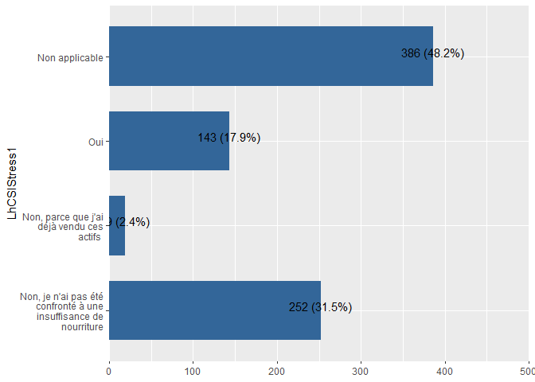
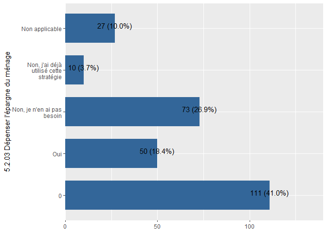
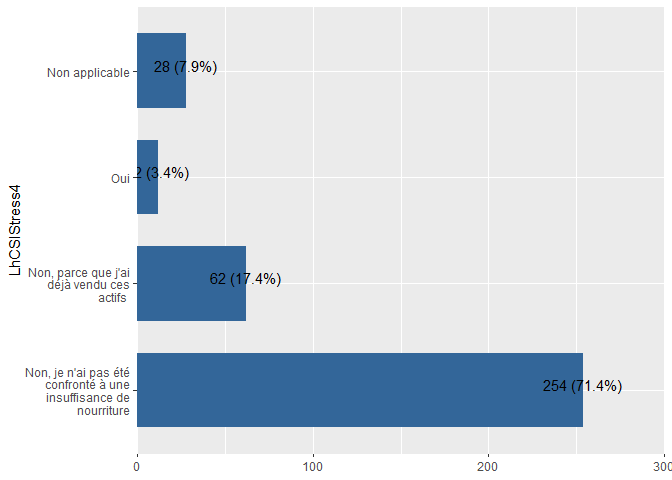
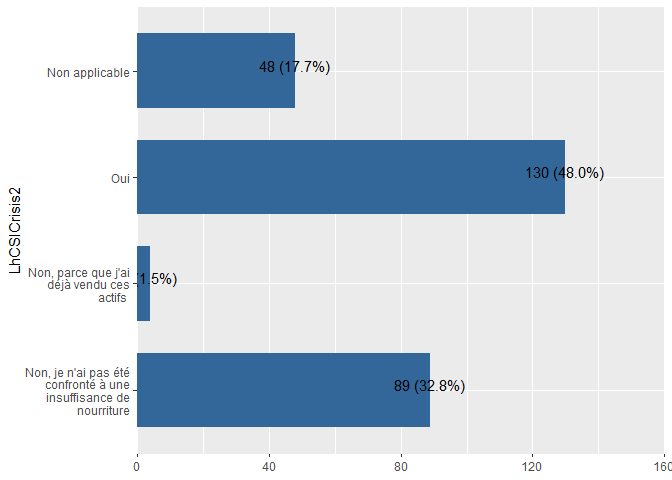
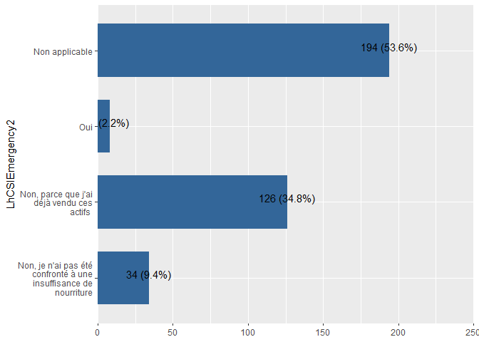

```r
library(haven)
library(labelled) # for general functions to work with labelled data
library(tidyverse) # general wrangling
library(dplyr)
library(Hmisc)
library(gtsummary) # to demonstrate automatic use of variable labels in summary tables
library(readxl)
library(foreign)
library(sjPlot)
library(sjmisc)
library(sjlabelled) # for example efc data set with variable labels
library(stringr)
```


```r
rm(list = ls())
```


```r
dir_input_data = "C:/Users/AHema/OneDrive - CGIAR/Desktop/WFP Resilience dataset/data/input_data/Chad"
dir_output_data = "C:/Users/AHema/OneDrive - CGIAR/Desktop/WFP Resilience dataset/data/output_data/Chad"
```


```r
Chad_Harmonization_variables <- read_excel(paste0(dir_input_data,"/Chad_Harmonization.xlsx"), 
    sheet = "variables_harmonization")
#View(Chad_Harmonization_variables)

Chad_Harmonization_description <- read_excel(paste0(dir_input_data,"/Chad_Harmonization.xlsx"), 
    sheet = "description")
#View(Chad_Harmonization_description)
```


```r
lst_data = Chad_Harmonization_description$Data
lst_test = Chad_Harmonization_description$Name

for(i in 1:length(lst_data)) {                              # Head of for-loop
  assign(lst_test[i],                                   # Read and store data frames
         read_sav(paste0(dir_input_data,"/",lst_data[i])))
}
```


```r
for (j in 1:length(lst_test)){
         df=  get(lst_test[j], envir = .GlobalEnv)
          for (i in 1:nrow(Chad_Harmonization_variables)){
            df[,Chad_Harmonization_variables$NewVariable_Name[i]]=ifelse(is.na(Chad_Harmonization_variables[i,lst_test[j]]),NA,df[,Chad_Harmonization_variables[i,lst_test[j]][[1]]])
          }
    
    df<-df %>% select(Chad_Harmonization_variables$NewVariable_Name)
    assign(lst_test[j],                                   # Read and store data frames
         df)
#write_sav(df, paste0(dir_output_data,"/",lst_test[j],".sav"))
#write_dta(df, paste0(dir_output_data,"/",lst_test[j],".dta"))
    

}
```


```r
Chad_pdm_2022$ID = 1:nrow(Chad_pdm_2022)
```


## Stratégies d'adaptation aux moyens d'existence (LhCSI)


```r
var_needed = c(
"LhCSIStress1",
"LhCSIStress2",
"LhCSIStress3",
"LhCSIStress4",
"LhCSICrisis1",
"LhCSICrisis2",
"LhCSICrisis3",
"LhCSIEmergency1",
"LhCSIEmergency2",
"LhCSIEmergency3")
```


```r
# 1 = Non, je n'ai pas été confronté à une insuffisance de nourriture
# 2 = Non, parce que j'ai déjà vendu ces actifs 
# 3 = Oui
# 4 = Non applicable
```


### LhCSI : Vendre des actifs/biens non productifs du ménage (radio, meuble, réfrigérateur, télévision, bijoux etc.)


```r
#View labels
expss::val_lab(Chad_baseline_2018$LhCSIStress1)

# Non Oui 
#   0   1 

table(Chad_baseline_2018$LhCSIStress1)
#   0   1   2   3   4 
# 333 525  76 391 609 

Chad_baseline_2018 %>% 
  plot_frq(coord.flip =T,LhCSIStress1)
```

<!-- -->

```r
Chad_baseline_2018$LhCSIStress1 <- as.character(Chad_baseline_2018$LhCSIStress1)
Chad_baseline_2018 <- 
  Chad_baseline_2018 %>%
  dplyr::mutate(
    LhCSIStress1 = dplyr::case_when(
      LhCSIStress1 == "0" ~ "3",
      .default = as.factor(LhCSIStress1)
    ) %>% structure(label = label(LhCSIStress1)))


Chad_baseline_2018 <- 
  Chad_baseline_2018 %>%
  dplyr::mutate(LhCSIStress1 = ifelse(is.na(LhCSIStress1),"4",LhCSIStress1))


Chad_baseline_2018 <- 
  Chad_baseline_2018 %>% dplyr::mutate(LhCSIStress1 = dplyr::recode(LhCSIStress1,"1"=3,"2"=2,"3"=1,"4"=4))
Chad_baseline_2018$LhCSIStress1 <- labelled::labelled(Chad_baseline_2018$LhCSIStress1, c(`Non, je n'ai pas été confronté à une insuffisance de nourriture` = 1, `Non, parce que j'ai déjà vendu ces actifs ` = 2, Oui= 3,`Non applicable`=4))
#check labels
expss::val_lab(Chad_baseline_2018$LhCSIStress1)
Chad_baseline_2018 %>% 
  plot_frq(coord.flip =T,LhCSIStress1)
```

<!-- -->

```r
#View labels
expss::val_lab(Chad_ea_2019$LhCSIStress1)
Chad_ea_2019 %>% 
  plot_frq(coord.flip =T,LhCSIStress1)
```

<!-- -->

```r
Chad_ea_2019 <- Chad_ea_2019 %>% 
  dplyr::mutate(LhCSIStress1 = dplyr::case_when(
    LhCSIStress1 == 1 ~ "1",
    LhCSIStress1 == 2 ~ "2",
    LhCSIStress1 == 3 ~ "3",
    LhCSIStress1 == 4 ~ "4",
    .default = NA
  ))
Chad_ea_2019 <- 
  Chad_ea_2019 %>%
  dplyr::mutate(LhCSIStress1 = ifelse(is.na(LhCSIStress1),"4",LhCSIStress1))
Chad_ea_2019 <- Chad_ea_2019 %>% 
  dplyr::mutate(LhCSIStress1 = dplyr::recode(LhCSIStress1,"1"=1,"2"=2,"3"=3,"4"=4))
Chad_ea_2019$LhCSIStress1 <- labelled::labelled(Chad_ea_2019$LhCSIStress1, c(`Non, je n'ai pas été confronté à une insuffisance de nourriture` = 1, `Non, parce que j'ai déjà vendu ces actifs ` = 2, Oui= 3,`Non applicable`=4))
#check labels
expss::val_lab(Chad_ea_2019$LhCSIStress1)
Chad_ea_2019 %>% 
  plot_frq(coord.flip =T,LhCSIStress1)
```

<!-- -->

```r
#View labels
expss::val_lab(Chad_ea_2020$LhCSIStress1)
Chad_ea_2020 %>% 
  plot_frq(coord.flip =T,LhCSIStress1)
```

<!-- -->

```r
Chad_ea_2019 <- 
  Chad_ea_2019 %>%
  dplyr::mutate(LhCSIStress1 = ifelse(is.na(LhCSIStress1),"4",LhCSIStress1))
#change labels
Chad_ea_2020 <- Chad_ea_2020 %>% 
  dplyr::mutate(LhCSIStress1 = dplyr::recode(LhCSIStress1,"1"=3,"3"=2,"2"=1,"4"=4))
Chad_ea_2020$LhCSIStress1 <- labelled::labelled(Chad_ea_2020$LhCSIStress1, c(`Non, je n'ai pas été confronté à une insuffisance de nourriture` = 1, `Non, parce que j'ai déjà vendu ces actifs ` = 2, Oui= 3,`Non applicable`=4))
#check labels
expss::val_lab(Chad_ea_2020$LhCSIStress1)
Chad_ea_2020 %>% 
  plot_frq(coord.flip =T,LhCSIStress1)
```

<!-- -->

```r
#View labels
expss::val_lab(Chad_ea_2021$LhCSIStress1)
Chad_ea_2021 %>% 
  plot_frq(coord.flip =T,LhCSIStress1)
```

<!-- -->

```r
#update labels
Chad_ea_2021$LhCSIStress1 <- labelled::labelled(Chad_ea_2021$LhCSIStress1, c(`Non, je n'ai pas été confronté à une insuffisance de nourriture` = 1, `Non, parce que j'ai déjà vendu ces actifs ` = 2, Oui= 3,`Non applicable`=4))
#check labels
expss::val_lab(Chad_ea_2021$LhCSIStress1)
Chad_ea_2021 %>% 
  plot_frq(coord.flip =T,LhCSIStress1)
```

<!-- -->

```r
#View labels
expss::val_lab(Chad_ea_2022$LhCSIStress1)
Chad_ea_2022 %>% 
  plot_frq(coord.flip =T,LhCSIStress1)
```

<!-- -->

```r
#update labels
Chad_ea_2022$LhCSIStress1 <- labelled::labelled(Chad_ea_2022$LhCSIStress1, c(`Non, je n'ai pas été confronté à une insuffisance de nourriture` = 1, `Non, parce que j'ai déjà vendu ces actifs ` = 2, Oui= 3,`Non applicable`=4))
#check labels
expss::val_lab(Chad_ea_2022$LhCSIStress1)
Chad_ea_2022 %>% 
  plot_frq(coord.flip =T,LhCSIStress1)
```

<!-- -->

```r
Chad_ea_2023$LhCSIStress1 <- labelled::labelled(Chad_ea_2023$LhCSIStress1, c(`Non, je n'ai pas été confronté à une insuffisance de nourriture` = 1, `Non, parce que j'ai déjà vendu ces actifs ` = 2, Oui= 3,`Non applicable`=4))
#View labels
expss::val_lab(Chad_pdm_2020$LhCSIStress1)
Chad_pdm_2020 %>% 
  plot_frq(coord.flip =T,LhCSIStress1)
```

<!-- -->

```r
#change labels
Chad_pdm_2020 <- Chad_pdm_2020 %>% 
  dplyr::mutate(LhCSIStress1 = ifelse(LhCSIStress1==0,1,LhCSIStress1))
Chad_pdm_2020 <- Chad_pdm_2020 %>% 
  dplyr::mutate(LhCSIStress1 = dplyr::recode(LhCSIStress1,"1"=3,"3"=2,"2"=1,"4"=4))
Chad_pdm_2020$LhCSIStress1 <- labelled::labelled(Chad_pdm_2020$LhCSIStress1, c(`Non, je n'ai pas été confronté à une insuffisance de nourriture` = 1, `Non, parce que j'ai déjà vendu ces actifs ` = 2, Oui= 3,`Non applicable`=4))
#check labels
expss::val_lab(Chad_pdm_2020$LhCSIStress1)
Chad_pdm_2020 %>% 
  plot_frq(coord.flip =T,LhCSIStress1)
```

<!-- -->

```r
#View labels
expss::val_lab(Chad_pdm_2021$LhCSIStress1)
Chad_pdm_2021 %>% 
  plot_frq(coord.flip =T,LhCSIStress1)
```

<!-- -->

```r
#Change labels
Chad_pdm_2021 <- Chad_pdm_2021 %>% 
  dplyr::mutate(LhCSIStress1 = dplyr::recode(LhCSIStress1,"1"=3,"3"=2,"2"=1,"4"=4))
Chad_pdm_2021$LhCSIStress1 <- labelled::labelled(Chad_pdm_2021$LhCSIStress1, c(`Non, je n'ai pas été confronté à une insuffisance de nourriture` = 1, `Non, parce que j'ai déjà vendu ces actifs ` = 2, Oui= 3,`Non applicable`=4))
#check labels
expss::val_lab(Chad_pdm_2021$LhCSIStress1)
Chad_pdm_2021 %>% 
  plot_frq(coord.flip =T,LhCSIStress1)
```

<!-- -->

```r
#View labels
expss::val_lab(Chad_pdm_2022$LhCSIStress1)
Chad_pdm_2022 %>% 
  plot_frq(coord.flip =T,LhCSIStress1)
```

<!-- -->

```r
#update labels
Chad_pdm_2022$LhCSIStress1 <- labelled::labelled(Chad_pdm_2022$LhCSIStress1, c(`Non, je n'ai pas été confronté à une insuffisance de nourriture` = 1, `Non, parce que j'ai déjà vendu ces actifs ` = 2, Oui= 3,`Non applicable`=4))
#check labels
expss::val_lab(Chad_pdm_2022$LhCSIStress1)
Chad_pdm_2022 %>% 
  plot_frq(coord.flip =T,LhCSIStress1)
```

<!-- -->

```r
Chad_pdm_2023$LhCSIStress1 <- labelled::labelled(Chad_pdm_2023$LhCSIStress1, c(`Non, je n'ai pas été confronté à une insuffisance de nourriture` = 1, `Non, parce que j'ai déjà vendu ces actifs ` = 2, Oui= 3,`Non applicable`=4))
```


### LhCSI : Vendre plus d’animaux (non-productifs) que d’habitude


```r
#View labels
expss::val_lab(Chad_baseline_2018$LhCSIStress2)
Chad_baseline_2018 %>% 
  plot_frq(coord.flip =T,LhCSIStress2)
```

<!-- -->

```r
Chad_baseline_2018$LhCSIStress2 <- as.character(Chad_baseline_2018$LhCSIStress2)
Chad_baseline_2018 <- 
  Chad_baseline_2018 %>%
  dplyr::mutate(
    LhCSIStress2 = dplyr::case_when(
      LhCSIStress2 == "0" ~ "1",
      .default = as.factor(LhCSIStress2)
    ) %>% structure(label = label(LhCSIStress2)))
Chad_baseline_2018 <- 
  Chad_baseline_2018 %>% dplyr::mutate(LhCSIStress2 = dplyr::recode(LhCSIStress2,"1"=3,"2"=2,"3"=1,"4"=4))
Chad_baseline_2018$LhCSIStress2 <- labelled::labelled(Chad_baseline_2018$LhCSIStress2, c(`Non, je n'ai pas été confronté à une insuffisance de nourriture` = 1, `Non, parce que j'ai déjà vendu ces actifs ` = 2, Oui= 3,`Non applicable`=4))
#check labels
expss::val_lab(Chad_baseline_2018$LhCSIStress2)
Chad_baseline_2018 %>% 
  plot_frq(coord.flip =T,LhCSIStress2)
```

<!-- -->

```r
#View labels
expss::val_lab(Chad_ea_2019$LhCSIStress2)
Chad_ea_2019 %>% 
  plot_frq(coord.flip =T,LhCSIStress2)
```

<!-- -->

```r
Chad_ea_2019 <- Chad_ea_2019 %>% 
  dplyr::mutate(LhCSIStress2 = dplyr::case_when(
    LhCSIStress2 == 1 ~ "1",
    LhCSIStress2 == 2 ~ "2",
    LhCSIStress2 == 3 ~ "3",
    LhCSIStress2 == 4 ~ "4",
    .default = NA
  ))

Chad_ea_2019 <- Chad_ea_2019 %>% 
  dplyr::mutate(LhCSIStress2 = dplyr::recode(LhCSIStress2,"1"=1,"2"=2,"3"=3,"4"=4))
Chad_ea_2019$LhCSIStress2 <- labelled::labelled(Chad_ea_2019$LhCSIStress2, c(`Non, je n'ai pas été confronté à une insuffisance de nourriture` = 1, `Non, parce que j'ai déjà vendu ces actifs ` = 2, Oui= 3,`Non applicable`=4))
#check labels
expss::val_lab(Chad_ea_2019$LhCSIStress2)
Chad_ea_2019 %>% 
  plot_frq(coord.flip =T,LhCSIStress2)
```

<!-- -->

```r
#View labels
expss::val_lab(Chad_ea_2020$LhCSIStress2)
Chad_ea_2020 %>% 
  plot_frq(coord.flip =T,LhCSIStress2)
```

<!-- -->

```r
#change labels
Chad_ea_2020 <- Chad_ea_2020 %>% 
  dplyr::mutate(LhCSIStress2 = dplyr::recode(LhCSIStress2,"1"=3,"3"=2,"2"=1,"4"=4))
Chad_ea_2020$LhCSIStress2 <- labelled::labelled(Chad_ea_2020$LhCSIStress2, c(`Non, je n'ai pas été confronté à une insuffisance de nourriture` = 1, `Non, parce que j'ai déjà vendu ces actifs ` = 2, Oui= 3,`Non applicable`=4))
#check labels
expss::val_lab(Chad_ea_2020$LhCSIStress2)
Chad_ea_2020 %>% 
  plot_frq(coord.flip =T,LhCSIStress2)
```

<!-- -->

```r
#View labels
expss::val_lab(Chad_ea_2021$LhCSIStress2)
Chad_ea_2021 %>% 
  plot_frq(coord.flip =T,LhCSIStress2)
```

<!-- -->

```r
#update labels
Chad_ea_2021$LhCSIStress2 <- labelled::labelled(Chad_ea_2021$LhCSIStress2, c(`Non, je n'ai pas été confronté à une insuffisance de nourriture` = 1, `Non, parce que j'ai déjà vendu ces actifs ` = 2, Oui= 3,`Non applicable`=4))
#check labels
expss::val_lab(Chad_ea_2021$LhCSIStress2)
Chad_ea_2021 %>% 
  plot_frq(coord.flip =T,LhCSIStress2)
```

<!-- -->

```r
#View labels
expss::val_lab(Chad_ea_2022$LhCSIStress2)
Chad_ea_2022 %>% 
  plot_frq(coord.flip =T,LhCSIStress2)
```

<!-- -->

```r
#update labels
Chad_ea_2022$LhCSIStress2 <- labelled::labelled(Chad_ea_2022$LhCSIStress2, c(`Non, je n'ai pas été confronté à une insuffisance de nourriture` = 1, `Non, parce que j'ai déjà vendu ces actifs ` = 2, Oui= 3,`Non applicable`=4))
#check labels
expss::val_lab(Chad_ea_2022$LhCSIStress2)
Chad_ea_2022 %>% 
  plot_frq(coord.flip =T,LhCSIStress2)
```

<!-- -->

```r
#View labels
expss::val_lab(Chad_pdm_2020$LhCSIStress2)
Chad_pdm_2020 %>% 
  plot_frq(coord.flip =T,LhCSIStress2)
```

<!-- -->

```r
#change labels
Chad_pdm_2020 <- Chad_pdm_2020 %>% 
  dplyr::mutate(LhCSIStress2 = ifelse(LhCSIStress2==0,1,LhCSIStress2))
Chad_pdm_2020 <- Chad_pdm_2020 %>% 
  dplyr::mutate(LhCSIStress2 = dplyr::recode(LhCSIStress2,"1"=3,"3"=2,"2"=1,"4"=4))
Chad_pdm_2020$LhCSIStress2 <- labelled::labelled(Chad_pdm_2020$LhCSIStress2, c(`Non, je n'ai pas été confronté à une insuffisance de nourriture` = 1, `Non, parce que j'ai déjà vendu ces actifs ` = 2, Oui= 3,`Non applicable`=4))
#check labels
expss::val_lab(Chad_pdm_2020$LhCSIStress2)
Chad_pdm_2020 %>% 
  plot_frq(coord.flip =T,LhCSIStress2)
```

<!-- -->

```r
#View labels
expss::val_lab(Chad_pdm_2021$LhCSIStress2)
Chad_pdm_2021 %>% 
  plot_frq(coord.flip =T,LhCSIStress2)
```

<!-- -->

```r
#change labels
Chad_pdm_2021 <- Chad_pdm_2021 %>% 
  dplyr::mutate(LhCSIStress2 = dplyr::recode(LhCSIStress2,"1"=3,"3"=2,"2"=1,"4"=4))
Chad_pdm_2021$LhCSIStress2 <- labelled::labelled(Chad_pdm_2021$LhCSIStress2, c(`Non, je n'ai pas été confronté à une insuffisance de nourriture` = 1, `Non, parce que j'ai déjà vendu ces actifs ` = 2, Oui= 3,`Non applicable`=4))
#check labels
expss::val_lab(Chad_pdm_2021$LhCSIStress2)
Chad_pdm_2021 %>% 
  plot_frq(coord.flip =T,LhCSIStress2)
```

<!-- -->

```r
#View labels
expss::val_lab(Chad_pdm_2022$LhCSIStress2)
Chad_pdm_2022 %>% 
  plot_frq(coord.flip =T,LhCSIStress2)
```

<!-- -->

```r
#update labels
Chad_pdm_2022$LhCSIStress2 <- labelled::labelled(Chad_pdm_2022$LhCSIStress2, c(`Non, je n'ai pas été confronté à une insuffisance de nourriture` = 1, `Non, parce que j'ai déjà vendu ces actifs ` = 2, Oui= 3,`Non applicable`=4))
#check labels
expss::val_lab(Chad_pdm_2022$LhCSIStress2)
Chad_pdm_2022 %>% 
  plot_frq(coord.flip =T,LhCSIStress2)
```

<!-- -->

```r
Chad_ea_2023$LhCSIStress2 <- labelled::labelled(Chad_ea_2023$LhCSIStress2, c(`Non, je n'ai pas été confronté à une insuffisance de nourriture` = 1, `Non, parce que j'ai déjà vendu ces actifs ` = 2, Oui= 3,`Non applicable`=4))

Chad_pdm_2023$LhCSIStress2 <- labelled::labelled(Chad_pdm_2023$LhCSIStress2, c(`Non, je n'ai pas été confronté à une insuffisance de nourriture` = 1, `Non, parce que j'ai déjà vendu ces actifs ` = 2, Oui= 3,`Non applicable`=4))
```


### LhCSI : Dépenser l’épargne en raison d'un manque de nourriture ou d'argent pour acheter de la nourriture ?


```r
#View labels
expss::val_lab(Chad_baseline_2018$LhCSIStress3)
Chad_baseline_2018 %>% 
  plot_frq(coord.flip =T,LhCSIStress3)
```

<!-- -->

```r
Chad_baseline_2018$LhCSIStress3 <- as.character(Chad_baseline_2018$LhCSIStress3)
Chad_baseline_2018 <- 
  Chad_baseline_2018 %>%
  dplyr::mutate(
    LhCSIStress3 = dplyr::case_when(
      LhCSIStress3 == "0" ~ "1",
      .default = as.factor(LhCSIStress3)
    ) %>% structure(label = label(LhCSIStress3)))
Chad_baseline_2018 <- 
  Chad_baseline_2018 %>% dplyr::mutate(LhCSIStress3 = dplyr::recode(LhCSIStress3,"1"=3,"2"=2,"3"=1,"4"=4))
Chad_baseline_2018$LhCSIStress3 <- labelled::labelled(Chad_baseline_2018$LhCSIStress3, c(`Non, je n'ai pas été confronté à une insuffisance de nourriture` = 1, `Non, parce que j'ai déjà vendu ces actifs ` = 2, Oui= 3,`Non applicable`=4))
#check labels
expss::val_lab(Chad_baseline_2018$LhCSIStress3)
Chad_baseline_2018 %>% 
  plot_frq(coord.flip =T,LhCSIStress3)
```

<!-- -->

```r
#View labels
expss::val_lab(Chad_ea_2019$LhCSIStress3)
Chad_ea_2019 %>% 
  plot_frq(coord.flip =T,LhCSIStress3)
```

<!-- -->

```r
Chad_ea_2019 <- Chad_ea_2019 %>% 
  dplyr::mutate(LhCSIStress3 = dplyr::case_when(
    LhCSIStress3 == 1 ~ "1",
    LhCSIStress3 == 2 ~ "2",
    LhCSIStress3 == 3 ~ "3",
    LhCSIStress3 == 4 ~ "4",
    .default = NA
  ))

Chad_ea_2019 <- Chad_ea_2019 %>% 
  dplyr::mutate(LhCSIStress3 = dplyr::recode(LhCSIStress3,"1"=1,"2"=2,"3"=3,"4"=4))
Chad_ea_2019$LhCSIStress3 <- labelled::labelled(Chad_ea_2019$LhCSIStress3, c(`Non, je n'ai pas été confronté à une insuffisance de nourriture` = 1, `Non, parce que j'ai déjà vendu ces actifs ` = 2, Oui= 3,`Non applicable`=4))
#check labels
expss::val_lab(Chad_ea_2019$LhCSIStress3)
Chad_ea_2019 %>% 
  plot_frq(coord.flip =T,LhCSIStress3)
```

<!-- -->

```r
#View labels
expss::val_lab(Chad_ea_2020$LhCSIStress3)
Chad_ea_2020 %>% 
  plot_frq(coord.flip =T,LhCSIStress3)
```

<!-- -->

```r
#change labels
Chad_ea_2020 <- Chad_ea_2020 %>% 
  dplyr::mutate(LhCSIStress3 = dplyr::recode(LhCSIStress3,"1"=3,"3"=2,"2"=1,"4"=4))
Chad_ea_2020$LhCSIStress3 <- labelled::labelled(Chad_ea_2020$LhCSIStress3, c(`Non, je n'ai pas été confronté à une insuffisance de nourriture` = 1, `Non, parce que j'ai déjà vendu ces actifs ` = 2, Oui= 3,`Non applicable`=4))
#check labels
expss::val_lab(Chad_ea_2020$LhCSIStress3)
Chad_ea_2020 %>% 
  plot_frq(coord.flip =T,LhCSIStress3)
```

<!-- -->

```r
#View labels
expss::val_lab(Chad_ea_2021$LhCSIStress3)
Chad_ea_2021 %>% 
  plot_frq(coord.flip =T,LhCSIStress3)
```

<!-- -->

```r
#update labels
Chad_ea_2021$LhCSIStress3 <- labelled::labelled(Chad_ea_2021$LhCSIStress3, c(`Non, je n'ai pas été confronté à une insuffisance de nourriture` = 1, `Non, parce que j'ai déjà vendu ces actifs ` = 2, Oui= 3,`Non applicable`=4))
#check labels
expss::val_lab(Chad_ea_2021$LhCSIStress3)
Chad_ea_2021 %>% 
  plot_frq(coord.flip =T,LhCSIStress3)
```

<!-- -->

```r
#View labels
expss::val_lab(Chad_ea_2022$LhCSIStress3)
Chad_ea_2022 %>% 
  plot_frq(coord.flip =T,LhCSIStress3)
```

<!-- -->

```r
#update labels
Chad_ea_2022$LhCSIStress3 <- labelled::labelled(Chad_ea_2022$LhCSIStress3, c(`Non, je n'ai pas été confronté à une insuffisance de nourriture` = 1, `Non, parce que j'ai déjà vendu ces actifs ` = 2, Oui= 3,`Non applicable`=4))
#check labels
expss::val_lab(Chad_ea_2022$LhCSIStress3)
Chad_ea_2022 %>% 
  plot_frq(coord.flip =T,LhCSIStress3)
```

<!-- -->

```r
#View labels
expss::val_lab(Chad_pdm_2020$LhCSIStress3)
Chad_pdm_2020 %>% 
  plot_frq(coord.flip =T,LhCSIStress3)
```

<!-- -->

```r
#change labels
Chad_pdm_2020 <- Chad_pdm_2020 %>% 
  dplyr::mutate(LhCSIStress3 = ifelse(LhCSIStress3==0,1,LhCSIStress3))
Chad_pdm_2020 <- Chad_pdm_2020 %>% 
  dplyr::mutate(LhCSIStress3 = dplyr::recode(LhCSIStress3,"1"=3,"3"=2,"2"=1,"4"=4))
Chad_pdm_2020$LhCSIStress3 <- labelled::labelled(Chad_pdm_2020$LhCSIStress3, c(`Non, je n'ai pas été confronté à une insuffisance de nourriture` = 1, `Non, parce que j'ai déjà vendu ces actifs ` = 2, Oui= 3,`Non applicable`=4))
#check labels
expss::val_lab(Chad_pdm_2020$LhCSIStress3)
Chad_pdm_2020 %>% 
  plot_frq(coord.flip =T,LhCSIStress3)
```

<!-- -->

```r
#View labels
expss::val_lab(Chad_pdm_2021$LhCSIStress3)
Chad_pdm_2021 %>% 
  plot_frq(coord.flip =T,LhCSIStress3)
```

<!-- -->

```r
#change labels
Chad_pdm_2021 <- Chad_pdm_2021 %>% 
  dplyr::mutate(LhCSIStress3 = dplyr::recode(LhCSIStress3,"1"=3,"3"=2,"2"=1,"4"=4))
Chad_pdm_2021$LhCSIStress3 <- labelled::labelled(Chad_pdm_2021$LhCSIStress3, c(`Non, je n'ai pas été confronté à une insuffisance de nourriture` = 1, `Non, parce que j'ai déjà vendu ces actifs ` = 2, Oui= 3,`Non applicable`=4))
#check labels
expss::val_lab(Chad_pdm_2021$LhCSIStress3)
Chad_pdm_2021 %>% 
  plot_frq(coord.flip =T,LhCSIStress3)
```

<!-- -->

```r
#View labels
expss::val_lab(Chad_pdm_2022$LhCSIStress3)
Chad_pdm_2022 %>% 
  plot_frq(coord.flip =T,LhCSIStress3)
```

<!-- -->

```r
#update labels
Chad_pdm_2022$LhCSIStress3 <- labelled::labelled(Chad_pdm_2022$LhCSIStress3, c(`Non, je n'ai pas été confronté à une insuffisance de nourriture` = 1, `Non, parce que j'ai déjà vendu ces actifs ` = 2, Oui= 3,`Non applicable`=4))
#check labels
expss::val_lab(Chad_pdm_2022$LhCSIStress3)
Chad_pdm_2022 %>% 
  plot_frq(coord.flip =T,LhCSIStress3)
```

<!-- -->

```r
Chad_ea_2023$LhCSIStress3 <- labelled::labelled(Chad_ea_2023$LhCSIStress3, c(`Non, je n'ai pas été confronté à une insuffisance de nourriture` = 1, `Non, parce que j'ai déjà vendu ces actifs ` = 2, Oui= 3,`Non applicable`=4))

Chad_pdm_2023$LhCSIStress3 <- labelled::labelled(Chad_pdm_2023$LhCSIStress3, c(`Non, je n'ai pas été confronté à une insuffisance de nourriture` = 1, `Non, parce que j'ai déjà vendu ces actifs ` = 2, Oui= 3,`Non applicable`=4))
```


### LhCSI : Emprunter de l’argent / nourriture auprès d’un prêteur formel /banque


```r
#View labels
expss::val_lab(Chad_baseline_2018$LhCSIStress4)
Chad_baseline_2018 %>% 
  plot_frq(coord.flip =T,LhCSIStress4)
```

<!-- -->

```r
Chad_baseline_2018$LhCSIStress4 <- as.character(Chad_baseline_2018$LhCSIStress4)
Chad_baseline_2018 <- 
  Chad_baseline_2018 %>%
  dplyr::mutate(
    LhCSIStress4 = dplyr::case_when(
      LhCSIStress4 == "0" ~ "1",
      .default = as.factor(LhCSIStress4)
    ) %>% structure(label = label(LhCSIStress4)))
Chad_baseline_2018 <- 
  Chad_baseline_2018 %>% dplyr::mutate(LhCSIStress4 = dplyr::recode(LhCSIStress4,"1"=3,"2"=2,"3"=1,"4"=4))
Chad_baseline_2018$LhCSIStress4 <- labelled::labelled(Chad_baseline_2018$LhCSIStress4, c(`Non, je n'ai pas été confronté à une insuffisance de nourriture` = 1, `Non, parce que j'ai déjà vendu ces actifs ` = 2, Oui= 3,`Non applicable`=4))
#check labels
expss::val_lab(Chad_baseline_2018$LhCSIStress4)
Chad_baseline_2018 %>% 
  plot_frq(coord.flip =T,LhCSIStress4)
```

<!-- -->

```r
#View labels
expss::val_lab(Chad_ea_2019$LhCSIStress4)
Chad_ea_2019 %>% 
  plot_frq(coord.flip =T,LhCSIStress4)
```

<!-- -->

```r
Chad_ea_2019 <- Chad_ea_2019 %>% 
  dplyr::mutate(LhCSIStress4 = dplyr::case_when(
    LhCSIStress4 == 1 ~ "1",
    LhCSIStress4 == 2 ~ "2",
    LhCSIStress4 == 3 ~ "3",
    LhCSIStress4 == 4 ~ "4",
    .default = NA
  ))

Chad_ea_2019 <- Chad_ea_2019 %>% 
  dplyr::mutate(LhCSIStress4 = dplyr::recode(LhCSIStress4,"1"=1,"2"=2,"3"=3,"4"=4))
Chad_ea_2019$LhCSIStress4 <- labelled::labelled(Chad_ea_2019$LhCSIStress4, c(`Non, je n'ai pas été confronté à une insuffisance de nourriture` = 1, `Non, parce que j'ai déjà vendu ces actifs ` = 2, Oui= 3,`Non applicable`=4))
#check labels
expss::val_lab(Chad_ea_2019$LhCSIStress4)
Chad_ea_2019 %>% 
  plot_frq(coord.flip =T,LhCSIStress4)
```

<!-- -->

```r
#View labels
expss::val_lab(Chad_ea_2020$LhCSIStress4)
Chad_ea_2020 %>% 
  plot_frq(coord.flip =T,LhCSIStress4)
```

<!-- -->

```r
#change labels
Chad_ea_2020 <- Chad_ea_2020 %>% 
  dplyr::mutate(LhCSIStress4 = dplyr::recode(LhCSIStress4,"1"=3,"3"=2,"2"=1,"4"=4))
Chad_ea_2020$LhCSIStress4 <- labelled::labelled(Chad_ea_2020$LhCSIStress4, c(`Non, je n'ai pas été confronté à une insuffisance de nourriture` = 1, `Non, parce que j'ai déjà vendu ces actifs ` = 2, Oui= 3,`Non applicable`=4))
#check labels
expss::val_lab(Chad_ea_2020$LhCSIStress4)
Chad_ea_2020 %>% 
  plot_frq(coord.flip =T,LhCSIStress4)
```

<!-- -->

```r
#View labels
expss::val_lab(Chad_ea_2021$LhCSIStress4)
Chad_ea_2021 %>% 
  plot_frq(coord.flip =T,LhCSIStress4)
```

<!-- -->

```r
#update labels
Chad_ea_2021$LhCSIStress4 <- labelled::labelled(Chad_ea_2021$LhCSIStress4, c(`Non, je n'ai pas été confronté à une insuffisance de nourriture` = 1, `Non, parce que j'ai déjà vendu ces actifs ` = 2, Oui= 3,`Non applicable`=4))
#check labels
expss::val_lab(Chad_ea_2021$LhCSIStress4)
Chad_ea_2021 %>% 
  plot_frq(coord.flip =T,LhCSIStress4)
```

<!-- -->

```r
#View labels
expss::val_lab(Chad_ea_2022$LhCSIStress4)
Chad_ea_2022 %>% 
  plot_frq(coord.flip =T,LhCSIStress4)
```

<!-- -->

```r
#update labels
Chad_ea_2022$LhCSIStress4 <- labelled::labelled(Chad_ea_2022$LhCSIStress4, c(`Non, je n'ai pas été confronté à une insuffisance de nourriture` = 1, `Non, parce que j'ai déjà vendu ces actifs ` = 2, Oui= 3,`Non applicable`=4))
#check labels
expss::val_lab(Chad_ea_2022$LhCSIStress4)
Chad_ea_2022 %>% 
  plot_frq(coord.flip =T,LhCSIStress4)
```

<!-- -->

```r
#View labels
expss::val_lab(Chad_pdm_2020$LhCSIStress4)
Chad_pdm_2020 %>% 
  plot_frq(coord.flip =T,LhCSIStress4)
```

<!-- -->

```r
#change labels
Chad_pdm_2020 <- Chad_pdm_2020 %>% 
  dplyr::mutate(LhCSIStress4 = ifelse(LhCSIStress4==0,1,LhCSIStress4))
Chad_pdm_2020 <- Chad_pdm_2020 %>% 
  dplyr::mutate(LhCSIStress4 = dplyr::recode(LhCSIStress4,"1"=3,"3"=2,"2"=1,"4"=4))
Chad_pdm_2020$LhCSIStress4 <- labelled::labelled(Chad_pdm_2020$LhCSIStress4, c(`Non, je n'ai pas été confronté à une insuffisance de nourriture` = 1, `Non, parce que j'ai déjà vendu ces actifs ` = 2, Oui= 3,`Non applicable`=4))
#check labels
expss::val_lab(Chad_pdm_2020$LhCSIStress4)
Chad_pdm_2020 %>% 
  plot_frq(coord.flip =T,LhCSIStress4)
```

<!-- -->

```r
#View labels
expss::val_lab(Chad_pdm_2021$LhCSIStress4)
Chad_pdm_2021 %>% 
  plot_frq(coord.flip =T,LhCSIStress4)
```

<!-- -->

```r
#change labels
Chad_pdm_2021 <- Chad_pdm_2021 %>% 
  dplyr::mutate(LhCSIStress4 = dplyr::recode(LhCSIStress4,"1"=3,"3"=2,"2"=1,"4"=4))
Chad_pdm_2021$LhCSIStress4 <- labelled::labelled(Chad_pdm_2021$LhCSIStress4, c(`Non, je n'ai pas été confronté à une insuffisance de nourriture` = 1, `Non, parce que j'ai déjà vendu ces actifs ` = 2, Oui= 3,`Non applicable`=4))
#check labels
expss::val_lab(Chad_pdm_2021$LhCSIStress4)
Chad_pdm_2021 %>% 
  plot_frq(coord.flip =T,LhCSIStress4)
```

<!-- -->

```r
#View labels
expss::val_lab(Chad_pdm_2022$LhCSIStress4)
Chad_pdm_2022 %>% 
  plot_frq(coord.flip =T,LhCSIStress4)
```

<!-- -->

```r
#update labels
Chad_pdm_2022$LhCSIStress4 <- labelled::labelled(Chad_pdm_2022$LhCSIStress4, c(`Non, je n'ai pas été confronté à une insuffisance de nourriture` = 1, `Non, parce que j'ai déjà vendu ces actifs ` = 2, Oui= 3,`Non applicable`=4))
#check labels
expss::val_lab(Chad_pdm_2022$LhCSIStress4)
Chad_pdm_2022 %>% 
  plot_frq(coord.flip =T,LhCSIStress4)
```

<!-- -->

```r
Chad_ea_2023$LhCSIStress4 <- labelled::labelled(Chad_ea_2023$LhCSIStress4, c(`Non, je n'ai pas été confronté à une insuffisance de nourriture` = 1, `Non, parce que j'ai déjà vendu ces actifs ` = 2, Oui= 3,`Non applicable`=4))

Chad_pdm_2023$LhCSIStress4 <- labelled::labelled(Chad_pdm_2023$LhCSIStress4, c(`Non, je n'ai pas été confronté à une insuffisance de nourriture` = 1, `Non, parce que j'ai déjà vendu ces actifs ` = 2, Oui= 3,`Non applicable`=4))
```


### LhCSI : Réduire les dépenses non alimentaires essentielles telles que l’éducation, la santé (dont de médicaments)


```r
# #View labels
# expss::val_lab(Chad_baseline_2018$LhCSICrisis1)
# Chad_baseline_2018 %>% 
#   plot_frq(coord.flip =T,LhCSICrisis1)

# #View labels
# expss::val_lab(Chad_ea_2019$LhCSICrisis1)
# Chad_ea_2019 %>% 
#   plot_frq(coord.flip =T,LhCSICrisis1)

# #View labels
# expss::val_lab(Chad_ea_2020$LhCSICrisis1)
# Chad_ea_2020 %>% 
#   plot_frq(coord.flip =T,LhCSICrisis1)

#View labels
expss::val_lab(Chad_ea_2021$LhCSICrisis1)
Chad_ea_2021 %>% 
  plot_frq(coord.flip =T,LhCSICrisis1)
```

<!-- -->

```r
#update labels
Chad_ea_2021$LhCSICrisis1 <- labelled::labelled(Chad_ea_2021$LhCSICrisis1, c(`Non, je n'ai pas été confronté à une insuffisance de nourriture` = 1, `Non, parce que j'ai déjà vendu ces actifs ` = 2, Oui= 3,`Non applicable`=4))
#check labels
expss::val_lab(Chad_ea_2021$LhCSICrisis1)
Chad_ea_2021 %>% 
  plot_frq(coord.flip =T,LhCSICrisis1)
```

<!-- -->

```r
#View labels
expss::val_lab(Chad_ea_2022$LhCSICrisis1)
Chad_ea_2022 %>% 
  plot_frq(coord.flip =T,LhCSICrisis1)
```

<!-- -->

```r
#update labels
Chad_ea_2022$LhCSICrisis1 <- labelled::labelled(Chad_ea_2022$LhCSICrisis1, c(`Non, je n'ai pas été confronté à une insuffisance de nourriture` = 1, `Non, parce que j'ai déjà vendu ces actifs ` = 2, Oui= 3,`Non applicable`=4))
#check labels
expss::val_lab(Chad_ea_2022$LhCSICrisis1)
Chad_ea_2022 %>% 
  plot_frq(coord.flip =T,LhCSICrisis1)
```

<!-- -->

```r
# #View labels
# expss::val_lab(Chad_pdm_2020$LhCSICrisis1)
# Chad_pdm_2020 %>% 
#   plot_frq(coord.flip =T,LhCSICrisis1)

# #View labels
# expss::val_lab(Chad_pdm_2021$LhCSICrisis1)
# Chad_pdm_2021 %>% 
#   plot_frq(coord.flip =T,LhCSICrisis1)


#View labels
expss::val_lab(Chad_pdm_2022$LhCSICrisis1)
Chad_pdm_2022 %>% 
  plot_frq(coord.flip =T,LhCSICrisis1)
```

<!-- -->

```r
#update labels
Chad_pdm_2022$LhCSICrisis1 <- labelled::labelled(Chad_pdm_2022$LhCSICrisis1, c(`Non, je n'ai pas été confronté à une insuffisance de nourriture` = 1, `Non, parce que j'ai déjà vendu ces actifs ` = 2, Oui= 3,`Non applicable`=4))
#check labels
expss::val_lab(Chad_pdm_2022$LhCSICrisis1)
Chad_pdm_2022 %>% 
  plot_frq(coord.flip =T,LhCSICrisis1)
```

<!-- -->

```r
Chad_ea_2023$LhCSICrisis1 <- labelled::labelled(Chad_ea_2023$LhCSICrisis1, c(`Non, je n'ai pas été confronté à une insuffisance de nourriture` = 1, `Non, parce que j'ai déjà vendu ces actifs ` = 2, Oui= 3,`Non applicable`=4))

Chad_pdm_2023$LhCSICrisis1 <- labelled::labelled(Chad_pdm_2023$LhCSICrisis1, c(`Non, je n'ai pas été confronté à une insuffisance de nourriture` = 1, `Non, parce que j'ai déjà vendu ces actifs ` = 2, Oui= 3,`Non applicable`=4))
```

### LhCSI : Vendre des biens productifs ou des moyens de transport (machine à coudre, brouette, vélo, car, etc.)


```r
#View labels
expss::val_lab(Chad_baseline_2018$LhCSICrisis2)
Chad_baseline_2018 %>% 
  plot_frq(coord.flip =T,LhCSICrisis2)
```

<!-- -->

```r
Chad_baseline_2018$LhCSICrisis2 <- as.character(Chad_baseline_2018$LhCSICrisis2)
Chad_baseline_2018 <- 
  Chad_baseline_2018 %>%
  dplyr::mutate(
    LhCSICrisis2 = dplyr::case_when(
      LhCSICrisis2 == "0" ~ "1",
      .default = as.factor(LhCSICrisis2)
    ) %>% structure(label = label(LhCSICrisis2)))
Chad_baseline_2018 <- 
  Chad_baseline_2018 %>% dplyr::mutate(LhCSICrisis2 = dplyr::recode(LhCSICrisis2,"1"=3,"2"=2,"3"=1,"4"=4))
Chad_baseline_2018$LhCSICrisis2 <- labelled::labelled(Chad_baseline_2018$LhCSICrisis2, c(`Non, je n'ai pas été confronté à une insuffisance de nourriture` = 1, `Non, parce que j'ai déjà vendu ces actifs ` = 2, Oui= 3,`Non applicable`=4))
#check labels
expss::val_lab(Chad_baseline_2018$LhCSICrisis2)
Chad_baseline_2018 %>% 
  plot_frq(coord.flip =T,LhCSICrisis2)
```

<!-- -->

```r
#View labels
expss::val_lab(Chad_ea_2019$LhCSICrisis2)
Chad_ea_2019 %>% 
  plot_frq(coord.flip =T,LhCSICrisis2)
```

<!-- -->

```r
Chad_ea_2019 <- Chad_ea_2019 %>% 
  dplyr::mutate(LhCSICrisis2 = dplyr::case_when(
    LhCSICrisis2 == 1 ~ "1",
    LhCSICrisis2 == 2 ~ "2",
    LhCSICrisis2 == 3 ~ "3",
    LhCSICrisis2 == 4 ~ "4",
    .default = NA
  ))

Chad_ea_2019 <- Chad_ea_2019 %>% 
  dplyr::mutate(LhCSICrisis2 = dplyr::recode(LhCSICrisis2,"1"=1,"2"=2,"3"=3,"4"=4))
Chad_ea_2019$LhCSICrisis2 <- labelled::labelled(Chad_ea_2019$LhCSICrisis2, c(`Non, je n'ai pas été confronté à une insuffisance de nourriture` = 1, `Non, parce que j'ai déjà vendu ces actifs ` = 2, Oui= 3,`Non applicable`=4))
#check labels
expss::val_lab(Chad_ea_2019$LhCSICrisis2)
Chad_ea_2019 %>% 
  plot_frq(coord.flip =T,LhCSICrisis2)
```

<!-- -->

```r
#View labels
expss::val_lab(Chad_ea_2020$LhCSICrisis2)
Chad_ea_2020 %>% 
  plot_frq(coord.flip =T,LhCSICrisis2)
```

<!-- -->

```r
#change labels
Chad_ea_2020 <- Chad_ea_2020 %>% 
  dplyr::mutate(LhCSICrisis2 = dplyr::recode(LhCSICrisis2,"1"=3,"3"=2,"2"=1,"4"=4))
Chad_ea_2020$LhCSICrisis2 <- labelled::labelled(Chad_ea_2020$LhCSICrisis2, c(`Non, je n'ai pas été confronté à une insuffisance de nourriture` = 1, `Non, parce que j'ai déjà vendu ces actifs ` = 2, Oui= 3,`Non applicable`=4))
#check labels
expss::val_lab(Chad_ea_2020$LhCSICrisis2)
Chad_ea_2020 %>% 
  plot_frq(coord.flip =T,LhCSICrisis2)
```

<!-- -->

```r
#View labels
expss::val_lab(Chad_ea_2021$LhCSICrisis2)
Chad_ea_2021 %>% 
  plot_frq(coord.flip =T,LhCSICrisis2)
```

<!-- -->

```r
#update labels
Chad_ea_2021$LhCSICrisis2 <- labelled::labelled(Chad_ea_2021$LhCSICrisis2, c(`Non, je n'ai pas été confronté à une insuffisance de nourriture` = 1, `Non, parce que j'ai déjà vendu ces actifs ` = 2, Oui= 3,`Non applicable`=4))
#check labels
expss::val_lab(Chad_ea_2021$LhCSICrisis2)
Chad_ea_2021 %>% 
  plot_frq(coord.flip =T,LhCSICrisis2)
```

<!-- -->

```r
#View labels
expss::val_lab(Chad_ea_2022$LhCSICrisis2)
Chad_ea_2022 %>% 
  plot_frq(coord.flip =T,LhCSICrisis2)
```

<!-- -->

```r
#update labels
Chad_ea_2022$LhCSICrisis2 <- labelled::labelled(Chad_ea_2022$LhCSICrisis2, c(`Non, je n'ai pas été confronté à une insuffisance de nourriture` = 1, `Non, parce que j'ai déjà vendu ces actifs ` = 2, Oui= 3,`Non applicable`=4))
#check labels
expss::val_lab(Chad_ea_2022$LhCSICrisis2)
Chad_ea_2022 %>% 
  plot_frq(coord.flip =T,LhCSICrisis2)
```

<!-- -->

```r
#View labels
expss::val_lab(Chad_pdm_2020$LhCSICrisis2)
Chad_pdm_2020 %>% 
  plot_frq(coord.flip =T,LhCSICrisis2)
```

<!-- -->

```r
#change labels
Chad_pdm_2020 <- Chad_pdm_2020 %>% 
  dplyr::mutate(LhCSICrisis2 = ifelse(LhCSICrisis2==0,1,LhCSICrisis2))
Chad_pdm_2020 <- Chad_pdm_2020 %>% 
  dplyr::mutate(LhCSICrisis2 = dplyr::recode(LhCSICrisis2,"1"=3,"3"=2,"2"=1,"4"=4))
Chad_pdm_2020$LhCSICrisis2 <- labelled::labelled(Chad_pdm_2020$LhCSICrisis2, c(`Non, je n'ai pas été confronté à une insuffisance de nourriture` = 1, `Non, parce que j'ai déjà vendu ces actifs ` = 2, Oui= 3,`Non applicable`=4))
#check labels
expss::val_lab(Chad_pdm_2020$LhCSICrisis2)
Chad_pdm_2020 %>% 
  plot_frq(coord.flip =T,LhCSICrisis2)
```

<!-- -->

```r
#View labels
expss::val_lab(Chad_pdm_2021$LhCSICrisis2)
Chad_pdm_2021 %>% 
  plot_frq(coord.flip =T,LhCSICrisis2)
```

<!-- -->

```r
#change labels
Chad_pdm_2021 <- Chad_pdm_2021 %>% 
  dplyr::mutate(LhCSICrisis2 = dplyr::recode(LhCSICrisis2,"1"=3,"3"=2,"2"=1,"4"=4))
Chad_pdm_2021$LhCSICrisis2 <- labelled::labelled(Chad_pdm_2021$LhCSICrisis2, c(`Non, je n'ai pas été confronté à une insuffisance de nourriture` = 1, `Non, parce que j'ai déjà vendu ces actifs ` = 2, Oui= 3,`Non applicable`=4))
#check labels
expss::val_lab(Chad_pdm_2021$LhCSICrisis2)
Chad_pdm_2021 %>% 
  plot_frq(coord.flip =T,LhCSICrisis2)
```

<!-- -->

```r
#View labels
expss::val_lab(Chad_pdm_2022$LhCSICrisis2)
Chad_pdm_2022 %>% 
  plot_frq(coord.flip =T,LhCSICrisis2)
```

<!-- -->

```r
#update labels
Chad_pdm_2022$LhCSICrisis2 <- labelled::labelled(Chad_pdm_2022$LhCSICrisis2, c(`Non, je n'ai pas été confronté à une insuffisance de nourriture` = 1, `Non, parce que j'ai déjà vendu ces actifs ` = 2, Oui= 3,`Non applicable`=4))
#check labels
expss::val_lab(Chad_pdm_2022$LhCSICrisis2)
Chad_pdm_2022 %>% 
  plot_frq(coord.flip =T,LhCSICrisis2)
```

<!-- -->

```r
Chad_ea_2023$LhCSICrisis2 <- labelled::labelled(Chad_ea_2023$LhCSICrisis2, c(`Non, je n'ai pas été confronté à une insuffisance de nourriture` = 1, `Non, parce que j'ai déjà vendu ces actifs ` = 2, Oui= 3,`Non applicable`=4))

Chad_pdm_2023$LhCSICrisis2 <- labelled::labelled(Chad_pdm_2023$LhCSICrisis2, c(`Non, je n'ai pas été confronté à une insuffisance de nourriture` = 1, `Non, parce que j'ai déjà vendu ces actifs ` = 2, Oui= 3,`Non applicable`=4))
```

### LhCSI : Retirer les enfants de l’école


```r
#View labels
expss::val_lab(Chad_baseline_2018$LhCSICrisis3)
Chad_baseline_2018 %>% 
  plot_frq(coord.flip =T,LhCSICrisis3)
```

<!-- -->

```r
Chad_baseline_2018$LhCSICrisis3 <- as.character(Chad_baseline_2018$LhCSICrisis3)
Chad_baseline_2018 <- 
  Chad_baseline_2018 %>%
  dplyr::mutate(
    LhCSICrisis3 = dplyr::case_when(
      LhCSICrisis3 == "0" ~ "1",
      .default = as.factor(LhCSICrisis3)
    ) %>% structure(label = label(LhCSICrisis3)))
Chad_baseline_2018 <- 
  Chad_baseline_2018 %>% dplyr::mutate(LhCSICrisis3 = dplyr::recode(LhCSICrisis3,"1"=3,"2"=2,"3"=1,"4"=4))
Chad_baseline_2018$LhCSICrisis3 <- labelled::labelled(Chad_baseline_2018$LhCSICrisis3, c(`Non, je n'ai pas été confronté à une insuffisance de nourriture` = 1, `Non, parce que j'ai déjà vendu ces actifs ` = 2, Oui= 3,`Non applicable`=4))
#check labels
expss::val_lab(Chad_baseline_2018$LhCSICrisis3)
Chad_baseline_2018 %>% 
  plot_frq(coord.flip =T,LhCSICrisis3)
```

<!-- -->

```r
#View labels
expss::val_lab(Chad_ea_2019$LhCSICrisis3)
Chad_ea_2019 %>% 
  plot_frq(coord.flip =T,LhCSICrisis3)
```

<!-- -->

```r
Chad_ea_2019 <- Chad_ea_2019 %>% 
  dplyr::mutate(LhCSICrisis3 = dplyr::case_when(
    LhCSICrisis3 == 1 ~ "1",
    LhCSICrisis3 == 2 ~ "2",
    LhCSICrisis3 == 3 ~ "3",
    LhCSICrisis3 == 4 ~ "4",
    .default = NA
  ))

Chad_ea_2019 <- Chad_ea_2019 %>% 
  dplyr::mutate(LhCSICrisis3 = dplyr::recode(LhCSICrisis3,"1"=1,"2"=2,"3"=3,"4"=4))
Chad_ea_2019$LhCSICrisis3 <- labelled::labelled(Chad_ea_2019$LhCSICrisis3, c(`Non, je n'ai pas été confronté à une insuffisance de nourriture` = 1, `Non, parce que j'ai déjà vendu ces actifs ` = 2, Oui= 3,`Non applicable`=4))
#check labels
expss::val_lab(Chad_ea_2019$LhCSICrisis3)
Chad_ea_2019 %>% 
  plot_frq(coord.flip =T,LhCSICrisis3)
```

<!-- -->

```r
#View labels
expss::val_lab(Chad_ea_2020$LhCSICrisis3)
Chad_ea_2020 %>% 
  plot_frq(coord.flip =T,LhCSICrisis3)
```

<!-- -->

```r
#change labels
Chad_ea_2020 <- Chad_ea_2020 %>% 
  dplyr::mutate(LhCSICrisis3 = dplyr::recode(LhCSICrisis3,"1"=3,"3"=2,"2"=1,"4"=4))
Chad_ea_2020$LhCSICrisis3 <- labelled::labelled(Chad_ea_2020$LhCSICrisis3, c(`Non, je n'ai pas été confronté à une insuffisance de nourriture` = 1, `Non, parce que j'ai déjà vendu ces actifs ` = 2, Oui= 3,`Non applicable`=4))
#check labels
expss::val_lab(Chad_ea_2020$LhCSICrisis3)
Chad_ea_2020 %>% 
  plot_frq(coord.flip =T,LhCSICrisis3)
```

<!-- -->

```r
#View labels
expss::val_lab(Chad_ea_2021$LhCSICrisis3)
Chad_ea_2021 %>% 
  plot_frq(coord.flip =T,LhCSICrisis3)
```

<!-- -->

```r
#update labels
Chad_ea_2021$LhCSICrisis3 <- labelled::labelled(Chad_ea_2021$LhCSICrisis3, c(`Non, je n'ai pas été confronté à une insuffisance de nourriture` = 1, `Non, parce que j'ai déjà vendu ces actifs ` = 2, Oui= 3,`Non applicable`=4))
#check labels
expss::val_lab(Chad_ea_2021$LhCSICrisis3)
Chad_ea_2021 %>% 
  plot_frq(coord.flip =T,LhCSICrisis3)
```

<!-- -->

```r
#View labels
expss::val_lab(Chad_ea_2022$LhCSICrisis3)
Chad_ea_2022 %>% 
  plot_frq(coord.flip =T,LhCSICrisis3)
```

<!-- -->

```r
#update labels
Chad_ea_2022$LhCSICrisis3 <- labelled::labelled(Chad_ea_2022$LhCSICrisis3, c(`Non, je n'ai pas été confronté à une insuffisance de nourriture` = 1, `Non, parce que j'ai déjà vendu ces actifs ` = 2, Oui= 3,`Non applicable`=4))
#check labels
expss::val_lab(Chad_ea_2022$LhCSICrisis3)
Chad_ea_2022 %>% 
  plot_frq(coord.flip =T,LhCSICrisis3)
```

<!-- -->

```r
#View labels
expss::val_lab(Chad_pdm_2020$LhCSICrisis3)
Chad_pdm_2020 %>% 
  plot_frq(coord.flip =T,LhCSICrisis3)
```

<!-- -->

```r
#change labels
Chad_pdm_2020 <- Chad_pdm_2020 %>% 
  dplyr::mutate(LhCSICrisis3 = ifelse(LhCSICrisis3==0,1,LhCSICrisis3))
Chad_pdm_2020 <- Chad_pdm_2020 %>% 
  dplyr::mutate(LhCSICrisis3 = dplyr::recode(LhCSICrisis3,"1"=3,"3"=2,"2"=1,"4"=4))
Chad_pdm_2020$LhCSICrisis3 <- labelled::labelled(Chad_pdm_2020$LhCSICrisis3, c(`Non, je n'ai pas été confronté à une insuffisance de nourriture` = 1, `Non, parce que j'ai déjà vendu ces actifs ` = 2, Oui= 3,`Non applicable`=4))
#check labels
expss::val_lab(Chad_pdm_2020$LhCSICrisis3)
Chad_pdm_2020 %>% 
  plot_frq(coord.flip =T,LhCSICrisis3)
```

<!-- -->

```r
#View labels
expss::val_lab(Chad_pdm_2021$LhCSICrisis3)
Chad_pdm_2021 %>% 
  plot_frq(coord.flip =T,LhCSICrisis3)
```

<!-- -->

```r
#change labels
Chad_pdm_2021 <- Chad_pdm_2021 %>% 
  dplyr::mutate(LhCSICrisis3 = dplyr::recode(LhCSICrisis3,"1"=3,"3"=2,"2"=1,"4"=4))
Chad_pdm_2021$LhCSICrisis3 <- labelled::labelled(Chad_pdm_2021$LhCSICrisis3, c(`Non, je n'ai pas été confronté à une insuffisance de nourriture` = 1, `Non, parce que j'ai déjà vendu ces actifs ` = 2, Oui= 3,`Non applicable`=4))
#check labels
expss::val_lab(Chad_pdm_2021$LhCSICrisis3)
Chad_pdm_2021 %>% 
  plot_frq(coord.flip =T,LhCSICrisis3)
```

<!-- -->

```r
#View labels
expss::val_lab(Chad_pdm_2022$LhCSICrisis3)
Chad_pdm_2022 %>% 
  plot_frq(coord.flip =T,LhCSICrisis3)
```

<!-- -->

```r
#update labels
Chad_pdm_2022$LhCSICrisis3 <- labelled::labelled(Chad_pdm_2022$LhCSICrisis3, c(`Non, je n'ai pas été confronté à une insuffisance de nourriture` = 1, `Non, parce que j'ai déjà vendu ces actifs ` = 2, Oui= 3,`Non applicable`=4))
#check labels
expss::val_lab(Chad_pdm_2022$LhCSICrisis3)
Chad_pdm_2022 %>% 
  plot_frq(coord.flip =T,LhCSICrisis3)
```

<!-- -->

```r
Chad_ea_2023$LhCSICrisis3 <- labelled::labelled(Chad_ea_2023$LhCSICrisis3, c(`Non, je n'ai pas été confronté à une insuffisance de nourriture` = 1, `Non, parce que j'ai déjà vendu ces actifs ` = 2, Oui= 3,`Non applicable`=4))

Chad_pdm_2023$LhCSICrisis3 <- labelled::labelled(Chad_pdm_2023$LhCSICrisis3, c(`Non, je n'ai pas été confronté à une insuffisance de nourriture` = 1, `Non, parce que j'ai déjà vendu ces actifs ` = 2, Oui= 3,`Non applicable`=4))
```


### LhCSI : Vendre la maison ou des terrains


```r
#View labels
expss::val_lab(Chad_baseline_2018$LhCSIEmergency1)
Chad_baseline_2018 %>% 
  plot_frq(coord.flip =T,LhCSIEmergency1)
```

<!-- -->

```r
Chad_baseline_2018$LhCSIEmergency1 <- as.character(Chad_baseline_2018$LhCSIEmergency1)
Chad_baseline_2018 <- 
  Chad_baseline_2018 %>%
  dplyr::mutate(
    LhCSIEmergency1 = dplyr::case_when(
      LhCSIEmergency1 == "0" ~ "1",
      .default = as.factor(LhCSIEmergency1)
    ) %>% structure(label = label(LhCSIEmergency1)))
Chad_baseline_2018 <- 
  Chad_baseline_2018 %>% dplyr::mutate(LhCSIEmergency1 = dplyr::recode(LhCSIEmergency1,"1"=3,"2"=2,"3"=1,"4"=4))
Chad_baseline_2018$LhCSIEmergency1 <- labelled::labelled(Chad_baseline_2018$LhCSIEmergency1, c(`Non, je n'ai pas été confronté à une insuffisance de nourriture` = 1, `Non, parce que j'ai déjà vendu ces actifs ` = 2, Oui= 3,`Non applicable`=4))
#check labels
expss::val_lab(Chad_baseline_2018$LhCSIEmergency1)
Chad_baseline_2018 %>% 
  plot_frq(coord.flip =T,LhCSIEmergency1)
```

<!-- -->

```r
#View labels
expss::val_lab(Chad_ea_2019$LhCSIEmergency1)
Chad_ea_2019 %>% 
  plot_frq(coord.flip =T,LhCSIEmergency1)
```

<!-- -->

```r
Chad_ea_2019 <- Chad_ea_2019 %>% 
  dplyr::mutate(LhCSIEmergency1 = dplyr::case_when(
    LhCSIEmergency1 == 1 ~ "1",
    LhCSIEmergency1 == 2 ~ "2",
    LhCSIEmergency1 == 3 ~ "3",
    LhCSIEmergency1 == 4 ~ "4",
    .default = NA
  ))

Chad_ea_2019 <- Chad_ea_2019 %>% 
  dplyr::mutate(LhCSIEmergency1 = dplyr::recode(LhCSIEmergency1,"1"=1,"2"=2,"3"=3,"4"=4))
Chad_ea_2019$LhCSIEmergency1 <- labelled::labelled(Chad_ea_2019$LhCSIEmergency1, c(`Non, je n'ai pas été confronté à une insuffisance de nourriture` = 1, `Non, parce que j'ai déjà vendu ces actifs ` = 2, Oui= 3,`Non applicable`=4))
#check labels
expss::val_lab(Chad_ea_2019$LhCSIEmergency1)
Chad_ea_2019 %>% 
  plot_frq(coord.flip =T,LhCSIEmergency1)
```

<!-- -->

```r
#View labels
expss::val_lab(Chad_ea_2020$LhCSIEmergency1)
Chad_ea_2020 %>% 
  plot_frq(coord.flip =T,LhCSIEmergency1)
```

<!-- -->

```r
#change labels
Chad_ea_2020 <- Chad_ea_2020 %>% 
  dplyr::mutate(LhCSIEmergency1 = dplyr::recode(LhCSIEmergency1,"1"=3,"3"=2,"2"=1,"4"=4))
Chad_ea_2020$LhCSIEmergency1 <- labelled::labelled(Chad_ea_2020$LhCSIEmergency1, c(`Non, je n'ai pas été confronté à une insuffisance de nourriture` = 1, `Non, parce que j'ai déjà vendu ces actifs ` = 2, Oui= 3,`Non applicable`=4))
#check labels
expss::val_lab(Chad_ea_2020$LhCSIEmergency1)
Chad_ea_2020 %>% 
  plot_frq(coord.flip =T,LhCSIEmergency1)
```

<!-- -->

```r
#View labels
expss::val_lab(Chad_ea_2021$LhCSIEmergency1)
Chad_ea_2021 %>% 
  plot_frq(coord.flip =T,LhCSIEmergency1)
```

<!-- -->

```r
#update labels
Chad_ea_2021$LhCSIEmergency1 <- labelled::labelled(Chad_ea_2021$LhCSIEmergency1, c(`Non, je n'ai pas été confronté à une insuffisance de nourriture` = 1, `Non, parce que j'ai déjà vendu ces actifs ` = 2, Oui= 3,`Non applicable`=4))
#check labels
expss::val_lab(Chad_ea_2021$LhCSIEmergency1)
Chad_ea_2021 %>% 
  plot_frq(coord.flip =T,LhCSIEmergency1)
```

<!-- -->

```r
#View labels
expss::val_lab(Chad_ea_2022$LhCSIEmergency1)
Chad_ea_2022 %>% 
  plot_frq(coord.flip =T,LhCSIEmergency1)
```

<!-- -->

```r
#update labels
Chad_ea_2022$LhCSIEmergency1 <- labelled::labelled(Chad_ea_2022$LhCSIEmergency1, c(`Non, je n'ai pas été confronté à une insuffisance de nourriture` = 1, `Non, parce que j'ai déjà vendu ces actifs ` = 2, Oui= 3,`Non applicable`=4))
#check labels
expss::val_lab(Chad_ea_2022$LhCSIEmergency1)
Chad_ea_2022 %>% 
  plot_frq(coord.flip =T,LhCSIEmergency1)
```

<!-- -->

```r
#View labels
expss::val_lab(Chad_pdm_2020$LhCSIEmergency1)
Chad_pdm_2020 %>% 
  plot_frq(coord.flip =T,LhCSIEmergency1)
```

<!-- -->

```r
#change labels
Chad_pdm_2020 <- Chad_pdm_2020 %>% 
  dplyr::mutate(LhCSIEmergency1 = ifelse(LhCSIEmergency1==0,1,LhCSIEmergency1))
Chad_pdm_2020 <- Chad_pdm_2020 %>% 
  dplyr::mutate(LhCSIEmergency1 = dplyr::recode(LhCSIEmergency1,"1"=3,"3"=2,"2"=1,"4"=4))
Chad_pdm_2020$LhCSIEmergency1 <- labelled::labelled(Chad_pdm_2020$LhCSIEmergency1, c(`Non, je n'ai pas été confronté à une insuffisance de nourriture` = 1, `Non, parce que j'ai déjà vendu ces actifs ` = 2, Oui= 3,`Non applicable`=4))
#check labels
expss::val_lab(Chad_pdm_2020$LhCSIEmergency1)
Chad_pdm_2020 %>% 
  plot_frq(coord.flip =T,LhCSIEmergency1)
```

<!-- -->

```r
#View labels
expss::val_lab(Chad_pdm_2021$LhCSIEmergency1)
Chad_pdm_2021 %>% 
  plot_frq(coord.flip =T,LhCSIEmergency1)
```

<!-- -->

```r
#change labels
Chad_pdm_2021 <- Chad_pdm_2021 %>% 
  dplyr::mutate(LhCSIEmergency1 = dplyr::recode(LhCSIEmergency1,"1"=3,"3"=2,"2"=1,"4"=4))
Chad_pdm_2021$LhCSIEmergency1 <- labelled::labelled(Chad_pdm_2021$LhCSIEmergency1, c(`Non, je n'ai pas été confronté à une insuffisance de nourriture` = 1, `Non, parce que j'ai déjà vendu ces actifs ` = 2, Oui= 3,`Non applicable`=4))
#check labels
expss::val_lab(Chad_pdm_2021$LhCSIEmergency1)
Chad_pdm_2021 %>% 
  plot_frq(coord.flip =T,LhCSIEmergency1)
```

<!-- -->

```r
#View labels
expss::val_lab(Chad_pdm_2022$LhCSIEmergency1)
Chad_pdm_2022 %>% 
  plot_frq(coord.flip =T,LhCSIEmergency1)
```

<!-- -->

```r
#update labels
Chad_pdm_2022$LhCSIEmergency1 <- labelled::labelled(Chad_pdm_2022$LhCSIEmergency1, c(`Non, je n'ai pas été confronté à une insuffisance de nourriture` = 1, `Non, parce que j'ai déjà vendu ces actifs ` = 2, Oui= 3,`Non applicable`=4))
#check labels
expss::val_lab(Chad_pdm_2022$LhCSIEmergency1)
Chad_pdm_2022 %>% 
  plot_frq(coord.flip =T,LhCSIEmergency1)
```

<!-- -->

```r
Chad_ea_2023$LhCSIEmergency1 <- labelled::labelled(Chad_ea_2023$LhCSIEmergency1, c(`Non, je n'ai pas été confronté à une insuffisance de nourriture` = 1, `Non, parce que j'ai déjà vendu ces actifs ` = 2, Oui= 3,`Non applicable`=4))

Chad_pdm_2023$LhCSIEmergency1 <- labelled::labelled(Chad_pdm_2023$LhCSIEmergency1, c(`Non, je n'ai pas été confronté à une insuffisance de nourriture` = 1, `Non, parce que j'ai déjà vendu ces actifs ` = 2, Oui= 3,`Non applicable`=4))
```


### LhCSI : Mendier


```r
#View labels
expss::val_lab(Chad_baseline_2018$LhCSIEmergency2)
Chad_baseline_2018 %>% 
  plot_frq(coord.flip =T,LhCSIEmergency2)
```

<!-- -->

```r
Chad_baseline_2018$LhCSIEmergency2 <- as.character(Chad_baseline_2018$LhCSIEmergency2)
Chad_baseline_2018 <- 
  Chad_baseline_2018 %>%
  dplyr::mutate(
    LhCSIEmergency2 = dplyr::case_when(
      LhCSIEmergency2 == "0" ~ "1",
      .default = as.factor(LhCSIEmergency2)
    ) %>% structure(label = label(LhCSIEmergency2)))
Chad_baseline_2018 <- 
  Chad_baseline_2018 %>% dplyr::mutate(LhCSIEmergency2 = dplyr::recode(LhCSIEmergency2,"1"=3,"2"=2,"3"=1,"4"=4))
Chad_baseline_2018$LhCSIEmergency2 <- labelled::labelled(Chad_baseline_2018$LhCSIEmergency2, c(`Non, je n'ai pas été confronté à une insuffisance de nourriture` = 1, `Non, parce que j'ai déjà vendu ces actifs ` = 2, Oui= 3,`Non applicable`=4))
#check labels
expss::val_lab(Chad_baseline_2018$LhCSIEmergency2)
Chad_baseline_2018 %>% 
  plot_frq(coord.flip =T,LhCSIEmergency2)
```

<!-- -->

```r
#View labels
expss::val_lab(Chad_ea_2019$LhCSIEmergency2)
Chad_ea_2019 %>% 
  plot_frq(coord.flip =T,LhCSIEmergency2)
```

<!-- -->

```r
Chad_ea_2019 <- Chad_ea_2019 %>% 
  dplyr::mutate(LhCSIEmergency2 = dplyr::case_when(
    LhCSIEmergency2 == 1 ~ "1",
    LhCSIEmergency2 == 2 ~ "2",
    LhCSIEmergency2 == 3 ~ "3",
    LhCSIEmergency2 == 4 ~ "4",
    .default = NA
  ))

Chad_ea_2019 <- Chad_ea_2019 %>% 
  dplyr::mutate(LhCSIEmergency2 = dplyr::recode(LhCSIEmergency2,"1"=1,"2"=2,"3"=3,"4"=4))
Chad_ea_2019$LhCSIEmergency2 <- labelled::labelled(Chad_ea_2019$LhCSIEmergency2, c(`Non, je n'ai pas été confronté à une insuffisance de nourriture` = 1, `Non, parce que j'ai déjà vendu ces actifs ` = 2, Oui= 3,`Non applicable`=4))
#check labels
expss::val_lab(Chad_ea_2019$LhCSIEmergency2)
Chad_ea_2019 %>% 
  plot_frq(coord.flip =T,LhCSIEmergency2)
```

<!-- -->

```r
#View labels
expss::val_lab(Chad_ea_2020$LhCSIEmergency2)
Chad_ea_2020 %>% 
  plot_frq(coord.flip =T,LhCSIEmergency2)
```

<!-- -->

```r
#change labels
Chad_ea_2020 <- Chad_ea_2020 %>% 
  dplyr::mutate(LhCSIEmergency2 = dplyr::recode(LhCSIEmergency2,"1"=3,"3"=2,"2"=1,"4"=4))
Chad_ea_2020$LhCSIEmergency2 <- labelled::labelled(Chad_ea_2020$LhCSIEmergency2, c(`Non, je n'ai pas été confronté à une insuffisance de nourriture` = 1, `Non, parce que j'ai déjà vendu ces actifs ` = 2, Oui= 3,`Non applicable`=4))
#check labels
expss::val_lab(Chad_ea_2020$LhCSIEmergency2)
Chad_ea_2020 %>% 
  plot_frq(coord.flip =T,LhCSIEmergency2)
```

<!-- -->

```r
#View labels
expss::val_lab(Chad_ea_2021$LhCSIEmergency2)
Chad_ea_2021 %>% 
  plot_frq(coord.flip =T,LhCSIEmergency2)
```

<!-- -->

```r
#update labels
Chad_ea_2021$LhCSIEmergency2 <- labelled::labelled(Chad_ea_2021$LhCSIEmergency2, c(`Non, je n'ai pas été confronté à une insuffisance de nourriture` = 1, `Non, parce que j'ai déjà vendu ces actifs ` = 2, Oui= 3,`Non applicable`=4))
#check labels
expss::val_lab(Chad_ea_2021$LhCSIEmergency2)
Chad_ea_2021 %>% 
  plot_frq(coord.flip =T,LhCSIEmergency2)
```

<!-- -->

```r
#View labels
expss::val_lab(Chad_ea_2022$LhCSIEmergency2)
Chad_ea_2022 %>% 
  plot_frq(coord.flip =T,LhCSIEmergency2)
```

<!-- -->

```r
#update labels
Chad_ea_2022$LhCSIEmergency2 <- labelled::labelled(Chad_ea_2022$LhCSIEmergency2, c(`Non, je n'ai pas été confronté à une insuffisance de nourriture` = 1, `Non, parce que j'ai déjà vendu ces actifs ` = 2, Oui= 3,`Non applicable`=4))
#check labels
expss::val_lab(Chad_ea_2022$LhCSIEmergency2)
Chad_ea_2022 %>% 
  plot_frq(coord.flip =T,LhCSIEmergency2)
```

<!-- -->

```r
#View labels
expss::val_lab(Chad_pdm_2020$LhCSIEmergency2)
Chad_pdm_2020 %>% 
  plot_frq(coord.flip =T,LhCSIEmergency2)
```

<!-- -->

```r
#change labels
Chad_pdm_2020 <- Chad_pdm_2020 %>% 
  dplyr::mutate(LhCSIEmergency2 = ifelse(LhCSIEmergency2==0,1,LhCSIEmergency2))
Chad_pdm_2020 <- Chad_pdm_2020 %>% 
  dplyr::mutate(LhCSIEmergency2 = dplyr::recode(LhCSIEmergency2,"1"=3,"3"=2,"2"=1,"4"=4))
Chad_pdm_2020$LhCSIEmergency2 <- labelled::labelled(Chad_pdm_2020$LhCSIEmergency2, c(`Non, je n'ai pas été confronté à une insuffisance de nourriture` = 1, `Non, parce que j'ai déjà vendu ces actifs ` = 2, Oui= 3,`Non applicable`=4))
#check labels
expss::val_lab(Chad_pdm_2020$LhCSIEmergency2)
Chad_pdm_2020 %>% 
  plot_frq(coord.flip =T,LhCSIEmergency2)
```

<!-- -->

```r
#View labels
expss::val_lab(Chad_pdm_2021$LhCSIEmergency2)
Chad_pdm_2021 %>% 
  plot_frq(coord.flip =T,LhCSIEmergency2)
```

<!-- -->

```r
#change labels
Chad_pdm_2021 <- Chad_pdm_2021 %>% 
  dplyr::mutate(LhCSIEmergency2 = dplyr::recode(LhCSIEmergency2,"1"=3,"3"=2,"2"=1,"4"=4))
Chad_pdm_2021$LhCSIEmergency2 <- labelled::labelled(Chad_pdm_2021$LhCSIEmergency2, c(`Non, je n'ai pas été confronté à une insuffisance de nourriture` = 1, `Non, parce que j'ai déjà vendu ces actifs ` = 2, Oui= 3,`Non applicable`=4))
#check labels
expss::val_lab(Chad_pdm_2021$LhCSIEmergency2)
Chad_pdm_2021 %>% 
  plot_frq(coord.flip =T,LhCSIEmergency2)
```

<!-- -->

```r
#View labels
expss::val_lab(Chad_pdm_2022$LhCSIEmergency2)
Chad_pdm_2022 %>% 
  plot_frq(coord.flip =T,LhCSIEmergency2)
```

<!-- -->

```r
#update labels
Chad_pdm_2022$LhCSIEmergency2 <- labelled::labelled(Chad_pdm_2022$LhCSIEmergency2, c(`Non, je n'ai pas été confronté à une insuffisance de nourriture` = 1, `Non, parce que j'ai déjà vendu ces actifs ` = 2, Oui= 3,`Non applicable`=4))
#check labels
expss::val_lab(Chad_pdm_2022$LhCSIEmergency2)
Chad_pdm_2022 %>% 
  plot_frq(coord.flip =T,LhCSIEmergency2)
```

<!-- -->

```r
Chad_ea_2023$LhCSIEmergency2 <- labelled::labelled(Chad_ea_2023$LhCSIEmergency2, c(`Non, je n'ai pas été confronté à une insuffisance de nourriture` = 1, `Non, parce que j'ai déjà vendu ces actifs ` = 2, Oui= 3,`Non applicable`=4))

Chad_pdm_2023$LhCSIEmergency2 <- labelled::labelled(Chad_pdm_2023$LhCSIEmergency2, c(`Non, je n'ai pas été confronté à une insuffisance de nourriture` = 1, `Non, parce que j'ai déjà vendu ces actifs ` = 2, Oui= 3,`Non applicable`=4))
```


### LhCSI : Vendre les derniers animaux femelles reproductrices


```r
#View labels
expss::val_lab(Chad_baseline_2018$LhCSIEmergency3)
Chad_baseline_2018 %>% 
  plot_frq(coord.flip =T,LhCSIEmergency3)
```

<!-- -->

```r
Chad_baseline_2018$LhCSIEmergency3 <- as.character(Chad_baseline_2018$LhCSIEmergency3)
Chad_baseline_2018 <- 
  Chad_baseline_2018 %>%
  dplyr::mutate(
    LhCSIEmergency3 = dplyr::case_when(
      LhCSIEmergency3 == "0" ~ "1",
      .default = as.factor(LhCSIEmergency3)
    ) %>% structure(label = label(LhCSIEmergency3)))
Chad_baseline_2018 <- 
  Chad_baseline_2018 %>% dplyr::mutate(LhCSIEmergency3 = dplyr::recode(LhCSIEmergency3,"1"=3,"2"=2,"3"=1,"4"=4))
Chad_baseline_2018$LhCSIEmergency3 <- labelled::labelled(Chad_baseline_2018$LhCSIEmergency3, c(`Non, je n'ai pas été confronté à une insuffisance de nourriture` = 1, `Non, parce que j'ai déjà vendu ces actifs ` = 2, Oui= 3,`Non applicable`=4))
#check labels
expss::val_lab(Chad_baseline_2018$LhCSIEmergency3)
Chad_baseline_2018 %>% 
  plot_frq(coord.flip =T,LhCSIEmergency3)
```

<!-- -->

```r
#View labels
expss::val_lab(Chad_ea_2019$LhCSIEmergency3)
Chad_ea_2019 %>% 
  plot_frq(coord.flip =T,LhCSIEmergency3)
```

<!-- -->

```r
Chad_ea_2019 <- Chad_ea_2019 %>% 
  dplyr::mutate(LhCSIEmergency3 = dplyr::case_when(
    LhCSIEmergency3 == 1 ~ "1",
    LhCSIEmergency3 == 2 ~ "2",
    LhCSIEmergency3 == 3 ~ "3",
    LhCSIEmergency3 == 4 ~ "4",
    .default = NA
  ))

Chad_ea_2019 <- Chad_ea_2019 %>% 
  dplyr::mutate(LhCSIEmergency3 = dplyr::recode(LhCSIEmergency3,"1"=1,"2"=2,"3"=3,"4"=4))
Chad_ea_2019$LhCSIEmergency3 <- labelled::labelled(Chad_ea_2019$LhCSIEmergency3, c(`Non, je n'ai pas été confronté à une insuffisance de nourriture` = 1, `Non, parce que j'ai déjà vendu ces actifs ` = 2, Oui= 3,`Non applicable`=4))
#check labels
expss::val_lab(Chad_ea_2019$LhCSIEmergency3)
Chad_ea_2019 %>% 
  plot_frq(coord.flip =T,LhCSIEmergency3)
```

<!-- -->

```r
#View labels
expss::val_lab(Chad_ea_2020$LhCSIEmergency3)
Chad_ea_2020 %>% 
  plot_frq(coord.flip =T,LhCSIEmergency3)
```

<!-- -->

```r
#change labels
Chad_ea_2020 <- Chad_ea_2020 %>% 
  dplyr::mutate(LhCSIEmergency3 = dplyr::recode(LhCSIEmergency3,"1"=3,"3"=2,"2"=1,"4"=4))
Chad_ea_2020$LhCSIEmergency3 <- labelled::labelled(Chad_ea_2020$LhCSIEmergency3, c(`Non, je n'ai pas été confronté à une insuffisance de nourriture` = 1, `Non, parce que j'ai déjà vendu ces actifs ` = 2, Oui= 3,`Non applicable`=4))
#check labels
expss::val_lab(Chad_ea_2020$LhCSIEmergency3)
Chad_ea_2020 %>% 
  plot_frq(coord.flip =T,LhCSIEmergency3)
```

<!-- -->

```r
#View labels
expss::val_lab(Chad_ea_2021$LhCSIEmergency3)
Chad_ea_2021 %>% 
  plot_frq(coord.flip =T,LhCSIEmergency3)
```

<!-- -->

```r
#update labels
Chad_ea_2021$LhCSIEmergency3 <- labelled::labelled(Chad_ea_2021$LhCSIEmergency3, c(`Non, je n'ai pas été confronté à une insuffisance de nourriture` = 1, `Non, parce que j'ai déjà vendu ces actifs ` = 2, Oui= 3,`Non applicable`=4))
#check labels
expss::val_lab(Chad_ea_2021$LhCSIEmergency3)
Chad_ea_2021 %>% 
  plot_frq(coord.flip =T,LhCSIEmergency3)
```

<!-- -->

```r
#View labels
expss::val_lab(Chad_ea_2022$LhCSIEmergency3)
Chad_ea_2022 %>% 
  plot_frq(coord.flip =T,LhCSIEmergency3)
```

<!-- -->

```r
#update labels
Chad_ea_2022$LhCSIEmergency3 <- labelled::labelled(Chad_ea_2022$LhCSIEmergency3, c(`Non, je n'ai pas été confronté à une insuffisance de nourriture` = 1, `Non, parce que j'ai déjà vendu ces actifs ` = 2, Oui= 3,`Non applicable`=4))
#check labels
expss::val_lab(Chad_ea_2022$LhCSIEmergency3)
Chad_ea_2022 %>% 
  plot_frq(coord.flip =T,LhCSIEmergency3)
```

<!-- -->

```r
#View labels
expss::val_lab(Chad_pdm_2020$LhCSIEmergency3)
Chad_pdm_2020 %>% 
  plot_frq(coord.flip =T,LhCSIEmergency3)
```

<!-- -->

```r
#change labels
Chad_pdm_2020 <- Chad_pdm_2020 %>% 
  dplyr::mutate(LhCSIEmergency3 = ifelse(LhCSIEmergency3==0,1,LhCSIEmergency3))
Chad_pdm_2020 <- Chad_pdm_2020 %>% 
  dplyr::mutate(LhCSIEmergency3 = dplyr::recode(LhCSIEmergency3,"1"=3,"3"=2,"2"=1,"4"=4))
Chad_pdm_2020$LhCSIEmergency3 <- labelled::labelled(Chad_pdm_2020$LhCSIEmergency3, c(`Non, je n'ai pas été confronté à une insuffisance de nourriture` = 1, `Non, parce que j'ai déjà vendu ces actifs ` = 2, Oui= 3,`Non applicable`=4))
#check labels
expss::val_lab(Chad_pdm_2020$LhCSIEmergency3)
Chad_pdm_2020 %>% 
  plot_frq(coord.flip =T,LhCSIEmergency3)
```

<!-- -->

```r
#View labels
expss::val_lab(Chad_pdm_2021$LhCSIEmergency3)
Chad_pdm_2021 %>% 
  plot_frq(coord.flip =T,LhCSIEmergency3)
```

<!-- -->

```r
#change labels
Chad_pdm_2021 <- Chad_pdm_2021 %>% 
  dplyr::mutate(LhCSIEmergency3 = dplyr::recode(LhCSIEmergency3,"1"=3,"3"=2,"2"=1,"4"=4))
Chad_pdm_2021$LhCSIEmergency3 <- labelled::labelled(Chad_pdm_2021$LhCSIEmergency3, c(`Non, je n'ai pas été confronté à une insuffisance de nourriture` = 1, `Non, parce que j'ai déjà vendu ces actifs ` = 2, Oui= 3,`Non applicable`=4))
#check labels
expss::val_lab(Chad_pdm_2021$LhCSIEmergency3)
Chad_pdm_2021 %>% 
  plot_frq(coord.flip =T,LhCSIEmergency3)
```

<!-- -->

```r
#View labels
expss::val_lab(Chad_pdm_2022$LhCSIEmergency3)
Chad_pdm_2022 %>% 
  plot_frq(coord.flip =T,LhCSIEmergency3)
```

<!-- -->

```r
#update labels
Chad_pdm_2022$LhCSIEmergency3 <- labelled::labelled(Chad_pdm_2022$LhCSIEmergency3, c(`Non, je n'ai pas été confronté à une insuffisance de nourriture` = 1, `Non, parce que j'ai déjà vendu ces actifs ` = 2, Oui= 3,`Non applicable`=4))
#check labels
expss::val_lab(Chad_pdm_2022$LhCSIEmergency3)
Chad_pdm_2022 %>% 
  plot_frq(coord.flip =T,LhCSIEmergency3)
```

<!-- -->

```r
Chad_ea_2023$LhCSIEmergency3 <- labelled::labelled(Chad_ea_2023$LhCSIEmergency3, c(`Non, je n'ai pas été confronté à une insuffisance de nourriture` = 1, `Non, parce que j'ai déjà vendu ces actifs ` = 2, Oui= 3,`Non applicable`=4))

Chad_pdm_2023$LhCSIEmergency3 <- labelled::labelled(Chad_pdm_2023$LhCSIEmergency3, c(`Non, je n'ai pas été confronté à une insuffisance de nourriture` = 1, `Non, parce que j'ai déjà vendu ces actifs ` = 2, Oui= 3,`Non applicable`=4))
```


# Merging all data


```r
Chad_baseline_2018 <- labelled::to_factor(Chad_baseline_2018)
Chad_ea_2019 <- labelled::to_factor(Chad_ea_2019)
Chad_ea_2020 <- labelled::to_factor(Chad_ea_2020)
Chad_ea_2021 <- labelled::to_factor(Chad_ea_2021)
Chad_ea_2022 <- labelled::to_factor(Chad_ea_2022)
Chad_ea_2023 <- labelled::to_factor(Chad_ea_2023)
Chad_pdm_2020 <- labelled::to_factor(Chad_pdm_2020)
Chad_pdm_2021 <- labelled::to_factor(Chad_pdm_2021)
Chad_pdm_2022 <- labelled::to_factor(Chad_pdm_2022)
Chad_pdm_2023 <- labelled::to_factor(Chad_pdm_2023)
WFP_Chad<-plyr::rbind.fill(Chad_baseline_2018,
Chad_ea_2019,
Chad_ea_2020,
Chad_ea_2021,
Chad_ea_2022,
Chad_ea_2023,
Chad_pdm_2020,
Chad_pdm_2021,
Chad_pdm_2022,
Chad_pdm_2023)
```


```r
key_vars = c("ID"
             )
```


```r
#WFP_Chad$SCA<-as.numeric(WFP_Chad$SCA)
WFP_Chad = WFP_Chad %>% dplyr::select(key_vars,var_needed)
```


```r
var_lhcsi = WFP_Chad %>% 
  dplyr::select(starts_with("LhCSI")) %>% names()

WFP_Chad <- WFP_Chad %>%
  mutate_at(var_lhcsi, as.numeric)

# Replace NA with Not Applicable for all LhCSI variables
WFP_Chad <- WFP_Chad %>%
  mutate(across(var_lhcsi, ~ifelse(is.na(.), 4, .)))


# Labels mapping
label_map <- c(
  `Non, je n'ai pas été confronté à une insuffisance de nourriture` = 1,
  `Non, parce que j'ai déjà vendu ces actifs ` = 2,
  Oui = 3,
  `Non applicable` = 4
)

# Apply labels using mutate() and across()
WFP_Chad <- WFP_Chad %>%
  mutate(across(var_lhcsi,
                ~ labelled::labelled(., label_map)))
```


```r
haven::write_dta(WFP_Chad,paste0(dir_output_data,"/","WFP_Chad_LhCSI.dta"))
```


