```r
library(haven)
library(labelled) # for general functions to work with labelled data
library(tidyverse) # general wrangling
library(dplyr)
library(Hmisc)
library(gtsummary) # to demonstrate automatic use of variable labels in summary tables
library(readxl)
library(foreign)
library(sjPlot)
library(sjmisc)
library(sjlabelled) # for example efc data set with variable labels
library(stringr)
```


```r
rm(list = ls())
```


```r
dir_input_data = "C:/Users/AHema/OneDrive - CGIAR/Desktop/WFP Resilience dataset/data/input_data/Chad"
dir_output_data = "C:/Users/AHema/OneDrive - CGIAR/Desktop/WFP Resilience dataset/data/output_data/Chad"
```


```r
Chad_Harmonization_variables <- read_excel(paste0(dir_input_data,"/Chad_Harmonization.xlsx"), 
    sheet = "variables_harmonization")
#View(Chad_Harmonization_variables)

Chad_Harmonization_description <- read_excel(paste0(dir_input_data,"/Chad_Harmonization.xlsx"), 
    sheet = "description")
#View(Chad_Harmonization_description)
```


```r
lst_data = Chad_Harmonization_description$Data
lst_test = Chad_Harmonization_description$Name

for(i in 1:length(lst_data)) {                              # Head of for-loop
  assign(lst_test[i],                                   # Read and store data frames
         read_sav(paste0(dir_input_data,"/",lst_data[i])))
}
```


```r
for (j in 1:length(lst_test)){
         df=  get(lst_test[j], envir = .GlobalEnv)
          for (i in 1:nrow(Chad_Harmonization_variables)){
            df[,Chad_Harmonization_variables$NewVariable_Name[i]]=ifelse(is.na(Chad_Harmonization_variables[i,lst_test[j]]),NA,df[,Chad_Harmonization_variables[i,lst_test[j]][[1]]])
          }
    
    df<-df %>% select(Chad_Harmonization_variables$NewVariable_Name)
    assign(lst_test[j],                                   # Read and store data frames
         df)
#write_sav(df, paste0(dir_output_data,"/",lst_test[j],".sav"))
#write_dta(df, paste0(dir_output_data,"/",lst_test[j],".dta"))
    

}
```


```r
Chad_pdm_2022$ID = 1:nrow(Chad_pdm_2022)
```


```r
key_vars = c("ID"
             )
```


```r
var_needed = c("rCSI",
"rCSILessQlty",
"rCSIBorrow",
"rCSIMealSize",
"rCSIMealAdult",
"rCSIMealNb")
```

## reduced coping strategy index OU l’indice réduit des stratégies de survie (rCSI)

### rCSI : Consommer des aliments moins préférés et moins chers


```r
Chad_baseline_2018 %>% 
  sjPlot::plot_frq(coord.flip =T,rCSILessQlty,show.na = T)
```

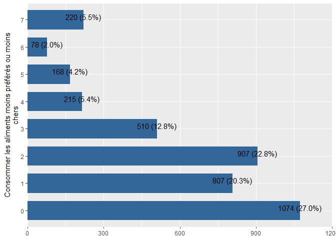<!-- -->

```r
Chad_ea_2019%>% 
  sjPlot::plot_frq(coord.flip =T,rCSILessQlty,show.na = T)
```

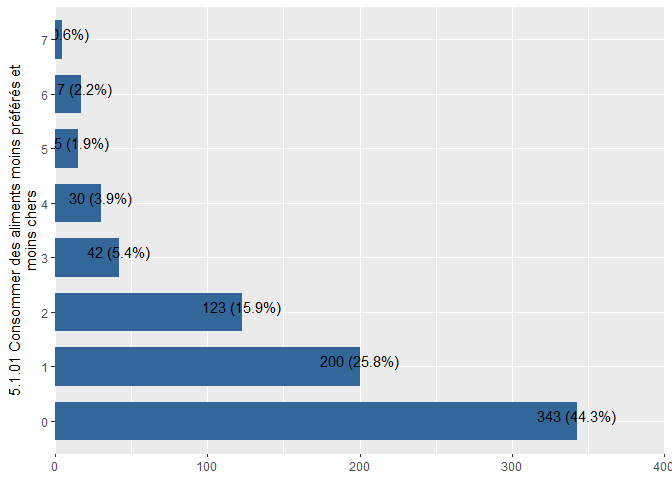<!-- -->

```r
Chad_ea_2020%>% 
  sjPlot::plot_frq(coord.flip =T,rCSILessQlty,show.na = T)
```

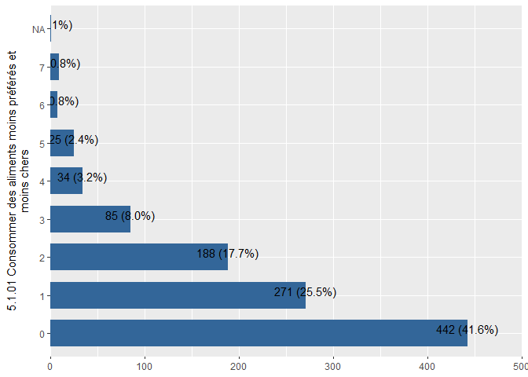<!-- -->

```r
Chad_ea_2021%>% 
  sjPlot::plot_frq(coord.flip =T,rCSILessQlty,show.na = T)
```

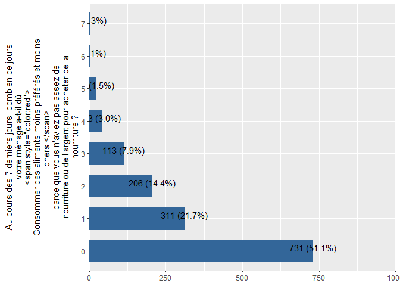<!-- -->

```r
Chad_ea_2022%>% 
  sjPlot::plot_frq(coord.flip =T,rCSILessQlty,show.na = T)
```

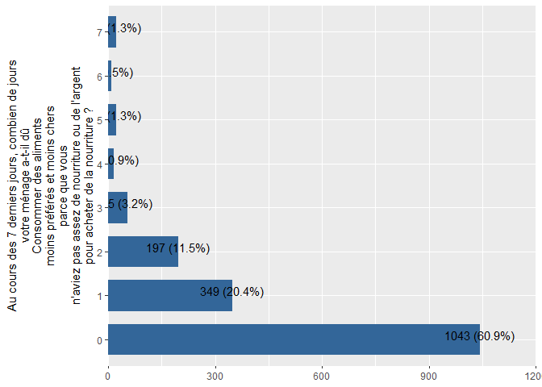<!-- -->

```r
Chad_pdm_2020%>% 
  sjPlot::plot_frq(coord.flip =T,rCSILessQlty,show.na = T)
```

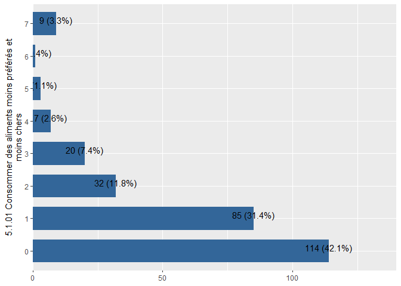<!-- -->

```r
Chad_pdm_2021%>% 
  sjPlot::plot_frq(coord.flip =T,rCSILessQlty,show.na = T)
```

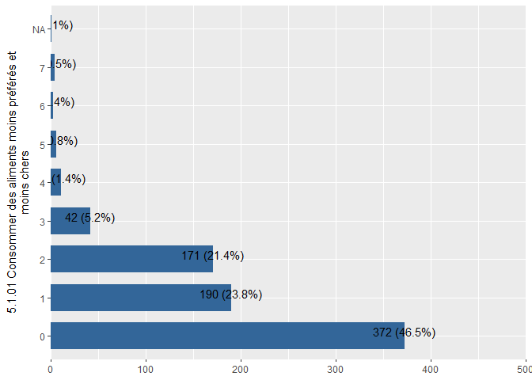<!-- -->

```r
Chad_pdm_2022%>% 
  sjPlot::plot_frq(coord.flip =T,rCSILessQlty,show.na = T)
```

<!-- -->


### rCSI : Emprunter de la nourriture ou compter sur l’aide des parents/amis


```r
Chad_baseline_2018 %>% 
  sjPlot::plot_frq(coord.flip =T,rCSIBorrow,show.na = T)
```

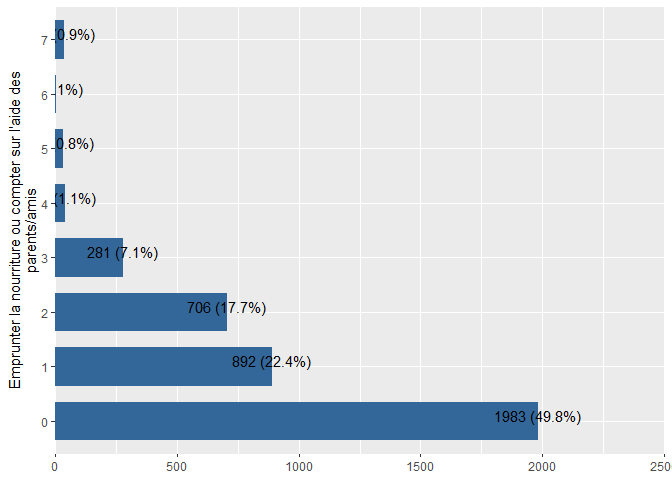<!-- -->

```r
Chad_ea_2019%>% 
  sjPlot::plot_frq(coord.flip =T,rCSIBorrow,show.na = T)
```

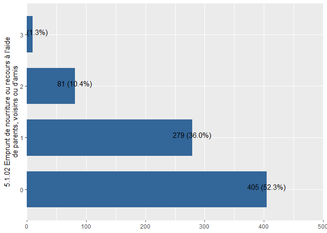<!-- -->

```r
Chad_ea_2020%>% 
  sjPlot::plot_frq(coord.flip =T,rCSIBorrow,show.na = T)
```

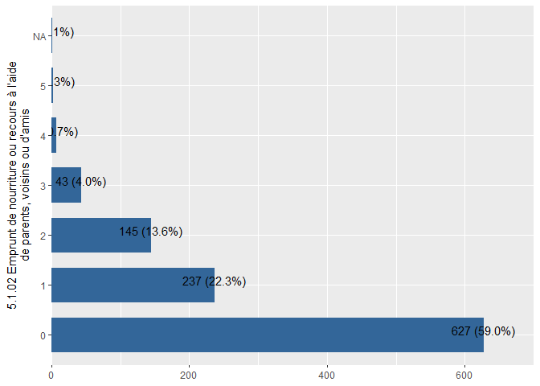<!-- -->

```r
Chad_ea_2021%>% 
  sjPlot::plot_frq(coord.flip =T,rCSIBorrow,show.na = T)
```

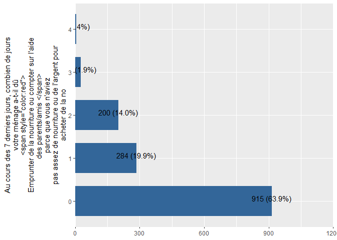<!-- -->

```r
Chad_ea_2022%>% 
  sjPlot::plot_frq(coord.flip =T,rCSIBorrow,show.na = T)
```

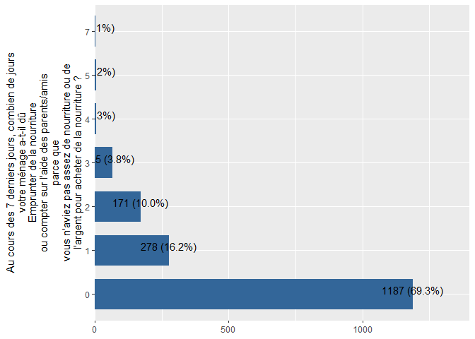<!-- -->

```r
Chad_pdm_2020%>% 
  sjPlot::plot_frq(coord.flip =T,rCSIBorrow,show.na = T)
```

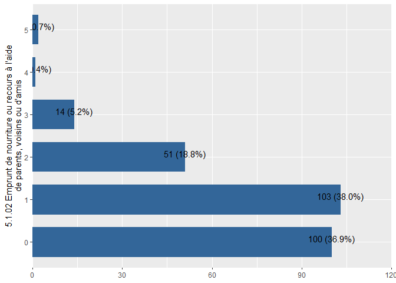<!-- -->

```r
Chad_pdm_2021%>% 
  sjPlot::plot_frq(coord.flip =T,rCSIBorrow,show.na = T)
```

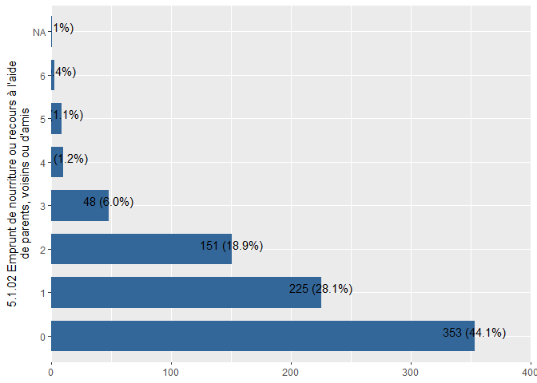<!-- -->

```r
Chad_pdm_2022%>% 
  sjPlot::plot_frq(coord.flip =T,rCSIBorrow,show.na = T)
```

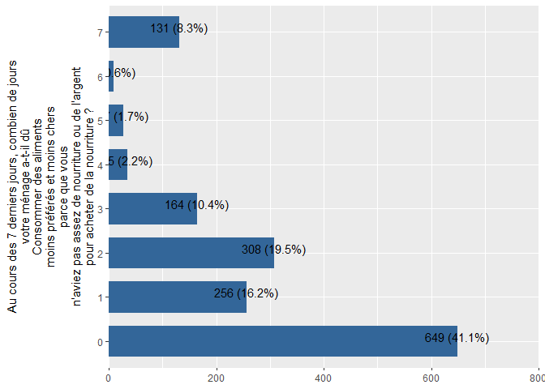<!-- -->


### rCSI : Diminuer la quantité consommée pendant les repas


```r
Chad_baseline_2018 %>% 
  sjPlot::plot_frq(coord.flip =T,rCSIMealSize,show.na = T)
```

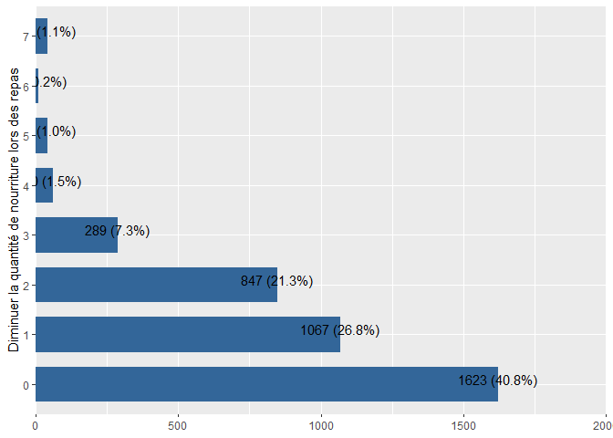<!-- -->

```r
Chad_ea_2019%>% 
  sjPlot::plot_frq(coord.flip =T,rCSIMealSize,show.na = T)
```

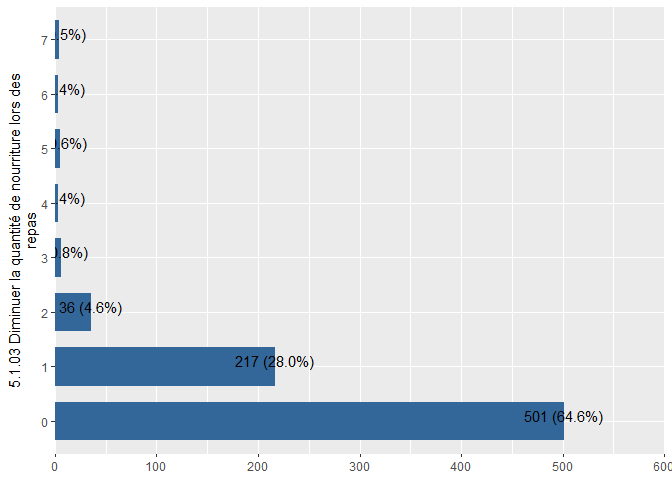<!-- -->

```r
Chad_ea_2020%>% 
  sjPlot::plot_frq(coord.flip =T,rCSIMealSize,show.na = T)
```

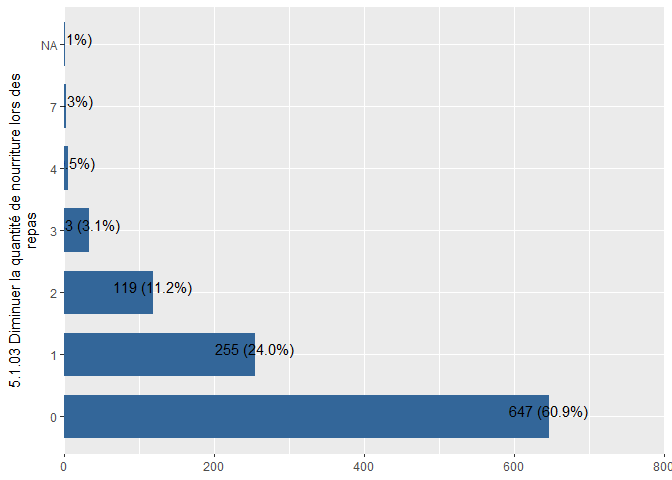<!-- -->

```r
Chad_ea_2021%>% 
  sjPlot::plot_frq(coord.flip =T,rCSIMealSize,show.na = T)
```

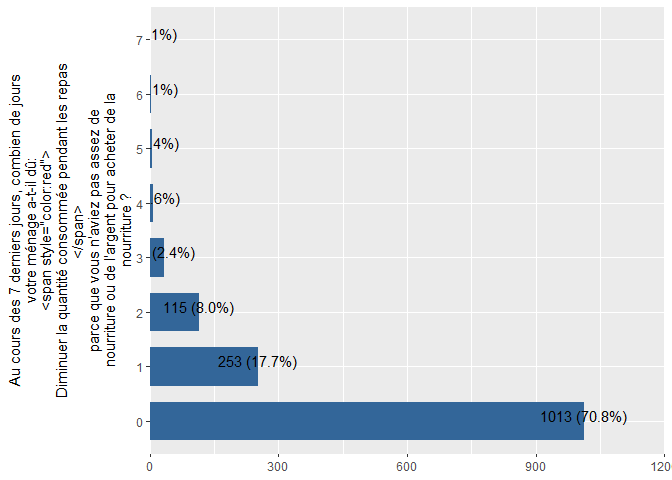<!-- -->

```r
Chad_ea_2022%>% 
  sjPlot::plot_frq(coord.flip =T,rCSIMealSize,show.na = T)
```

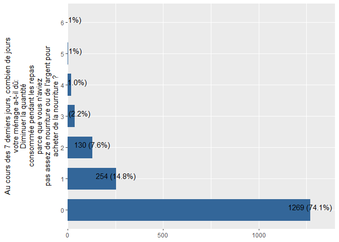<!-- -->

```r
Chad_pdm_2020%>% 
  sjPlot::plot_frq(coord.flip =T,rCSIMealSize,show.na = T)
```

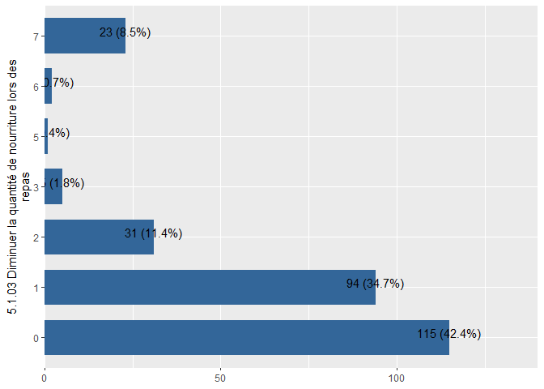<!-- -->

```r
Chad_pdm_2021%>% 
  sjPlot::plot_frq(coord.flip =T,rCSIMealSize,show.na = T)
```

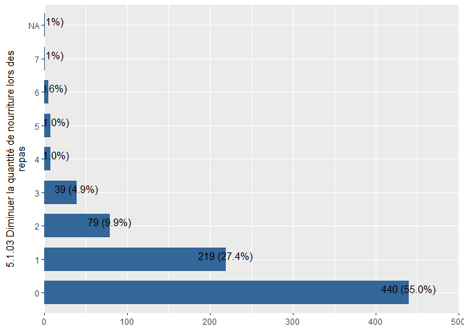<!-- -->

```r
Chad_pdm_2022%>% 
  sjPlot::plot_frq(coord.flip =T,rCSIMealSize,show.na = T)
```

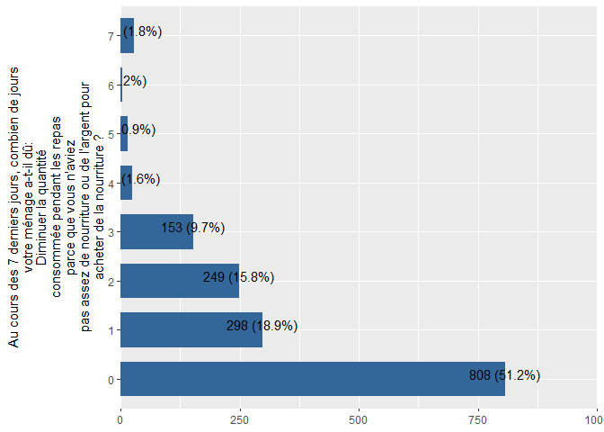<!-- -->


### rCSI :  Restreindre la consommation des adultes  pour nourrir les enfants


```r
Chad_baseline_2018 %>% 
  sjPlot::plot_frq(coord.flip =T,rCSIMealAdult,show.na = T)
```

<!-- -->

```r
Chad_ea_2019%>% 
  sjPlot::plot_frq(coord.flip =T,rCSIMealAdult,show.na = T)
```

<!-- -->

```r
Chad_ea_2020%>% 
  sjPlot::plot_frq(coord.flip =T,rCSIMealAdult,show.na = T)
```

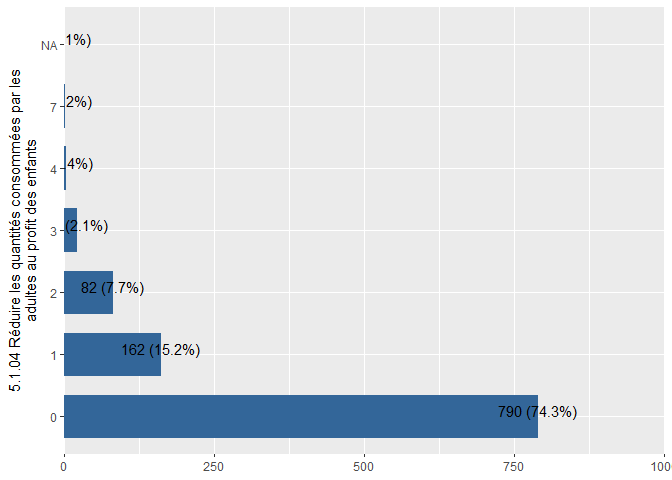<!-- -->

```r
Chad_ea_2021%>% 
  sjPlot::plot_frq(coord.flip =T,rCSIMealAdult,show.na = T)
```

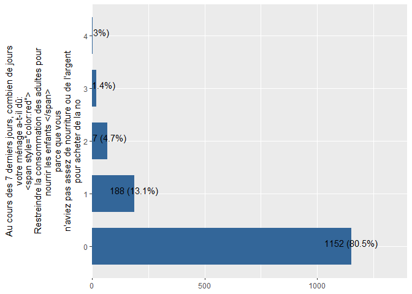<!-- -->

```r
Chad_ea_2022%>% 
  sjPlot::plot_frq(coord.flip =T,rCSIMealAdult,show.na = T)
```

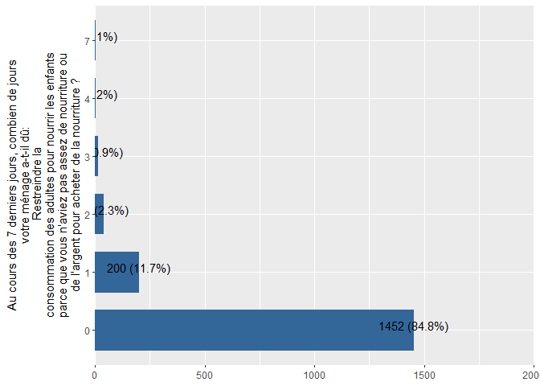<!-- -->

```r
Chad_pdm_2020%>% 
  sjPlot::plot_frq(coord.flip =T,rCSIMealAdult,show.na = T)
```

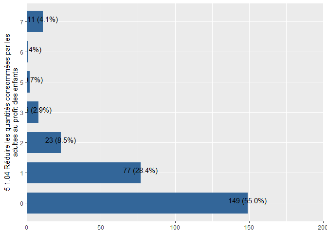<!-- -->

```r
Chad_pdm_2021%>% 
  sjPlot::plot_frq(coord.flip =T,rCSIMealAdult,show.na = T)
```

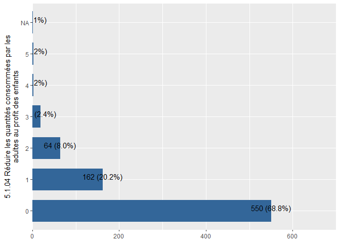<!-- -->

```r
Chad_pdm_2022%>% 
  sjPlot::plot_frq(coord.flip =T,rCSIMealAdult,show.na = T)
```

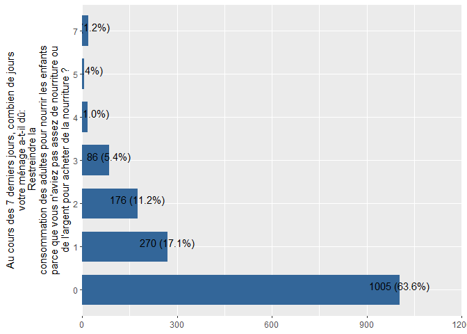<!-- -->


### rCSI : Diminuer le nombre de repas par jour


```r
library(tidyverse)

# List of data frames you want to process
data_frames <- list(
  Chad_baseline_2018,
  Chad_ea_2019,
  Chad_ea_2020,
  Chad_ea_2021,
  Chad_ea_2022,
  Chad_pdm_2020,
  Chad_pdm_2021,
  Chad_pdm_2022
)

# Function to apply sjPlot::plot_frq to each data frame
plot_frq_wrapper <- function(df) {
  sjPlot::plot_frq(df, coord.flip = TRUE, rCSIMealNb, show.na = TRUE)
}

# Using purrr::map to apply the function to each data frame
plots <- map(data_frames, plot_frq_wrapper)
plots
```

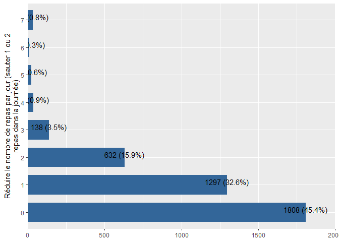<!-- -->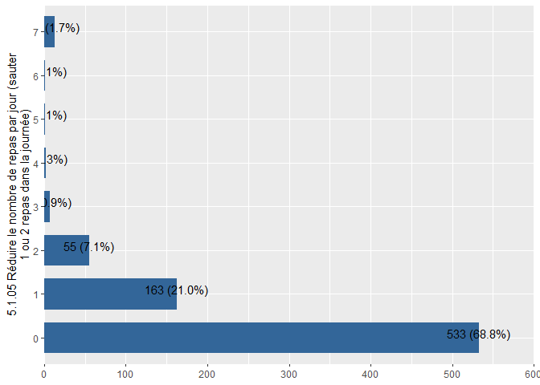<!-- -->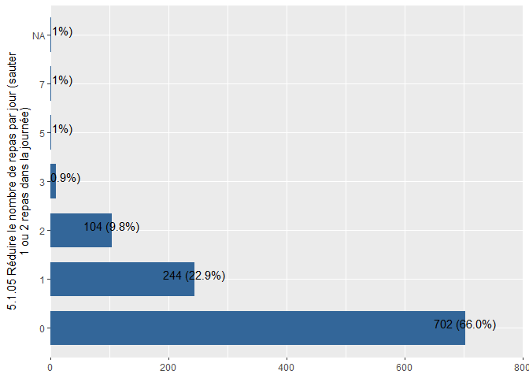<!-- -->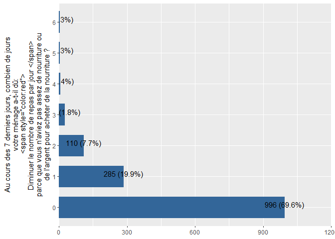<!-- -->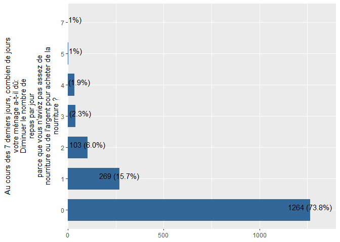<!-- -->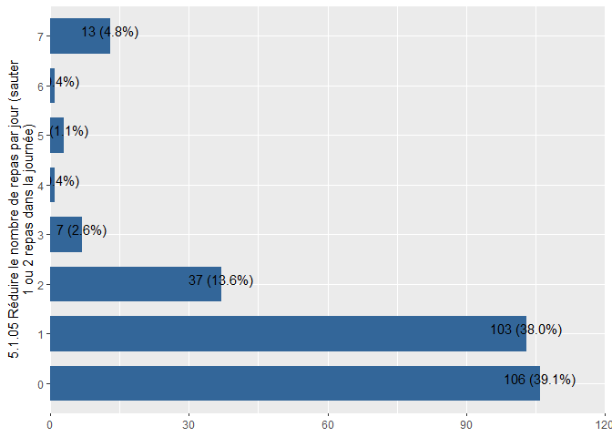<!-- -->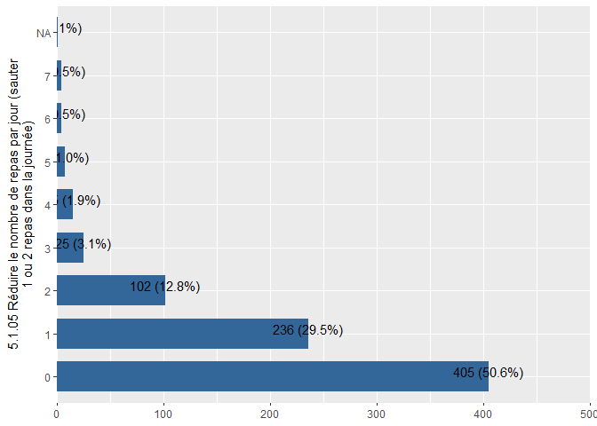<!-- -->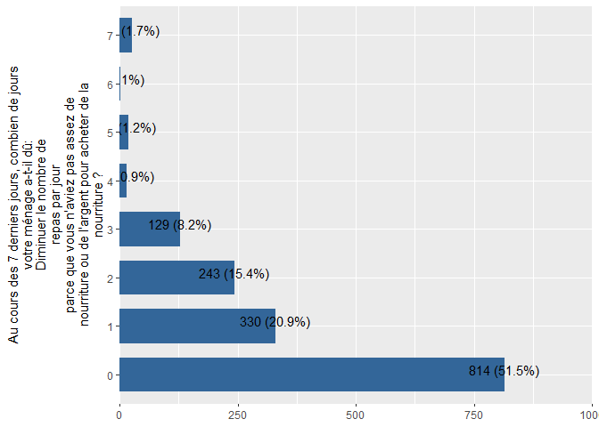<!-- -->


# Merging all data


```r
Chad_baseline_2018 <- labelled::to_factor(Chad_baseline_2018)
Chad_ea_2019 <- labelled::to_factor(Chad_ea_2019)
Chad_ea_2020 <- labelled::to_factor(Chad_ea_2020)
Chad_ea_2021 <- labelled::to_factor(Chad_ea_2021)
Chad_ea_2022 <- labelled::to_factor(Chad_ea_2022)
Chad_ea_2023 <- labelled::to_factor(Chad_ea_2023)
Chad_pdm_2020 <- labelled::to_factor(Chad_pdm_2020)
Chad_pdm_2021 <- labelled::to_factor(Chad_pdm_2021)
Chad_pdm_2022 <- labelled::to_factor(Chad_pdm_2022)
Chad_pdm_2023 <- labelled::to_factor(Chad_pdm_2023)
WFP_Chad<-plyr::rbind.fill(Chad_baseline_2018,
Chad_ea_2019,
Chad_ea_2020,
Chad_ea_2021,
Chad_ea_2022,
Chad_ea_2023,
Chad_pdm_2020,
Chad_pdm_2021,
Chad_pdm_2022,
Chad_pdm_2023)
```


```r
#calculate rCSI Score
WFP_Chad <- WFP_Chad %>% mutate(rCSI = rCSILessQlty  + (2 * rCSIBorrow) + rCSIMealSize + (3 * rCSIMealAdult) + rCSIMealNb)
var_label(WFP_Chad$rCSI) <- "rCSI"
```


Households are divided in four classes according to the rCSI score: 0-3, 4-18, and 19 and above which correspond to IPC Phases 1, 2 and 3 and above respectively.


```r
#WFP_Chad$SCA<-as.numeric(WFP_Chad$SCA)
WFP_Chad = WFP_Chad %>% dplyr::select(key_vars,var_needed)
```


```r
haven::write_dta(WFP_Chad,paste0(dir_output_data,"/","WFP_Chad_rCSI.dta"))
```
